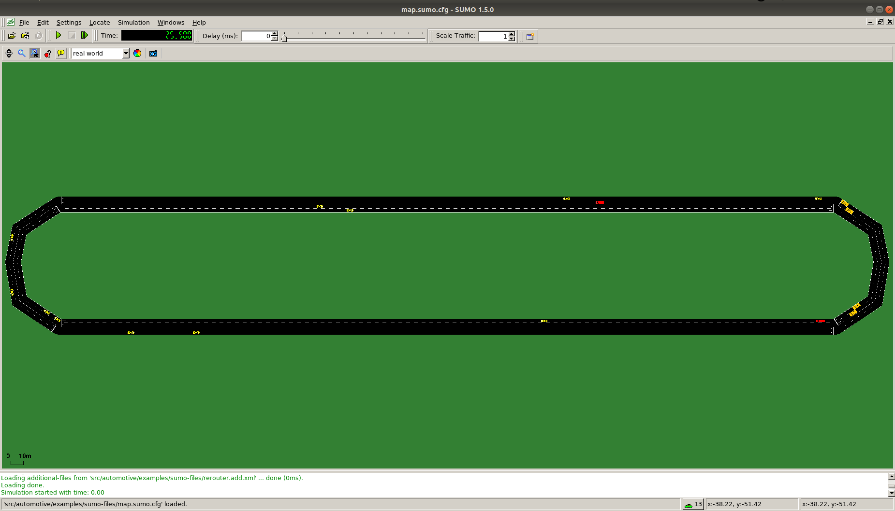
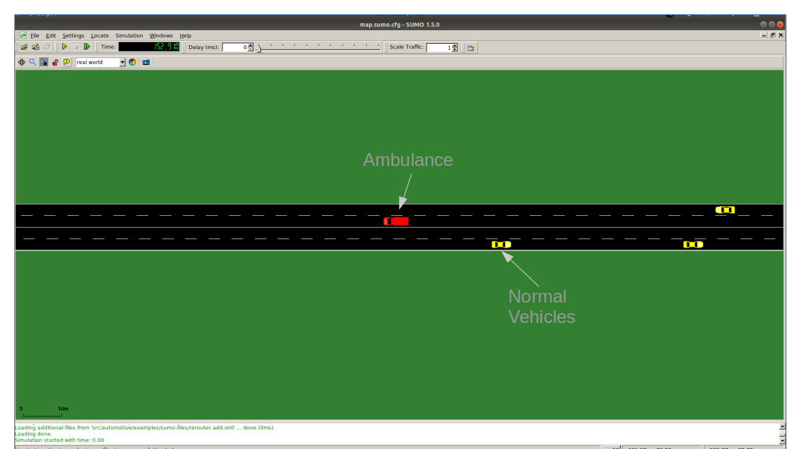

# ms-van3t

ns-3 modules to build and simulate ETSI-compliant VANET (V2X) applications using SUMO (v-1.6.0+) and ns-3 (v-3.33), with the possibility of easily switching stack and communication technology.

It has been tested with SUMO v1.6.0, v1.7.0, v1.8.0 and ns3 v3.33 on Ubuntu 18.04 and 20.04.
Back compatibility **is not** ensured with new versions of TraCI.

To build the project:
* Install SUMO following the guide at [https://sumo.dlr.de/wiki/Downloads](https://sumo.dlr.de/wiki/Downloads)
    * You can use 
    	`sudo add-apt-repository ppa:sumo/stable`  
    	`sudo apt update`  
    	`sudo apt install sumo sumo-tools sumo-doc`  
    * Be careful: in the future the previous commands will install updated version of SUMO which are not ensured to work with this scripts (that are tested with any version from **v-1.6.0** to **v-1.8.0** )

* Clone this repository in your pc.

* Run, from this repository:
`./sandbox_builder.sh`
This script will download ns-3.33 and install this framework. The folder `ns-3.33` will remain linked to this GitHub repository (not to the vanilla ns-3.33 one), allowing you to more easily develop updates and possibile contributions to *ms-van3t*.
    
* Configure `waf` to build the framework with `<ns3-folder>./waf configure --build-profile=optimized --enable-examples --enable-tests (add here what you want to enable)"` - The usage of the optimized profile allows to speed up the simulation time - 
**Sometimes it may happen that in build phase you have some "Warning threated as error"**. To solve this issue, configure the project using:
`CXXFLAGS="-Wno-maybe-uninitialized" ./waf configure --build-profile=optimized --enable-examples --enable-tests --enable-sudo`.

* Build ns3:
`./waf build`

**Important**

The final project path-tree should look like (referring to the `src` directory):

    automotive/
               doc/
               examples/
                        sumo_files_v2v_map/
                        sumo_files_v2i_map/
               helper/
               model/
                    applications/
                    asn1/
                    facilities/
                    utilities/
               test/
    traci/
          doc/
          examples/
          model/
    traci-applications/
                       examples/
                       helper/
                       model/

`automotive/` contains all the application related files. Inside `sumo_files_v2v_map` you can find the SUMO map and trace for the V2V sample application, while inside `sumo_files_v2i_map` you can find the SUMO map and trace for the V2I sample application.
`traci/` and `traci-applications/` contain instead all the logic to link ns-3 and SUMO.

The user is also encouraged to use the `sumo_files_v2v_map` and `sumo_files_v2i_map` folders to save there the SUMO-related files for his/her own applications.

# Simple V2I example and V2I/V2N applications

*ms-van3t* currently supports two stack/communication technologies for V2I/V2N:
- 802.11p, communicating, for instance, with a Road Side Unit (sample program name: `v2i-80211p`)
- LTE, for V2N communications (sample program name: `v2i-lte`)

To run the sample V2I program you can use:
`./waf --run "v2i-lte"` or
`./waf --run "v2i-80211p"`

*  Nodes are created in the ns3 simulation as vehicles enter the SUMO simulation
*  A full LTE or WAVE stack is implemented at lower layers (depending on which example is run)

In this example, every vehicle that enters the scenario will start sending CAMs with a frequency between *1 Hz* and *10 Hz* (according to the ETSI standards). The server, that is behind the RSU or behind an eNB + EPC, will receive them and will check the position of the vehicles. 

The map is divided into two areas: the area in the middle, where the maximum speed is 25km/h and an outer area, where the speed limit is set to 75km/h. 

The server checks whenever a transition between the two areas is performed by a vehicle, and, when it happens, it sends it a DENM message to tell it to slow-down (or to let it speed-up again).

The mobility trace is contained in the file `ns-3.33/src/automotive/example/sumo_files_v2i_map/cars.rou.xml`.
This SUMO map embeds some re-routers allowing the vehicles to continuously move in the map.

The CAMs and DENMs dissemination logic are in the modules inside the `automotive/facilities` folder while the application logic resides on appClient.cc/.h and appServer.cc/.h, inside `automotive/applications`.
The user *IS NOT* expected to modify the code inside the "facilities" folder, but rather to use the ETSI Facilities Layer methods inside the application.

**Important**

If using the LTE version in this very simple toy case, it is possible to connect at most 23 UEs to the enB (due to LENA framework limitation). You can avoid this problem by using the option `--ns3::LteEnbRrc::SrsPeriodicity=[value]"` where [value]=0, 2, 5, 10, 20, 40, 80, 160, 320. In this way you can add more UEs. Example: `./waf --run "v2i-lte --ns3::LteEnbRrc::SrsPeriodicity=160"`

**List of the most important options:**
* `--realtime                  [bool] decide to run the simulation using the realtime scheduler or not`
* `--sim-time                  [double] simulation time`
* `--sumo-gui                  [bool] decide to show sumo-gui or not`
* `--server-aggregate-output   [bool] if true, the server will print every second a report on the number of DENM sent and CAM received correctly`
* `--sumo-updates              [double] frequency of SUMO updates`
* `--send-cam                  [bool] enable vehicles to send CAM`
* `--asn                       [bool] if true, CAMs and DENMs are encoded and decoded using ASN.1`
* `--lonlat                    [bool] if true, the position information included in CAMs id traslated from XY to lonlat geo coordinates`
* `--csv-log                   [string] prefix of the CSV log files where to save the disaggregated data coming from the CAMs received by the server and the DENMs received by the vehicles (the user can then use this sample application to build more complex logging mechanisms and/or log additional data coming from the server and/or the vehicles)`

# Simple V2V example and V2V applications

*ms-van3t* currently supports two stack/communication technologies for V2V:
- 802.11p (sample program name: `v2v-80211p`)
- C-V2X Mode 4 (sample program name: `v2v-cv2x`)

To run the program:

`./waf --run "v2v-cv2x"` or
`./waf --run "v2v-80211p"`

*  Nodes are created in the ns3 simulation as vehicle enters the SUMO simulation
*  A full C-V2X or 802.11p stack is implemented at lower layers

In this example, every vehicle that enters the scenario will start sending CAMs with a frequency between *1 Hz* and *10 Hz* (according to the ETSI standards). The vehicles are divided into "passenger" vehicles (i.e., normal vehicles) and "emergency" vehicles. 

When an emergency vehicle enters the scenario, beside the CAMs it starts broadcasting DENM messages containing information related to the road segments that it is crossing, and its actual position. The vehicles around will receive them and, in case they are on its way, they decelerate and move to the inner lane, in order to facilitate its takeover. 

If the inner lane is occupied, they will try to speedup and perform a lane merge maneuver as soon as possible.

The CAMs and DENMs dissemination logic are in the modules inside the `automotive/facilities` folder while the application logic is inside appSimple.cc (in `automotive/applications`).
The user *IS NOT* expected to modify the code inside the "facilities" folder, but rather to use the ETSI Facilities Layer methods inside the application.

The SUMO scenario comprehends a ring-like topology, with two directions and two lanes for each direction (with a total of 4 lanes). 

The mobility trace is contained inside the file `automotive/example/sumo_files_v2v_map/cars.rou.xml`.

The SUMO map also embeds some re-routers allowing the vehicles to continuosly travel on the available road segments.

For visualization purposes, in SUMO, normal vehicles are shown as yellow cars, while ambulances/emergency vehicles are red. When a vehicle is reacting to the presence of an ambulance, it turns either orange (slowing down and changing lane) or green (speeding up to change lane and then slow down as soon as possible).

**List of the most important options:**
* `--realtime                   [bool] decide to run the simulation using the realtime scheduler or not`
* `--sim-time                   [double] simulation time`
* `--sumo-gui                   [bool] decide to show sumo-gui or not`
* `--sumo-updates               [double] frequency of SUMO updates`
* `--send-cam                   [bool] enable vehicles to send CAM`
* `--asn                        [bool] if true, CAMs and DENMs are encoded and decoded using ASN.1`
* `--lonlat                     [bool] if true, the position information included in CAMs id traslated from XY to lonlat geo coordinates`
* `--csv-log:                   [string] prefix of the CSV log files where to save CAMs and DENMs disaggregated data and statistics`

**Note:**
In this version LTE python bindings are disabled!

# Sample V2X emulator application

*ms-van3t* also includes an example of an emulation application, which is able to send the CAMs and DENMs generated by the vehicles, (virtually) travelling on the SUMO map, over a real network, by relying on a physical interface.

The same application should also be able to receive CAMs and DENMs coming from the external world (i.e. from a certain physical interface of the device running ns-3).

For the time being, this sample application is relying on the same map and mobility traces of the V2V application and *it sends only CAM messages*.

In order to properly work, the emulator application should always run in real time, and the device on which ns-3 is run should be able to handle the specified number of vehicles without delays and without slowing down. 

As it is communicating with the external world, it handles only ASN.1 standard-compliant messages.

More in details, this application emulates N vehicles, each with its own CA and DEN basic service, and make them send the CAM messages and receive the DENM messages through a physical interface (specified with the "interface" option), instead of using any ns-3 simulated model.
This should enable, in the future, hardware-in-the-loop testing and evaluation.

You can run it with:
`./waf --run "emu-v2x --interface=<interface name>"`

Where `<interface name>` is the name of the physical interface, on your PC, where CAMs will be sent.

**Please note** that the interface, in order to work with ns-3, should be put in promiscuous mode.

You can put an interface in promiscuous mode with:
`sudo ip link set <interface name> promisc on`

The promiscuous mode can then be disabled with:
`sudo ip link set <interface name> promisc off`

`sudo` may be needed to use the underlying ns-3 *FdNetDevice*: if you get a "permission denied" error, try to run again the `emu-v2x` application with `sudo`.

The files in which this application is contained are:
- `ns-3.33/src/automotive/model/applications/obuEmu.h`
- `ns-3.33/src/automotive/model/applications/obuEmu.cc`
- `ns-3.33/src/automotive/helper/obuEmu-helper.h`
- `ns-3.33/src/automotive/helper/obuEmu-helper.cc`

**List of the most important options:**
* `--sim-time                   [double] total emulation/simulation time`
* `--sumo-gui                   [bool] decide to show sumo-gui or not`
* `--sumo-updates               [double] frequency of SUMO updates`
* `--send-cam                   [bool] enable vehicles to send CAMs`
* `--interface                  [string] Name of the physical interface to send(/receive) V2X messages to(/from)`
