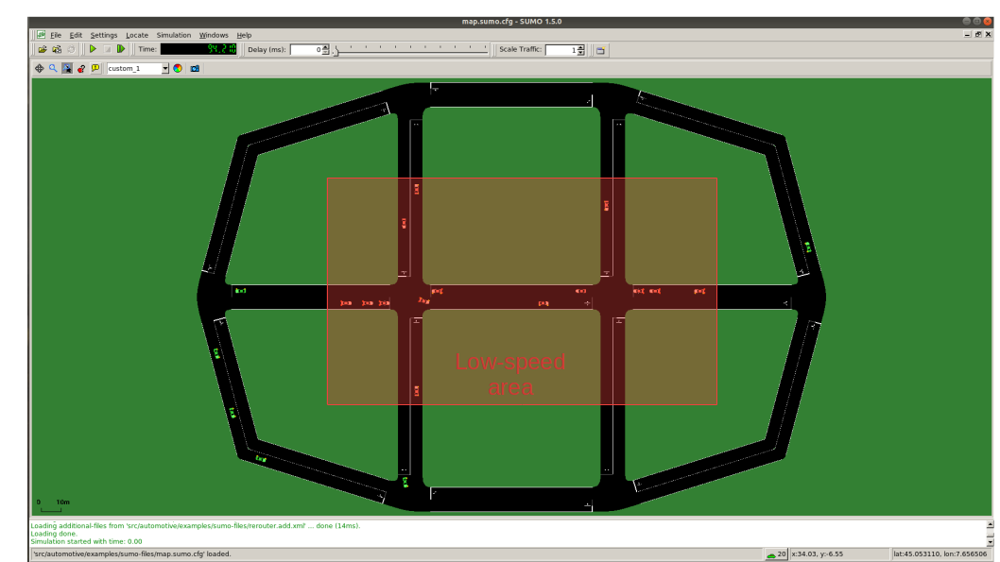

# v2i-framework

ns3 modules to build a simple V2I application using SUMO (v-1.6.0) and ns-3 (v-3.29).

It has been tested with SUMO v1.6.0 and ns3 v3.29 on Ubuntu 20.04.
Back compatibility **is not** ensured with newer version of TraCI.

To build the project:
* Install SUMO following the guide at [https://sumo.dlr.de/wiki/Downloads](https://sumo.dlr.de/wiki/Downloads)
    * You can use 
    	`sudo add-apt-repository ppa:sumo/stable`  
    	`sudo apt update`  
    	`sudo apt install sumo sumo-tools sumo-doc`  
    * Be careful: in the future the previous commands will install updated version of SUMO which are not ensured to work with this scripts (that are tested with **v-1.6.0**)

* Clone this repository in your pc.
    
* Configure waf to build the new modules with "<ns3-folder>./waf configure --build-profile=optimized --enable-examples --enable-tests" (add here what you want to enable) - The usage of the optimized profile allows to speed up the simulation time

* Build ns3

**Important**
The final project path-tree should be like:

    automotive/
               doc/
               examples/
                        sumo-files/
               helper/
               model/
                    asn1/
                    facilities/
                    utilities/
               test/
    traci/
          doc/
          examples/
          model/
    traci-applications/
                       examples/
                       helper/
                       model/

automotive/ contains all the application related files. Inside sumo-files you can find the SUMO map, trace and other sumo-related stuff.
traci/ and traci-applications/ contains all the logic to link ns-3 and SUMO.

**Simple V2I example**

To run the program:
`./waf --run "v2i-lte"` or
`./waf --run "v2i-80211p"`

*  Nodes are created in the ns3 simulation as vehicle enters the SUMO simulation
*  A full LTE or WAVE stack is implemented at lower layers (depending on which example is run)

In this example, every vehicle that enters the scenario will start sending CAM (in plain text or in ASN.1) with freq 10 hz. The server, that is behind the RSU or behind eNB e EPC, will receive them and it will check the position of the vehicle. The map is divided into two areas: the area in the middle, where the max speed is 6.94ms/s and the outer area, where the max speed is 30m/s. 

The server checks whenever a transition between the two areas is performed by a vehicle, and when it happens, it sends it a DENM message to tell it to slow-down or to speed-up.

The mobility trace is managed by the file automotive/example/sumo-files/cars.rou.xml -> please note that the very first line of this file are used to determine the number of UE to be generated in the simulation and is very important to update it if the number of vehicles changes.
The SUMO map embeds also some re-routers that allows the vehicles to move in the map without exiting.

CAM and DENM are received and generated through v2i-CAM-sender and v2i-DENM-sender respectively, while the application logic resides on appClient and appServer.

**Important**
If using the LTE version in this very simple toy case, it is possible to connect at most 23 UEs to the enB (due to LENA framework limitation). You can avoid this problem by using the command `--ns3::LteEnbRrc::SrsPeriodicity=[value]"`where [value]=0, 2, 5, 10, 20, 40, 80, 160, 320. In this way you can add more UEs. Example: `./waf --run "v2i-lte --ns3::LteEnbRrc::SrsPeriodicity=160"`

**List of commands**
* --realtime				   [bool] decide to run the simulation using the realtime scheduler or not
* --sim-time                   [double] simulation time
* --sumo-gui                   [bool] decide to show sumo-gui or not
* --server-aggregate-output	   [bool] if true, the server will print every second a report on the number of DENM sent and CAM received correctly
* --sumo-updates 			   [double] frequency of SUMO updates
* --send-cam 				   [bool] enable vehicles to send CAM
* --asn                        [bool] if true, CAMs and DENMs are encoded and decoded using ASN.1 
* --cam-intertime              [double] CAM dissemination intertime
* --lonlat					   [bool] if true, the position information included in CAMs id traslated from XY to lonlat geo coordinates
