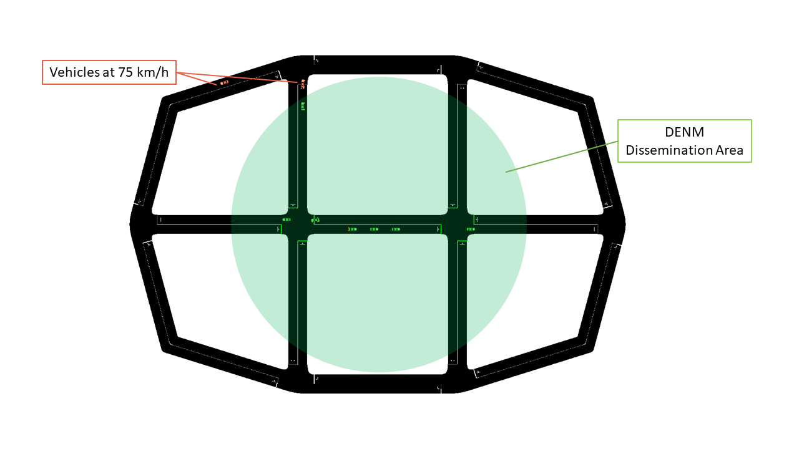
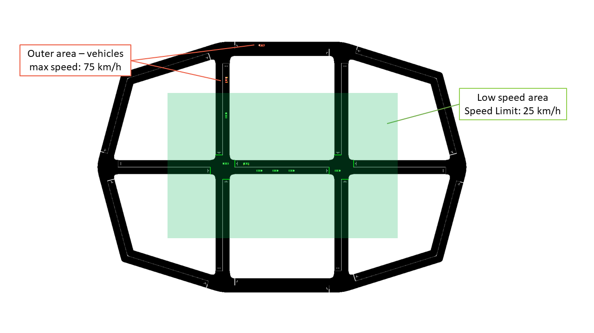
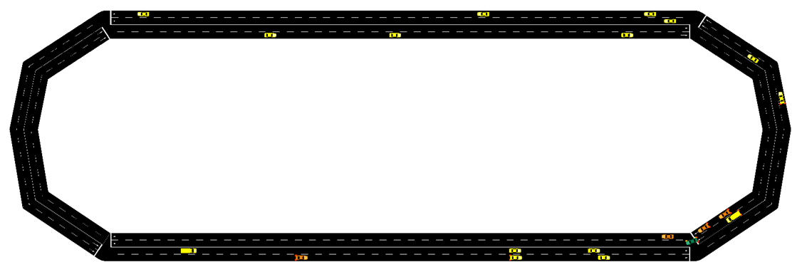
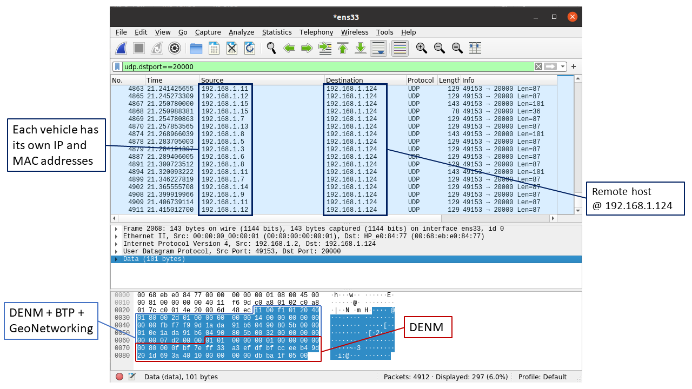

# ms-van3t


ns-3 modules to build and simulate ETSI-compliant VANET (V2X) applications using SUMO (v-1.6.0+) and ns-3 (v-3.33), with the possibility of easily switching stack and communication technology.

It has been tested with SUMO v1.6.0, v1.7.0, v1.8.0 and ns-3 v3.33 on Ubuntu 18.04 and 20.04.
Back compatibility **is not** ensured with new versions of TraCI.

To build the project:
* Install SUMO following the guide at [https://sumo.dlr.de/wiki/Downloads](https://sumo.dlr.de/wiki/Downloads)
    * You can use 
    
    	`sudo add-apt-repository ppa:sumo/stable`  
    	`sudo apt update`  
    	`sudo apt install sumo sumo-tools sumo-doc`  
    * Be careful: in the future the previous commands will install updated version of SUMO which are not ensured to work with this scripts (that are tested with any version from **v-1.6.0** to **v-1.8.0** )
    * Test sumo by opening a terminal and running "sumo-gui".
	
    * **Possible problems**:
			
			You may get the following error when running SUMO:
			
        	"sumo-gui: symbol lookup error: /usr/lib/libgdal.so.26: undefined symbol: GEOSMakeValid_r"
    
        	To solve it, remove all the reference to GEOS inside /usr/local/lib/ (do NOT do it if you need the GEOS library):
    
        	"sudo rm /usr/local/lib/libgeos*"

* Clone this repository in your pc:

`git clone https://github.com/marcomali/ms-van3t`

* Run, from this repository either:

`./sandbox_builder.sh install-dependencies` -> if this is the first time you install ns-3 or ms-van3t on your system

or

`./sandbox_builder.sh` -> if this is **not** the first time you install ns-3 

This script will download ns-3.33 and install this framework. The folder `ns-3.33` will remain linked to this GitHub repository (not to the vanilla ns-3.33 one), allowing you to more easily develop updates and possibile contributions to *ms-van3t*.
    
* Configure `waf` to build the framework with `<ns3-folder>./waf configure --build-profile=optimized --enable-examples --enable-tests (add here what you want to enable)"` - The usage of the optimized profile allows to speed up the simulation time

* Build ns3:
`./waf build`

**Important**

The final project path-tree should look like (referring to the `src` directory):

    automotive/
          doc/
          examples/
            sumo_files_v2v_map/
            sumo_files_v2i_map/
          helper/
          model/
            Applications/
            asn1-legacy/
            asn1-modern/
            BTP/
            Facilities/
            GeoNet/
            utilities/
          test/
    cv2x/
          bindings/
          doc/
          examples/
          helper/
          model/
          patching_scripts/
          test/
	gps-tc/
		  doc/
		  examples/
		  helper/
		  model/
		  test/
    traci/
          doc/
          examples/
          model/
    traci-applications/
          examples/
          helper/
          model/

`automotive/` contains all the application related files and all the source code implementing the ETSI ITS-G5 stack for vehicular communications. Inside `sumo_files_v2v_map` you can find the SUMO map and trace for the V2V sample application, while inside `sumo_files_v2i_map` you can find the SUMO map and trace for the V2I sample application. `traci/` and `traci-applications/` contain instead all the logic to link ns-3 and SUMO. `cv2x/` contains the model for C-V2X in transmission mode 4.

The user is also encouraged to use the `sumo_files_v2v_map` and `sumo_files_v2i_map` folders to save there the SUMO-related files for his/her own applications.

**The version of CAM and DENM messages (v1 or v2)** can be easily switched by relying on the `switch_CAM_DENM_version.sh` script. This script relies on the `ns-3.33/src/automotive/currmode.txt` file. Please **never** modify it manually or delete it!


# Sample V2I example and V2I/V2N applications

*ms-van3t* currently supports two stacks/communication technologies for V2I/V2N:
- 802.11p, communicating, for instance, with a Road Side Unit (sample program name: `v2i-areaSpeedAdvisor-80211p`)
- LTE, for V2N communications (sample program name: `v2i-areaSpeedAdvisor-lte`)

To run the sample V2I program you can use:
`./waf --run "v2i-areaSpeedAdvisor-lte"` or
`./waf --run "v2i-areaSpeedAdvisor-80211p"`

*  Nodes are created in the ns3 simulation as vehicles enter the SUMO simulation
*  A full LTE or 802.11p stack is implemented at lower layers (depending on which example is run)

In this example, every vehicle that enters the scenario will start sending CAMs with a frequency between *1 Hz* and *10 Hz* (according to the ETSI standards). 

Then, the logic of the two sample applications for V2I/V2N is similar, but it differs slightly depending on whether 802.11p is used (V2I) or LTE is used (V2N).  

At a glance, in 802.11p vehicles broadcast periodic CAM messages and an RSU periodically broadcasts DENM messages to inform vehicles travelling in a low speed area to slow down. In this case CAMs and DENMs messages are encapsulated inside BTP and GeoNetworking.
In LTE, instead, the CAM messages are forwarded to a remote host (behind an eNB + EPC), which analyzes the position of the vehicles and sends unicast DENMs to vehicles entering a low speed area to change their maximum allowed speed. In this case, due to the absence of a MBMS module in the LTE framework of ns-3, all the messages are sent in unicast. 
CAM and DENM messages are encapsulated inside BTP, GeoNetworking, UDP and IP.

__802.11p application logic__

The map is divided into two areas: a circular area in the middle of the map, with a radius of 90 m, on which DENMs are broadcasted by the RSU (with their GeoArea set accordingly), where the maximum speed is 25km/h and an outer area, where the speed limit is set to 75km/h.

The RSU disseminates a DENM every second in the area mentioned before, and continues its transmissions until it receives CAMs from vehicles in the map. When no CAMs are received for more than 5 seconds, the DENM dissemination in paused, until new vehicles enter the scenario and new CAMs are received by the RSU.



__LTE application logic__

The map is divided into two areas: the area in the middle, where the maximum speed is 25km/h and an outer area, where the speed limit is set to 75km/h. In this case, DENMs cannot be transmitted using merely BTP and GeoNetworking, but they have to rely on UDP and IPv4, since the server is located in a remote host behind the eNB and EPC. The server checks whenever a transition between the two areas is performed by a vehicle, and, when it happens, it sends it a _unicast_ DENM message to tell it to slow-down (or to let it speed-up again).



__Mobility Traces and Facilities Layer__

The mobility trace is contained in the file `ns-3.33/src/automotive/example/sumo_files_v2i_map/cars.rou.xml`.
This SUMO map embeds some re-routers allowing the vehicles to continuously move in the map.

The CAMs and DENMs dissemination logics are in the modules inside the `automotive/Facilities` folder while the application logic resides on (areaSpeedAdvisorClient80211p.cc/.h, areaSpeedAdvisorClientLTE.cc/.h) and (areaSpeedAdvisorServer80211p.cc/.h, areaSpeedAdvisorServerLTE.cc/.h) inside `automotive/Applications`.

The user *IS NOT* expected to modify the code inside the "Facilities", "BTP" and "GeoNet" folders, but rather to use the ETSI Facilities Layer methods inside the application.

**Important**

If using the LTE version in this very simple toy case, it is possible to connect at most 23 UEs to the enB (due to the LENA framework currently implemented features). You can avoid this problem by using the option `--ns3::LteEnbRrc::SrsPeriodicity=[value]"` where [value]=0, 2, 5, 10, 20, 40, 80, 160, 320. In this way you can add more UEs. Example: `./waf --run "v2i-areaSpeedAdvisory-lte --ns3::LteEnbRrc::SrsPeriodicity=160"`

**List of the most important options:**
* `--realtime                  [bool] decide to run the simulation using the realtime scheduler or not`
* `--sim-time                  [double] simulation time`
* `--sumo-gui                  [bool] decide to show sumo-gui or not`
* `--server-aggregate-output   [bool] if true, the server will print every second a report on the number of DENM sent and CAM received correctly`
* `--sumo-updates              [double] frequency of SUMO updates`
* `--csv-log                   [string] prefix of the CSV log files where to save the disaggregated data coming from the CAMs received by the server and the DENMs received by the vehicles (the user can then use this sample application to build more complex logging mechanisms and/or log additional data coming from the server and/or the vehicles)`


# Sample V2V example and V2V applications

*ms-van3t* currently supports two stacks/communication technologies for V2V:
- 802.11p (sample program name: `v2v-80211p`)
- C-V2X Mode 4 (sample program name: `v2v-cv2x`)

To run the program:

`./waf --run "v2v-emergencyVehicleAlert-cv2x"` or
`./waf --run "v2v-emergencyVehicleAlert-80211p"`

*  Nodes are created in the ns3 simulation as vehicle enters the SUMO simulation
*  A full C-V2X or 802.11p stack is implemented at lower layers

In this example, every vehicle that enters the scenario will start sending CAMs with a frequency between *1 Hz* and *10 Hz* (according to the ETSI standards). The vehicles are divided into "passenger" vehicles (i.e., normal vehicles) and "emergency" vehicles. 

A CAM generated by an emergency vehicle will have the "StationType" Data Element (i.e. a field of the message) set to "specialVehicles".
When normal vehicles receive these CAM messages from an emergency vehicle, they will check whether their heading is similar to the one of the emergency vehicle and which is their distance to the latter.

If the heading is similar and the distance is small enough, it means that the emergency vehicle is approaching. In this case, the receiving vehicles will either slow down (if on a different lane than the one the emergency vehicle is travelling on) or change lane as soon as possible (speeding up for a little while, if necessary, when they are on the same lane as the emergency vehicle).

When acting, in the SUMO GUI, vehicles will either turn orange (different lane --> slow down) or green (same lane --> clear path as soon as possible).

The CAMs and DENMs dissemination logic are in the modules inside the `automotive/Facilities` folder while the application logic is inside emergencyVehicleAlert.cc/.h (in `automotive/Applications`).
The user *IS NOT* expected to modify the code inside the "Facilities", "BTP" or "GeoNet" folders, but rather to use the ETSI Facilities Layer methods inside the application.

The SUMO scenario comprehends a ring-like topology, with two directions and two lanes for each direction (with a total of 4 lanes). 



The mobility trace is contained inside the file `automotive/example/sumo_files_v2v_map/cars.rou.xml`.

The SUMO map also embeds some re-routers allowing the vehicles to continuously travel on the available road segments.


**List of the most important options:**
* `--realtime                   [bool] decide to run the simulation using the realtime scheduler or not`
* `--sim-time                   [double] simulation time`
* `--sumo-gui                   [bool] decide to show sumo-gui or not`
* `--sumo-updates               [double] frequency of SUMO updates`
* `--csv-log:                   [string] prefix of the CSV log files where to save CAMs and DENMs disaggregated data and statistics`


# Sample V2X emulator application

*ms-van3t* also includes an example of an emulation application, which is able to send the CAMs and DENMs generated by the vehicles, (virtually) travelling on the SUMO map, over a real network, by relying on a physical interface.

The same application should also be able to receive CAMs and DENMs coming from the external world (i.e. from a certain physical interface of the device running ns-3).

For the time being, this sample application is relying on the same map and mobility traces of the V2V application and it sends both CAM messages and periodic DENM messages, as an example on how both kinds of messages can be emulated and sent to the external world.

In order to properly work, the emulator application should always run in real time, and the device on which ns-3 is run should be able to handle the specified number of vehicles without delays and without slowing down. 

As it is communicating with the external world, it handles only ASN.1 standard-compliant messages.

More in details, this application emulates N vehicles, each with its own CA and DEN basic service, and make them send the CAM/DENM messages and receive the CAM/DENM messages through a physical interface (specified with the "interface" option), instead of using any ns-3 simulated model.
This should enable, in the future, hardware-in-the-loop testing and evaluation.

You can run it with:
`./waf --run "v2x-emulator --interface=<interface name>"`

Where `<interface name>` is the name of the physical interface, on your PC, where CAMs will be sent.

**Please note that the interface, in order to work with ns-3, should be put in promiscuous mode.**

You can put an interface in promiscuous mode with:
`sudo ip link set <interface name> promisc on`

The promiscuous mode can then be disabled with:
`sudo ip link set <interface name> promisc off`

`sudo` may be needed to use the underlying ns-3 *FdNetDevice*: if you get a "permission denied" error, try to run again the `emu-v2x` application with `sudo`.

The logic of the application is contained inside model/Applications/v2x-helper.c/.h

**UDP mode** 

In the default emulation mode, messages will be sent, through the specified interface, as broadcast packets encapsulated inside BTP and GeoNetworking.

The user can also specify, however, a _UDP mode_, enabling the transmission of messages to an external UDP server. In this case, the ETSI V2X messages (i.e. CAM, DENM) will be encapsulated inside BTP --> GeoNetworking --> UDP --> IPv4, and sent to a host with a specified IPv4 and port.

*Any host is fine, but the following limitations apply:*

- The remote UDP server must be able to reply to the ARP requests sent by the vehicles, which will use their own source IP address and MAC and **not** the ones of the physical interface
- No loopback operations are possible so far, due to the limitation mentioned before
- The network at which the physical interface is connected shall be able to support the communication using spoofed MAC and IP addresses (otherwise, the ARP requests sent by ns-3 may not receive any reply). In general, we verified that any Ethernet link between ns-3 and the remote host receiving the UDP packets should be fine.

**Screenshots**

The following screenshot shows a Wireshark capture of the messages sent by the emulator application, when operating in normal mode and selecting the `ens33` interface (e.g. `./waf --run "v2x-emulator --interface=ens33"`)


The following screenshot shows a Wireshark capture of the messages sent by the emulator application, when operating in UDP mode, targeting a UDP server at 192.168.1.124/24, port 20000, and transmitting over the `ens33` interface (e.g. `./waf --run "v2x-emulator --udp=192.168.1.124:20000 --interface=ens33 netmask=255.255.255.0 gateway=192.168.1.1"`)




**List of the most important options:**
* `--sim-time                   [double] total emulation/simulation time`
* `--sumo-gui                   [bool] decide to show sumo-gui or not`
* `--sumo-updates               [double] frequency of SUMO updates`
* `--send-cam                   [bool] enable vehicles to send CAMs`
* `--send-denm                  [bool] enable vehicles to send DENMs`
* `--interface                  [string] Name of the physical interface to send(/receive) V2X messages to(/from)`
* `--udp                		   [string] To enable UDP mode and specify UDP port and IP address where the V2X messages are redirected (format: <IP>:<port>)`
* `--gateway                    [string] To specify the gateway at which the UDP/IP packets will be sent`
* `--subnet                     [string] To specify the subnet which will  be used to assign the IP addresses of emulated nodes (the .1 address is automatically excluded)`
*  `--netmask                     [string] To specify the netmask of the network`

## Acknowledgements

To acknowledge us in your publication(s) please refer to the following publication:

```tex
@inproceedings{10.1145/3416014.3424603,
	author = {Malinverno, Marco and Raviglione, Francesco and Casetti, Claudio and Chiasserini, Carla-Fabiana and Mangues-Bafalluy, Josep and Requena-Esteso, Manuel},
	title = {A Multi-Stack Simulation Framework for Vehicular Applications Testing},
	year = {2020},
	isbn = {9781450381215},
	publisher = {Association for Computing Machinery},
	address = {New York, NY, USA},
	url = {https://doi.org/10.1145/3416014.3424603},
	doi = {10.1145/3416014.3424603},
	booktitle = {Proceedings of the 10th ACM Symposium on Design and Analysis of Intelligent Vehicular Networks and Applications},
	pages = {17–24},
	numpages = {8},
	keywords = {vehicular networks, sumo, V2X, NS-3, 802.11p, ETSI facilities layer, C-V2X},
	location = {Alicante, Spain},
	series = {DIVANet '20}
}
```
