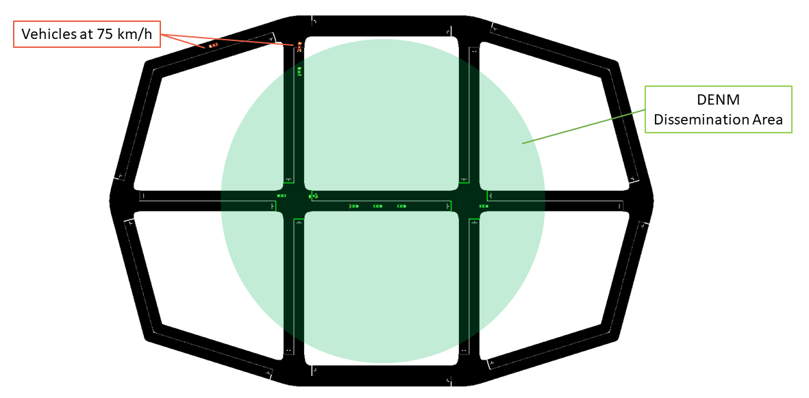
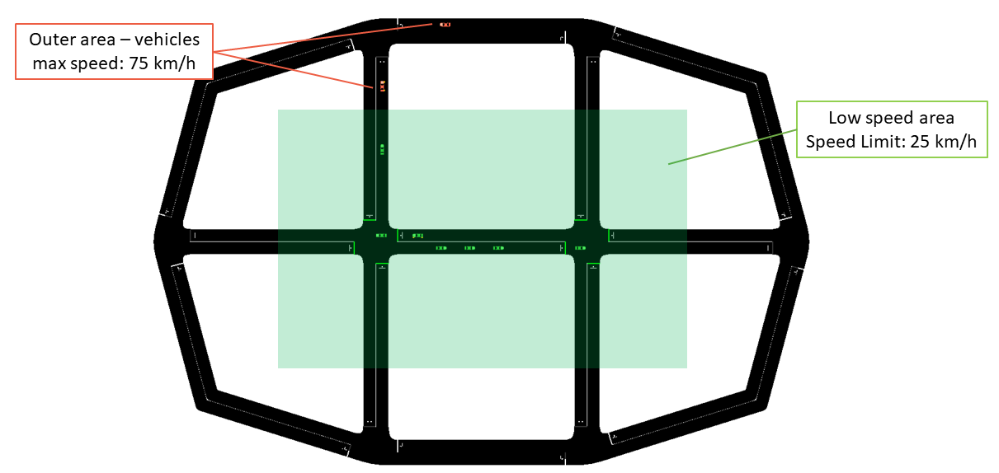
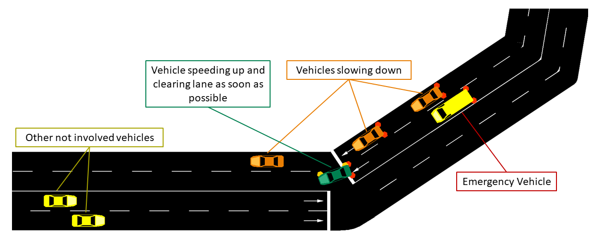

====================
Sample Applications
====================

*ms-van3t* supports two stacks/communication technologies for V2I/V2N:

- 802.11p, which communicates, for instance, with a Road Side Unit 
  (sample program name: ``v2i-areaSpeedAdvisor-80211p``)
- LTE, for V2N communications (sample program name: ``v2i-areaSpeedAdvisor-lte``)

Sample V2I example and V2I/V2N applications
===========================================

To run the sample V2I program, you can use the following commands:

.. code-block:: bash

   ./ns3 run "v2i-areaSpeedAdvisor-lte"
   ./ns3 run "v2i-areaSpeedAdvisor-80211p"

Nodes are created in the ns3 simulation as vehicles enter the SUMO simulation.
A full LTE or 802.11p stack is implemented at lower layers (depending on which example is run).

In this example, every vehicle that enters the scenario will start sending CAMs with a frequency between *1 Hz* and *10 Hz* (according to the ETSI standards). 

Then, the logic of the two sample applications for V2I/V2N is similar, but it differs slightly depending on whether 802.11p is used (V2I) or LTE is used (V2N).  

At a glance, in 802.11p vehicles broadcast periodic CAM messages and an RSU periodically broadcasts DENM messages to inform vehicles travelling in a low speed area to slow down. In this case CAMs and DENMs messages are encapsulated inside BTP and GeoNetworking.
In LTE, instead, the CAM messages are forwarded to a remote host (behind an eNB + EPC), which analyzes the position of the vehicles and sends unicast DENMs to vehicles entering a low speed area to change their maximum allowed speed. In this case, due to the absence of a MBMS module in the LTE framework of ns-3, all the messages are sent in unicast. 
CAM and DENM messages are encapsulated inside BTP, GeoNetworking, UDP and IP.

**802.11p application logic**
------------------------------

The map is divided into two areas: a circular area in the middle of the map, with a radius of 90 m, on which DENMs are broadcasted by the RSU (with their GeoArea set accordingly), where the maximum speed is 25km/h and an outer area, where the speed limit is set to 75km/h.

The RSU disseminates a DENM every second in the area mentioned before, and continues its transmissions until it receives CAMs from vehicles in the map. When no CAMs are received for more than 5 seconds, the DENM dissemination in paused, until new vehicles enter the scenario and new CAMs are received by the RSU.

**LTE application logic**
------------------------------

The map is divided into two areas: the area in the middle, where the maximum speed is 25km/h and an outer area, where the speed limit is set to 75km/h. In this case, DENMs cannot be transmitted using merely BTP and GeoNetworking, but they have to rely on UDP and IPv4, since the server is located in a remote host behind the eNB and EPC. The server checks whenever a transition between the two areas is performed by a vehicle, and, when it happens, it sends it a *unicast* DENM message to tell it to slow-down (or to let it speed-up again).

**Mobility Traces and Facilities Layer**
----------------------------------------

The mobility trace is contained in the file ``ns-3-dev/src/automotive/example/sumo_files_v2i_map/cars.rou.xml``.
This SUMO map embeds some re-routers allowing the vehicles to continuously move in the map.

The CAMs and DENMs dissemination logics are in the modules inside the ``automotive/Facilities`` folder while the application logic resides on (areaSpeedAdvisorClient80211p.cc/.h, areaSpeedAdvisorClientLTE.cc/.h) and (areaSpeedAdvisorServer80211p.cc/.h, areaSpeedAdvisorServerLTE.cc/.h) inside `automotive/Applications`.

The user *IS NOT* expected to modify the code inside the "Facilities", "BTP" and "GeoNet" folders, but rather to use the ETSI Facilities Layer methods inside the application.

**Important**
--------------

If using the LTE version in this very simple toy case, it is possible to connect at most 23 UEs to the enB (due to the LENA framework currently implemented features). You can avoid this problem by using the option `--ns3::LteEnbRrc::SrsPeriodicity=[value]"` where [value]=0, 2, 5, 10, 20, 40, 80, 160, 320. In this way you can add more UEs. Example: 

.. code-block:: bash

  ./ns3 run "v2i-areaSpeedAdvisory-lte --ns3::LteEnbRrc::SrsPeriodicity=160"

List of the most important options:
-----------------------------------

* ``--realtime                  [bool] decide to run the simulation using the realtime scheduler or not``
* ``--sim-time                  [double] simulation time``
* ``--sumo-gui                  [bool] decide to show sumo-gui or not``
* ``--server-aggregate-output   [bool] if true, the server will print every second a report on the number of DENM sent and CAM received correctly``
* ``--sumo-updates              [double] frequency of SUMO updates``
* ``--csv-log                   [string] prefix of the CSV log files where to save the disaggregated data coming from the CAMs received by the server and the DENMs received by the vehicles (the user can then use this sample application to build more complex logging mechanisms and/or log additional data coming from the server and/or the vehicles)``

Sample V2V example and V2V applications
=======================================

*ms-van3t* supports three stacks/communication technologies for V2V:

- 802.11p (sample program name: ``v2v-emergencyVehicleAlert-80211p``)
- LTE-V2X Mode 4 (sample program name: ``v2v-emergencyVehicleAlert-cv2x``)
- NR-V2X Mode 2 (sample program name: ``v2v-emergencyVehicleAlert-nrv2x``)

To run the program:

.. code-block:: bash

   ./ns3 run "v2v-emergencyVehicleAlert-cv2x"
   ./ns3 run "v2v-emergencyVehicleAlert-80211p"
   ./ns3 run "v2v-emergencyVehicleAlert-nrv2x"

Nodes are created in the ns3 simulation as vehicle enters the SUMO simulation.
A full NR-V2X, LTE-V2X or 802.11p stack is implemented at lower layers.

In this example, every vehicle that enters the scenario will start sending CAMs with a frequency between *1 Hz* and *10 Hz* (according to the ETSI standards). The vehicles are divided into "passenger" vehicles (i.e., normal vehicles) and "emergency" vehicles. 
A CAM generated by an emergency vehicle will have the "StationType" Data Element (i.e. a field of the message) set to "specialVehicles".
When normal vehicles receive these CAM messages from an emergency vehicle, they will check whether their heading is similar to the one of the emergency vehicle and which is their distance to the latter.
If the heading is similar and the distance is small enough, it means that the emergency vehicle is approaching. In this case, the receiving vehicles will either slow down (if on a different lane than the one the emergency vehicle is travelling on) or change lane as soon as possible (speeding up for a little while, if necessary, when they are on the same lane as the emergency vehicle).
When acting, in the SUMO GUI, vehicles will either turn orange (different lane --> slow down) or green (same lane --> clear path as soon as possible).

The CAMs and DENMs dissemination logic are in the modules inside the ``automotive/Facilities`` folder while the application logic is inside emergencyVehicleAlert.cc/.h (in ``automotive/Applications``).
The user *IS NOT* expected to modify the code inside the "Facilities", "BTP" or "GeoNet" folders, but rather to use the ETSI Facilities Layer methods inside the application.

The SUMO scenario comprehends a ring-like topology, with two directions and two lanes for each direction (with a total of 4 lanes). 

.. image:: v2v-road-topology.png

The mobility trace is contained inside the file `automotive/example/sumo_files_v2v_map/cars.rou.xml`.

The SUMO map also embeds some re-routers allowing the vehicles to continuously travel on the available road segments.

List of the most important options:
-----------------------------------

* ``--realtime                   [bool] decide to run the simulation using the realtime scheduler or not``
* ``--sim-time                   [double] simulation time``
* ``--sumo-gui                   [bool] decide to show sumo-gui or not``
* ``--sumo-updates               [double] frequency of SUMO updates``
* ``--csv-log:                   [string] prefix of the CSV log files where to save CAMs and DENMs disaggregated data and statistics``
