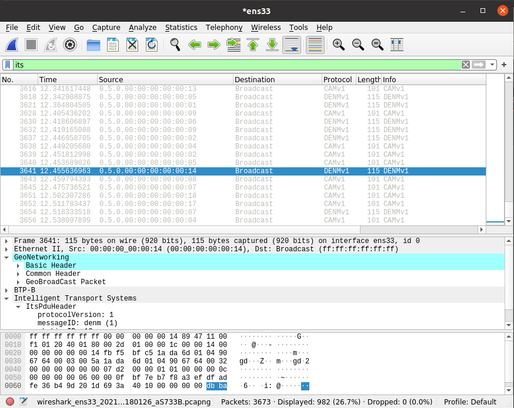

==================================
Sample V2X emulator application
==================================

*ms-van3t* also includes an example of an emulation application, which is able to send the CAMs and DENMs generated by the vehicles, (virtually) travelling on the SUMO map, over a real network, by relying on a physical interface.

The same application should also be able to receive CAMs and DENMs coming from the external world (i.e. from a certain physical interface of the device running ns-3).

For the time being, this sample application is relying on the same map and mobility traces of the V2V application and it sends both CAM messages and periodic DENM messages, as an example on how both kinds of messages can be emulated and sent to the external world.

In order to properly work, the emulator application should always run in real time, and the device on which ns-3 is run should be able to handle the specified number of vehicles without delays and without slowing down. 

As it is communicating with the external world, it handles only ASN.1 standard-compliant messages.

More in details, this application emulates N vehicles, each with its own CA and DEN basic service, and make them send the CAM/DENM messages and receive the CAM/DENM messages through a physical interface (specified with the "interface" option), instead of using any ns-3 simulated model.
This should enable, in the future, hardware-in-the-loop testing and evaluation.

You can run it with:

.. code-block:: bash

   ./ns3 run "v2x-emulator --interface=<interface name>"

Where `<interface name>` is the name of the physical interface, on your PC, where CAMs will be sent.

**Please note that the interface, in order to work with ns-3, should be put in promiscuous mode.**

You can put an interface in promiscuous mode with:

.. code-block:: bash

   sudo ip link set <interface name> promisc on

The promiscuous mode can then be disabled with:

.. code-block:: bash

   sudo ip link set <interface name> promisc off

`sudo` may be needed to use the underlying ns-3 *FdNetDevice*: if you get a "permission denied" error, try adding `--enable-sudo` when doing `./ns3 configure` and then running without `sudo` (ns3 will ask for your password if needed).  

The logic of the application is contained inside model/Applications/v2x-helper.c/.h

UDP mode
---------

In the default emulation mode, messages will be sent, through the specified interface, as broadcast packets encapsulated inside BTP and GeoNetworking.

The user can also specify, however, a UDP mode, enabling the transmission of messages to an external UDP server. In this case, the ETSI V2X messages (i.e. CAM, DENM) will be encapsulated inside BTP --> GeoNetworking --> UDP --> IPv4, and sent to a host with a specified IPv4 and port.

*Any host is fine, but the following limitations apply:*

- The remote UDP server must be able to reply to the ARP requests sent by the vehicles, which will use their own source IP address and MAC and **not** the ones of the physical interface
- No loopback operations are possible so far, due to the limitation mentioned before
- The network at which the physical interface is connected shall be able to support the communication using spoofed MAC and IP addresses (otherwise, the ARP requests sent by ns-3 may not receive any reply). In general, we verified that any Ethernet link between ns-3 and the remote host receiving the UDP packets should be fine.

Screenshots
-------------

The following screenshot shows a Wireshark capture of the messages sent by the emulator application, when operating in normal mode and selecting the `ens33` interface (e.g. `./ns3 run "v2x-emulator --interface=ens33"`)

The following screenshot shows a Wireshark capture of the messages sent by the emulator application, when operating in UDP mode, targeting a UDP server at 192.168.1.124/24, port 20000, and transmitting over the `ens33` interface (e.g. `./ns3 run "v2x-emulator --udp=192.168.1.124:20000 --interface=ens33 netmask=255.255.255.0 gateway=192.168.1.1"`)

.. image:: v2x-emulator-udp-mode.png

List of the most important options:
--------------------------------------

- ``--sim-time                   [double] total emulation/simulation time``
- ``--sumo-gui                   [bool] decide to show sumo-gui or not``
- ``--sumo-updates               [double] frequency of SUMO updates``
- ``--send-cam                   [bool] enable vehicles to send CAMs``
- ``--send-denm                  [bool] enable vehicles to send DENMs``
- ``--interface                  [string] Name of the physical interface to send(/receive) V2X messages to(/from)``
- ``--udp                		   [string] To enable UDP mode and specify UDP port and IP address where the V2X messages are redirected (format: <IP>:<port>)``
- ``--gateway                    [string] To specify the gateway at which the UDP/IP packets will be sent``
- ``--subnet                     [string] To specify the subnet which will  be used to assign the IP addresses of emulated nodes (the .1 address is automatically excluded)``
- ``--netmask                     [string] To specify the netmask of the network``
