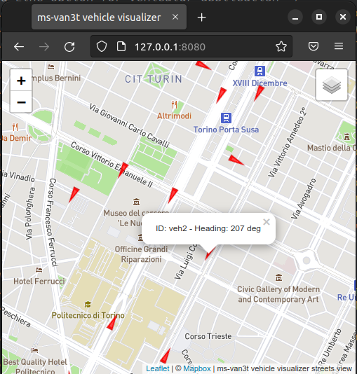

========
Modules
========
.. contents:: Table of Contents
    :local:

Automotive module
==================
The automotive module is the main module of **ms-van3t** containing all the sample applications, ETSI C-ITS sub-modules, and additional auxiliary sub-modules, all listed below: 

Facilities layer
----------------

Cooperative Awareness basic service (CABasicService)
~~~~~~~~~~~~~~~~~~~~~~~~~~~~~~~~~~~~~~~~~~~~~~~~~~~~
  
.. doxygenclass:: ns3::CABasicService
   :members:

Decentralized Environmental Notification basic service (DENBasicService)
~~~~~~~~~~~~~~~~~~~~~~~~~~~~~~~~~~~~~~~~~~~~~~~~~~~~~~~~~~~~~~~~~~~~~~~~

.. doxygenclass:: ns3::DENBasicService
   :members:

Infrastructure to Vehicle Information basic service (IVIBasicService)
~~~~~~~~~~~~~~~~~~~~~~~~~~~~~~~~~~~~~~~~~~~~~~~~~~~~~~~~~~~~~~~~~~~~~

.. doxygenclass:: ns3::IVIBasicService
   :members:

Collective Perception basic service (CPBasicService)
~~~~~~~~~~~~~~~~~~~~~~~~~~~~~~~~~~~~~~~~~~~~~~~~~~~~

.. doxygenclass:: ns3::CPBasicService
   :members:

Vehicle Data Provider (VDP)
~~~~~~~~~~~~~~~~~~~~~~~~~~~

.. doxygenclass:: ns3::VDPTraCI
   :members:

Local Dynamic Map (LDM)
~~~~~~~~~~~~~~~~~~~~~~~

.. doxygenclass:: ns3::LDM
   :members:

  
Networking and Transport layers
-------------------------------
  
Basic Transport Protocol (BTP)
~~~~~~~~~~~~~~~~~~~~~~~~~~~~~~

.. doxygenclass:: ns3::btp
   :members:

GeoNetworking (GeoNet) 
~~~~~~~~~~~~~~~~~~~~~~

.. doxygenclass:: ns3::GeoNet
   :members:

Measurements 
------------
  
Packet Reception Ratio supervisor (PRRsupervisor)
~~~~~~~~~~~~~~~~~~~~~~~~~~~~~~~~~~~~~~~~~~~~~~~~~

.. doxygenclass:: ns3::PRRSupervisor
   :members:

Utilities
---------

SUMO sensor
~~~~~~~~~~~

.. doxygenclass:: ns3::SUMOSensor
   :members:

GPS-tc module
=============
The *gps-tc* module provides classes and functions to leverage offline-collected GNSS traces. This module allows realistic positioning data rather than artificial traces created with SUMO.

Vehicle Visualizer module
=========================

**Requirement:** if you want to use this module, Node.js should be installed (on Ubuntu/Debian you can install it with ``sudo apt install nodejs``).

``ms-van3t`` also comes with a web-based vehicle visualizer, able to display the vehicles travelling
during the simulation on a map, rendered directly inside the user's browser.
It can be particularly useful when working with GPS Traces (see the ``gps-tc`` module), which are not
coupled with a GUI (as opposed to SUMO).

If you want to fully exploit its potentiality, you need a Mapbox token, as the visualizer
relies on Mapbox to draw the street, hybrid and satellite map layers.

**Once you get it, the mapbox token shall be copied inside the file ``mapbox_token`` in ``src/vehicle-visualizer/js``**

You can find more information on Mapbox `here <https://www.mapbox.com/>`_. They currently have quite good free tier options (allowing, at least in March 2021, up to 200000 free tile requests/month),
which should be enough to use the ms-van3t vehicle visualizer without the need of paying anything. Please check them before signing up to Mapbox
and getting a token to be used here. In general, we found out that a normal simulation, in which some sporadic zoom in/zoom out and
three layer changes are performed, may require around 150/200 tile requests (we advise you to check often the tile request count on the Mapbox website, when you use your token).

In general, you should disable the vehicle visualizer when doing long batches of simulations.
If you do not own a Mapbox token (i.e. the ``mapbox_token`` file is empty), the visualizer will work in any case, with the following limitations:

- You **must** make an **occasional** use of the visualizer (i.e. **no** heavy usage allowed, **no** derivative apps can be developed starting from the visualizer). Not making an occasional usage will conflict with the `Tile Usage Policy <https://operations.osmfoundation.org/policies/tiles/>`_ of OpenStreetMap, which is not considered acceptable. So, you **must disable** the vehicle-visualizer when doing batches of simulations to gather some results. **You are responsible for this!**

- Only one map layer (standard streets view from OpenStreetMap) will be available for use  

In order to use the visualizer in your application, you need to add, in the main function (i.e. ``int main()``),
the following code, which creates a new ``vehicleVisualizer`` object::

    vehicleVisualizer vehicleVisObj;
    Ptr<vehicleVisualizer> vehicleVis = &vehicleVisObj;
    vehicleVis->startServer();
    vehicleVis->connectToServer ();

Do **not** create a new ``vehicleVisualizer`` object with ``CreateObject`` or ``new``, unless you plan to manually
call ``delete`` on it, as we rely on the object destructor in order to send a terminate message to the web visualizer
server and gracefully terminate it.

After creating a new vehicle visualizer object, you need to pass its pointer to the module which manages the vehicle's mobility.
If you are using SUMO and TraCI, you can call::

    sumoClient->SetAttribute ("VehicleVisualizer", PointerValue (vehicleVis));

Where sumoClient is a pointer to TraCI client object (``Ptr<TraciClient>``) you previously created.

If you are using, instead, GPS-tc, you can call::

    GPSTCHelper.setVehicleVisualizer(vehicleVis);

Where ``GPSTCHelper`` is a ``GPSTraceClientHelper`` object. In this case, ``setVehicleVisualizer()``
must be called **before** ``createTraceClientsFromCSV()``, otherwise the vehicle visualizer
reference will not be passed to the GPS Trace Client objects managing the mobility of the
vehicles and no moving vehicles will appear on the map.

The vehicles displayed by the visualizer can also be inserted and updated from user applications (e.g. in an emulator application, you
can use the CAMs received from the external world to add real vehicles to the map, together
with the simulated ones).

In order to add and update a moving object from an application, the latter should have, first of all,
a reference to the visualizer object (i.e. ``Ptr<vehicleVisualizer>``). Then, it will be able to use
``<name of pointer to the vehicleVisualizer>->sendObjectUpdate()`` to add and update any object in the map.
In this case it is important to specify, as first argument of the ``sendObjectUpdate()`` function, an object ID which must be different from the IDs of the simulated
vehicles.

You can also refer to the examples inside ``src/automotive/examples``, which all (but the V2X emulator) include the possibility
of using the web-based vehicle visualizer via the ``--vehicle-visualizer=true`` option.

The visualizer, once a simulation has been started, can be opened inside any browser, as long as the simulation is running, at ``localhost:8080`` (if a different HTTP port is not specified with the ``setHTTPPort()`` method of the ``vehicleVisualizer`` object).

