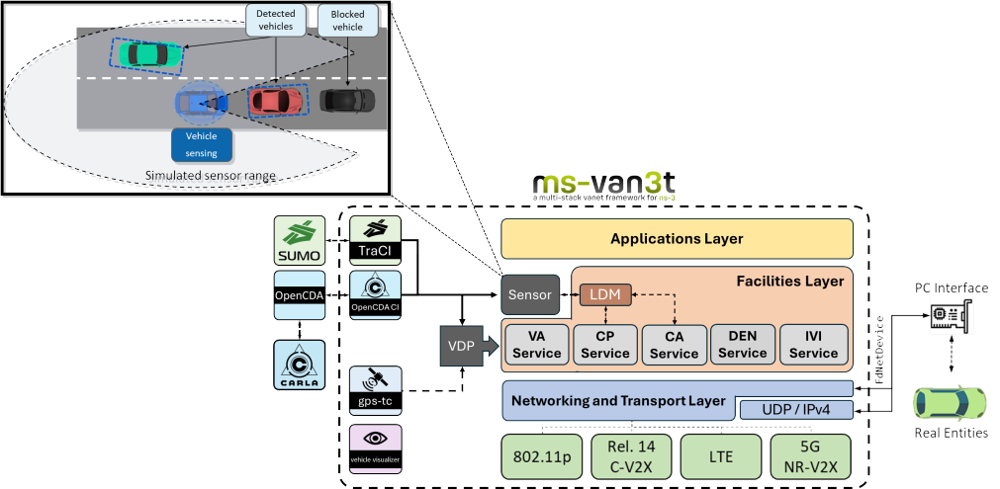

Welcome to ms-van3t's documentation!
====================================

**ms-van3t** provides ns-3 modules to build and simulate ETSI-compliant VANET (V2X) applications using SUMO (v-1.6.0+) and ns-3 (ns-3-dev, version supporting the NR-V2X module by CTTC), with the possibility of easily switching stack and communication technology.

It has been tested with SUMO v1.6.0, v1.7.0, v1.8.0, v1.12.0, v1.18.0 on Ubuntu 20.04 and 22.04. Back compatibility **is not** ensured with new versions of TraCI.

Supported ETSI C-ITS messages
-------------------------------

*ms-van3t* currently supports the following ETSI C-ITS messages:

- CAM
- DENM
- IVIM
- CPM
- VAM

Supported access technologies
-------------------------------

*ms-van3t* currently supports state-of-the-art models for the following access technologies:

- IEEE 802.11p
- 3GPP LTE
- `3GPP Release 14 LTE-V2X <https://github.com/FabianEckermann/ns-3_c-v2x>`_
- 3GPP Release 16 5G NR-V2X

Contents
--------

.. toctree::

   installation
   IDE
   CARLA
   Simulation
   Applications
   Emulation
   Modules
   Acknowledgements

.. note::

   This project is under active development.
