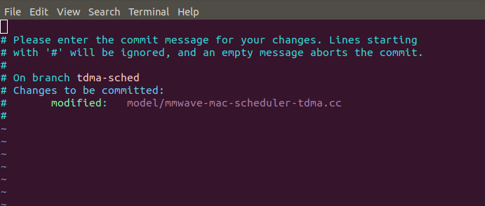
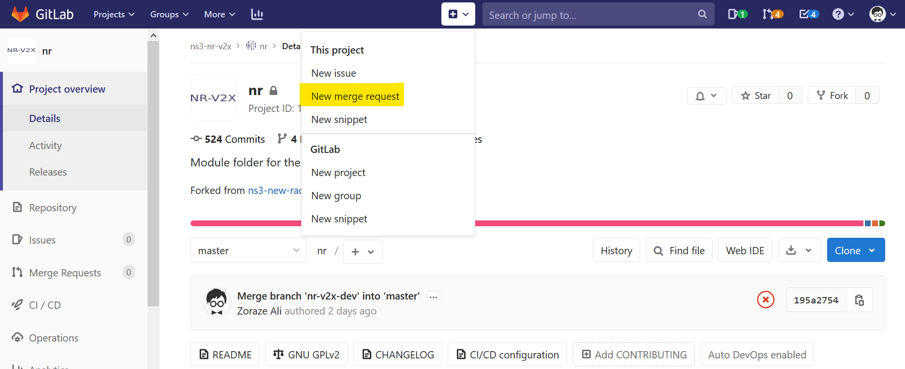
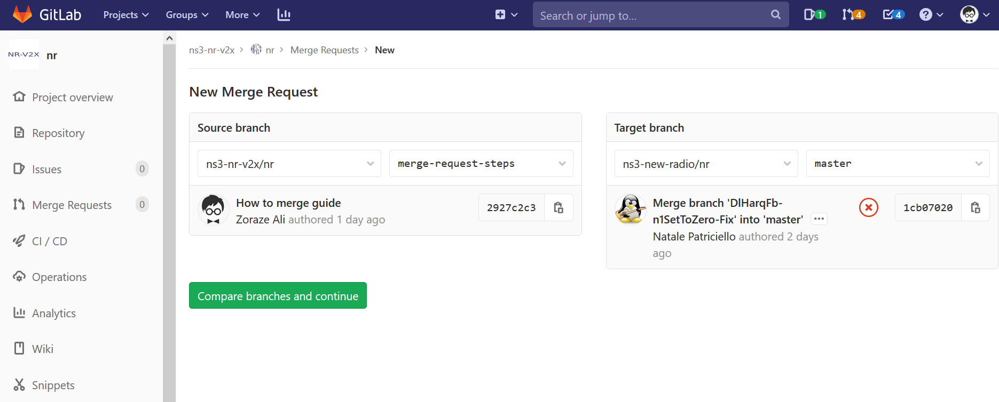
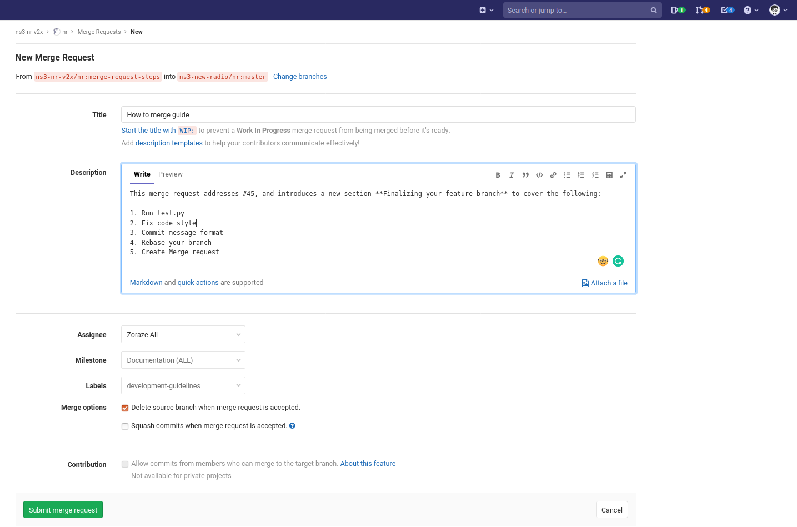

Development guidelines       {#devguidelines}
======================

When in doubt when writing something, please refer to this page to get
some hints. DISCLAIMER: These are not rules. You can override them using the
force (not git --force)

### Table of Contents

[GPL header](#GPL-header)

[Header inclusion](#header-inclusion)

[API design](#api-design)

[Finalizing your feature branch](#finalizing-your-feature-branch)

1. [Run "test.py"](#1-run-testpy)
2. [Fix code style](#2-fix-code-style)
3. [Commit message format](#3-commit-message-format)
4. [Rebase your branch](#4-rebase-your-branch)
5. [Create Merge request](#5-create-merge-request)
6. [Documentation](#6-documentation)

GPL header
----------

At the beginning of every file, please put:

```
/* -*-  Mode: C++; c-file-style: "gnu"; indent-tabs-mode:nil; -*- */
/*
 *   Copyright (c) 2019 Centre Tecnologic de Telecomunicacions de Catalunya (CTTC)
 *
 *   This program is free software; you can redistribute it and/or modify
 *   it under the terms of the GNU General Public License version 2 as
 *   published by the Free Software Foundation;
 *
 *   This program is distributed in the hope that it will be useful,
 *   but WITHOUT ANY WARRANTY; without even the implied warranty of
 *   MERCHANTABILITY or FITNESS FOR A PARTICULAR PURPOSE.  See the
 *   GNU General Public License for more details.
 *
 *   You should have received a copy of the GNU General Public License
 *   along with this program; if not, write to the Free Software
 *   Foundation, Inc., 59 Temple Place, Suite 330, Boston, MA  02111-1307  USA
 *
 */
```

Please note that (1) in the future we may remove the (stupid) line that is
indicating to Emacs what is the style of the file, and (2) we may replace the
entire GPL header with the following SPDX identifier: `// GPL-2.0-only`.

Please note that we do not use the convention of putting authors, as we don't
have a clear definition of an author. Moreover, even if we had it, it would be
useless as our users write to the generic 5G-LENA email address, or open a bug
in the gitlab interface (and then we will assign it internally).

Header inclusion
----------------

In a `.h` file, please include only the headers strictly needed by the unit,
and forward-declare everything else. An example is the following:

```
#include "MyBossClass.h"
#include "Mac.h"

class Spectrum; // forward-declaration
class Phy; // forward-declaration

class MyPreciousClass : public MyBossClass // Cannot be forward-declared
{
public:
  MyPreciousClass ();

private:
  Ptr<Spectrum> m_spectrum;  //!< Pointer to Spectrum: can be forward-declared
  Mac m_mac;                 //!< Instance to Mac: cannot be forward-declared
  std::shared_ptr<Phy> m_phy;//!< Another pointer: Can be forward-declared
};
```

A typical cleaning task is to take one random `.h` file, and check that the
includes are really needed. If not, then, move the include to the `.cc` file,
and forward-declare the type in the header file. Of course, you may get
compiler errors: but we are sure you can fix them.

*Why the forward-declaration is so important?* Well, the reasons are two:

1. Reduce compile times;
2. Break cyclic references when two definitions both uses each other.

Note that the files from the local folder are included by using "", 
while the files from the other folders are included with <>, 
i.e., files that are included with "ns3/" prefix. E.g.,: 

```
#include <ns3/log.h> // inclusion of a header from another folder
#include "nr-phy.h"  // inclusion of a header from the same folder
```


API design
----------

This is heavily inspired by [this article by M. Ettrich](https://doc.qt.io/archives/qq/qq13-apis.html).

An API is the interface of our code towards the other. As good people, we do not
want others to suffer... so, your new and shiny API must be:


* **minimal**: A minimal API is one that has as few public members per class
and as few classes as possible. This makes it easier to understand, remember,
debug, and change the API.

* **complete**: A complete API means the expected functionality should be there.
This can conflict with keeping it minimal. Also, if a member function is in
the wrong class, many potential users of the function won't find it.

* **simple**: As with other design work, you should apply the principle of
least surprise. Make common tasks easy. Rare tasks should be possible but not
the focus. Solve the specific problem; don't make the solution overly general
when this is not needed.

* **intuitive**: As with anything else on a computer, an API should be intuitive.
Different experience and background leads to different perceptions on what is
intuitive and what isn't. An API is intuitive if a semi-experienced user gets
away without reading the documentation, and if a programmer who doesn't know
the API can understand code written using it.

* **memorizable**: To make the API easy to remember, choose a consistent and
precise naming convention. Use recognizable patterns and concepts, and avoid
abbreviations.

* **readable**: Code is written once, but read (and debugged and changed)
many times. Readable code may sometimes take longer to write, but saves
time throughout the product's life cycle.

* **correct**: The code must do what the interface says. For example, if a class
has a public *Set\** method, it must be possible to call the method as many
times as the user wishes, expecting the method to setup everything else in a
correct way. If this action is not possible, then the value is not an Attribute
(a property) but is a characteristic, immutable, and hence has to be set in the
constructor.

For C++:

###### Pointers vs. References

Which is best for out-parameters, pointers or references?

```
void getHsv(int *h, int *s, int *v) const
void getHsv(int &h, int &s, int &v) const
```

Most C++ books recommend references whenever possible, according to the
general perception that references are "safer and nicer" than pointers.
In contrast, smart people tend to prefer pointers because they make the user
code more readable. Compare:

```
 color.getHsv(&h, &s, &v);
 color.getHsv(h, s, v);
```

Only the first line makes it clear that there's a high probability that h, s,
and v will be modified by the function call.

That said, compilers really don't like out parameters, so you should avoid
them in new APIs. Instead, return a small struct:

```
struct Hsv { int hue, saturation, value };
Hsv getHsv() const;
```

Lastly, don't think that Ptr<> class is equivalent to a pointer.

```
static void MyInit (Ptr<SomeClass> v)
{
    v = CreateObject<SomeClass> ();
}

int main ()
{
    Ptr<SomeClass> a;
    MyInit (a);

    std::cout << a->m_someValue << std::endl; // How to get a nice SEGFAULT

    return 0;
}
```

This introduces the next point...

###### Passing by const-ref vs. Passing by value

* If the type is bigger than 64 bytes, pass by const-ref.

* If the type has a non-trivial copy-constructor or a non-trivial destructor,
pass by const-ref to avoid executing these methods. *This includes smart pointers*.

* All other types should usually be passed by value.

Example:

```
void SetK2 (uint32_t k2);
void SetCategory (char cat);
void SetName(const std::string &name);
void SetAlarm (const Ptr<Time> &alarm); // const-ref is much faster than running copy-constructor and destructor
void SetAlarm (const Time &time);
```

and therefore:

```
static void MyInit (Ptr<SomeClass> *v)
{
    *v = CreateObject<SomeClass> ();
}

int main ()
{
    Ptr<SomeClass> a;
    MyInit (&a);  // See? a is going to be modified

    std::cout << a->m_someValue << std::endl; // Everything works!

    return 0;
}
```

###### Avoiding virtual functions

There is no much to say here; virtual functions are slow, and often are not
needed (see [this article](https://medium.com/humans-create-software/composition-over-inheritance-cb6f88070205)).

###### const correctness

Put const everywhere. Always. When something is broken, check why. If it makes
sense, then remove the const keyword.

For everything else, please read [here](https://wiki.qt.io/API_Design_Principles)

Finalizing your feature branch
------------------------------

Once you are done with your feature implementation or fixing a bug, following
the underlying steps will ease the process to review, and merge your code into
the master branch.

### 1. Run "test.py"

After successful compilation, and before doing a commit it is
useful to run "test.py" script to make sure that the new changes have not
caused other part of the code to fail. This script can be run from the
**ns-3-dev** root folder:

```
./test.py
```

Please note that if your branch contains some newly added examples, 
these examples should be added to the list of examples in 
"nr/test/examples-to-run.py" script. 
If an example has very different modes of executions, 
it is recommended to provide different configurations that would configure 
the example for these different cases. See, for example, configurations for 
"cttc-nr-cc-bwp-demo":

```
("cttc-nr-cc-bwp-demo --tddPattern=\"DL|S|UL|UL|DL|DL|S|UL|UL|DL|\"", "True", "True"),
("cttc-nr-cc-bwp-demo --tddPattern=\"F|F|F|F|F|F|F|F|F|F|\"", "True", "True"),
```

It is important to add all examples to "examples-to-run.py" script because this 
script is used by "test.py" to fetch the list of examples for each module that will 
be run along with the tests (when running test.py) in order to check the correct 
functioning of each module.

### 2. Fix code style

**Note: check-style.py script should be run to fix the code style format of new files
only (i.e., .cc or .h).**

At all time, if possible, one should follow the ns-3 coding style guidelines
listed [here](https://www.nsnam.org/develop/contributing-code/coding-style/).

To expedite this process, ***ns-3*** provides a script **check-style.py**, found
in **utils** directory. More details about this script and its usage can be
found [here](https://www.nsnam.org/doxygen/group___check_style.html).

To fix the style of a new file, issue the following command from the root folder of
**ns-3-dev**:

```
utils/check-style.py --level=3 --in-place -f src/nr/model/your-new-file.cc
```

After the above two steps, we can commit our changes.

### 3. Commit message format

To the point and precise commit messages are always appreciated. Therefore,

it is advised to follow the following rules to commit like a pro:

1.  Subject of a commit message should not exceed 80 characters.

2. More description about ***what*** and ***why*** should go to the body of a
   commit message.

3. Each commit message should start with a ***tag*** in small letters.

4. Tag should immediately (no space) follow by a colon **":"** sign.

5. Add space after the colon **":"** sign to start the message.

6. This message should have the first letter as **capital**.

7. Do not end the subject line with a period.

For example, the following commit tells us that it introduced a change at the
MAC layer, and specifically in the scheduler.

```
-------------- subject of a commit message -------------
mac-sched: Do not assume there are always UE to schedule
---Tag --- ----------- This is the message -------------
```

Now, lets assume that we need to include a description about the change, e.g,
why that change was introduced, and which issue number this commit going to
address. All of this information should go to the body of the commit message. To
do this, issue the following command:

```
~/ns-3-dev/src/nr$ git commit
```

This would open your default Git editor, here we would use the default Vim editor.



Now, press **i** to insert your commit message, i.e., the commit subject line, the
commit body, and the string to close the issue, each of them separated by a blank
line. For example:


Notice, **Closes #1**. **Closes** is a special GitLab flag to close an issue
automatically when the feature branch is merged into the master. And, **#** is
used to reference an issue.

Now, press **Esc** to go out of insert mode, and then type **:wq** to save and
quit. It would look like the following:


It is time to hit the enter key! After this, you have successfully commit your
new changes. We are almost there to generate a merge request. However, you should
first check if the master branch has progressed or not. If it does not, go to step 5.
Otherwise, we need to rebase our branch to include new changes in the master branch.


### 4. Rebase your branch

The primary reason for rebasing is to maintain a linear project history. For
example, consider a situation where the master branch has progressed since you
started working on a feature branch. You want to get the latest updates to the
master branch in your feature branch, but you want to keep your branch's history
clean so it appears as if you've been working off the latest master branch. This
gives the later benefit of a clean merge of your feature branch back into the
master branch. It's very important to understand that even though the branch
looks the same, it's composed of entirely new commits.

To rebase your branch over master first switch to your branch, and then run
the following command:

```
git rebase master
```
If there are no conflicts, git will rewind the head of your branch and apply your
changes on top of latest commit on master. In case of conflicts, solve them
following your usual way, and then issue the following command:

```
git rebase --continue
```
In case, you have no idea what is going on and you need help, better abort:

```
git rebase --abort
```

Finally, we are now ready to create a merge request.

### 5. Create Merge request

Every merge request starts by creating a branch. So, if you are reading this
section we believe that you have commit your changes in your new shiny branch,
and have rebased it over master (If master branch has progressed). 

Once you have pushed a new branch to GitLab, visit your repository in GitLab
and to see a call-to-action at the top of your screen from which you can click
the button Create Merge Request.


You can also create a merge request from the project page:

* By expending the drop down menu with **+** sign icon.



* By clicking the **Merge Requests** option on the left.


Click the button **New merge request**. On the next page, choose your source and
target branch. For example:



Click on the button **Compare branches and continue**, fill in the following fields:

* Title
* Description
* Assignee (It is you)
* Milestone
* Labels

For example:



Optionally, unchecked the box **"Delete source branch when merge request is accepted."**
if it is not desirable. Then, click the button **Submit merge request**. Congratulations,
you have created your first merge request.

##### How to close a merge automatically upon merging the feature branch into the master?

Git automatically closes a merge request if its index is mentioned in the description
of a commit in the feature branch to be merged in the master. Now, for an issue
in the issue tracker, the index is known before creating a merge request
to fix it; therefore, one could easily mention it in the description
of a commit. On the other hand, to merge a new feature branch, we need first to
create a merge request to know its index. So, once we have created a merge
request following the above steps, it is time to modify the latest commit
message of our feature branch by using the following command.

```
git commit --amend
```

This would open your default Git editor, here we would use the default Vim
editor and follow the same steps mentioned in [Step 3](#3-commit-message-format)
to edit the commit. Press **i** to enter in the edit mode, move the cursor till the
end of your commit subject line and then hit enter key twice. This would separate
our new line by a blank line. The new message line should look like the following:

```
see MR !the-index-of-merge-request
```

Notice, **!** sign. It is very important to use **!** sign to mention a
merge request. Now, press **Esc** to go out of insert mode, and then type
**:wq** to save and quit. Since we have changed the commit message we need to
update our remote feature branch by doing a force push.

```
git push -f
```

##### What if the master branch has progressed after creating the merge request? 

This is a very usual case during an active development project. If this happens,
we need to rebase our feature branch following the [Step 4](#4-rebase-your-branch),
and force push to our remote branch using the following command.

```
git push -f
```

### 6. Documentation

The design of new features implemented in the module has to be documented in nr-module.rst
within the nr/doc/source folder, Section 2 (design). The design description
includes: the current NR specification (with references to NR docs)
and the design choice in the module (with supported features and functionalities).
References to classes are not included; however, attributes are detailed,
to give the user a high-level description of what can be configured.

Also, nr-module.rst file includes the list of tests and examples with a brief
description and a link to the corresponding doxygen documentation
for each of them. Any new test and/or example, needs to be included there as well.

To compile the documentation file, from src/nr/doc, do:

```
make latexpdf
```

and a PDF file (NRModule.pdf) will be created inside nr/doc/build/latex.

#### How to create the documentation for a test

Any test (i.e., a file is under the nr/test directory) must include the
description of the file itself, which explains what is the purpose of the test,
and how is working. For example:

```
/**
  * \file test-timings.cc
  * \ingroup test
  *
  * \brief Check numerology timings. The test, that is run for every numerology,
  * checks that the slot number of certain events is the same as the one
  * pre-recorded by an expert, that spent time in checking that such timing is
  * correct. We currently check only RAR and DL_DCI messages, improvements are
  * more than welcome.
  */
```

The block must start with the command `\file` plus the filename, and must be
in the `test` group. The brief description must be complete, and without empty
lines. In this way, the description will be in the forefront of the main test
page group.

The doxygen for the classes or method is optional.
