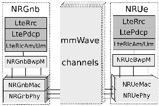

Module Documentation
----------------------------

.. highlight:: cpp

.. heading hierarchy:
   ------------- Chapter
   ************* Section (#.#)
   ============= Subsection (#.#.#)
   ############# Paragraph (no number)

..
   The document is written following RST formatting. Please, check your writing on grammarly; to ease it, use the auto-wrapping feature of your text editor, without entering new lines unless you would like to start a new paragraph.

.. toctree::
   :maxdepth: 3
   :caption: Table of Contents

Introduction
------------
The 3rd Generation Partnership Project (3GPP) has devoted significant efforts to standardize the fifth-generation (5G) New Radio (NR) access technology [TS38300]_, which is designed to be extremely flexible from its physical layer definition and up to the architecture. The objective is to be able to work in a wide range of frequency bands and address many different use cases and deployment options.

As the NR specification is developed and evolves, a network simulator that is capable of simulating emerging NR features is of great interest for both scientific and industrial communities. In recent years a lot of effort has been made by New York University (NYU) Wireless and the University of Padova to develop a simulator that will allow simulations of communications in millimeter-wave (mmWave) bands, the heart of future 5G cellular wireless systems. Hence, a new mmWave simulation tool has been developed as a new module of ns-3. A complete description of the mmWave module is provided in [end-to-end-mezz]_. The mmWave module source code is still not part of the standard ns-3 distribution and is available at a different repository [mmwave-module]_. In the mmWave module, the physical (PHY) layer and medium access control (MAC) are a modified version of the ns-3 'LTE' PHY and MAC layers, supporting a mmWave channel, propagation, beamforming, and antenna models. The MAC layer supports Time Division Duplexing (TDD), and a Time Division Multiple Access (TDMA) MAC scheduling, with enhanced Hybrid Automatic Repeat and reQuest (HARQ) for low latency applications. The higher layers are mostly based on ns-3 'LTE' module functionalities but are extended to support features such as dual connectivity and low latency radio link control (RLC) layer.

In this document, we describe the implementation that we have initiated to generate a 3GPP-compliant NR module able to provide ns-3 simulation capabilities in the bands above and below 6 GHz, aligned with 3GPP NR Release-15, following the description in [TS38300]_. The work has been initially funded by InterDigital Communications Inc, and continues with funding from the Lawrence Livermore National Lab (LLNL) and a grant from the National Institute of Standards and Technologies (NIST).

The 'NR' module is a hard fork of the 'mmWave' simulator,  focused on targeting the 3GPP Release-15 NR specification. As such, it incorporates fundamental PHY-MAC NR features like a flexible frame structure by means of multiple numerologies support, bandwidth parts (BWPs), Frequency Division Multiplexing (FDM) of numerologies, Orthogonal Frequency-Division Multiple Access (OFDMA), flexible time- and frequency- resource allocation and scheduling, Low-Density Parity Check (LDPC) coding for data channels, modulation and coding schemes (MCSs) with up to 256-QAM, and dynamic TDD, among others. The NR module still relies on higher layers and core network (RLC, PDCP, RRC, NAS, EPC) based on ns-3 'LTE' module, thus providing an NR non-standalone (NSA) implementation.

The source code for the 'NR' module lives currently in the directory ``src/nr``.

Over time, extensions found in this module may migrate to the existing ns-3 main development tree.

The rest of this document is organized into five major chapters:

2. **Design:**  Describes the models developed for ns-3 extension to support NR features and procedures.
3. **Usage:**  Documents how users may run and extend the NR test scenarios.
4. **Validation:**  Documents how the models and scenarios have been verified and validated by test programs.
5. **Open Issues and Future Work:**  Describes topics for which future work on model or scenario enhancements is recommended, or for which questions on interpretations of standards documents may be listed.

Design
------
In this section, we present the design of the different features and procedures that we have developed following 3GPP Release-15 NR activity. For those features/mechanisms/layers that still have not been upgraded to NR, the current design following LTE specifications is also indicated.

Architecture
************
The 'NR' module has been designed to perform end-to-end simulations of 3GPP-oriented cellular networks. The end-to-end overview of a typical simulation with the 'NR' module is drawn in Figure :ref:`fig-e2e`. In dark gray, we represent the existing, and unmodified, ns-3 and LENA components. In light gray, we describe the NR components. On one side, we have a remote host (depicted as a single node in the Figure, for simplicity, but there can be multiple nodes) that connects to an PGW/SGW (Packet Gateway and Service Gateway), through a link. Such a connection can be defined with any technology that is currently available in ns-3.  The diagram illustrates a single link, but there are no limits on the topology, including any number of remote hosts. Inside the SGW/PGW, the ``EpcSgwPgwApp`` encapsulates the packet using the GTP protocol. Through an IP connection, which represents the backhaul of the NR network (again, described with a single link in the Figure, but the topology can vary), the GTP packet is received by the gNB. There, after decapsulating the payload, the packet is transmitted inside the NR stack through the entry point represented by the class ``NRGnbNetDevice``. The packet, if received correctly at the UE, is passed to higher layers by the class ``NRUeNetDevice``. The path crossed by packets in the UL case is the same as the one described above but in the opposite direction.

.. _fig-e2e:

.. figure:: figures/drawing2.*
   :align: center
   :scale: 80 %

   End-to-end class overview

Concerning the RAN, we detail what is happening between ``NRGnbNetDevice`` and ``NRUeNetDevice`` in Figure :ref:`fig-ran`. The ``NRGnbMac`` and ``NRUeMac`` MAC classes implement the LTE module Service Access Point (SAP) provider and user interfaces, enabling the communication with the LTE RLC layer. The module supports RLC TM, SM, UM, and AM modes. The MAC layer contains the scheduler (``NRMacScheduler`` and derived classes). Every scheduler also implements an SAP for LTE RRC layer configuration (``LteEnbRrc``). The ``NrPhy`` classes are used to perform the directional communication for both downlink (DL) and uplink (UL), to transmit/receive the data and control channels. Each ``NrPhy`` class writes into an instance of the ``NrSpectrumPhy`` class, which is shared between the UL and DL parts.

.. _fig-ran:

   RAN class overview

Two interesting blocks in Figure :ref:`fig-ran` are the ``NRGnbBwpM`` and ``NRUeBwpM`` layers. 3GPP does not explicitly define them, and as such, they are virtual layers. Still, they help construct a fundamental feature of our simulator: the multiplexing of different BWPs. NR has included the definition of 3GPP BWPs for energy-saving purposes, as well as to multiplex a variety of services with different QoS requirements. The component carrier concept was already introduced in LTE, and persists in NR through our general BWP concept, as a way to aggregate carriers and thereby improve the system capacity. In the 'NR' simulator, it is possible to divide the entire bandwidth into different BWPs. Each BWP can have its own PHY and MAC configuration (e.g., specific numerology, scheduler rationale, and so on). We added the possibility for any node to transmit and receive flows in different BWPs, by either assigning each bearer to a specific BWP or distributing the data flow among different BWPs, according to the rules of the manager. The introduction of a proxy layer to multiplex and demultiplex the data was necessary to glue everything together, and this is the purpose of these two new classes (``NRGnbBwpM`` and ``NRUeBwpM``).

Note: The 3GPP definition for "Bandwidth Part" (BWP) is made for energy-saving purposes at the UE nodes. As per the 3GPP standard, the active 3GPP BWP at a UE can vary semi-statically, and multiple 3GPP BWPs can span over the same frequency spectrum region. In this text, and through the code, we use the word BWP to refer to various things that are not always in line with the 3GPP definition.

First of all, we use it to indicate the minimum piece of spectrum that can be modeled. In this regard, a BWP has a center frequency and a bandwidth, plus some characteristics for the 3GPP channel model (e.g., the scenario). Each device can handle multiple BWPs, but such BWPs must be orthogonal in frequency (i.e., they must span over different frequency spectrum regions, that can be contiguous or not, depending on the user-defined configuration).

Secondly, the 'NR' module is communicating through each BWP with a PHY and a MAC entity, as well as with one spectrum channel and one antenna instance. In other words, for every spectrum bandwidth part, the module will create a PHY, a MAC, a Spectrum channel, and an antenna. We consider, in the code, that this set of components form a BWP. Moreover, we have a router between the RLC queues and the different MAC entities, which is called the BWP manager.

Summarizing, our BWP terminology can refer to orthogonal 3GPP BWPs, as well as to orthogonal 3GPP Component Carriers, and it is up to the BWP manager to route the flows accordingly based on the behavior the user wants to implement. Our primary use case for BWPs is to avoid interference, as well as to send different flow types through different BWPs, to achieve a dedicated-resource RAN slicing.

Identifying components
**********************

Often, a simulation user will need to identify the object from which some messages come from, or to be able to read the output traces correctly. Each message will be associated with one tuple -- ccId and bwpId. The meaning of these names does not reflect the natural sense that we could give to these words. In particular, the definition is the following:

* the bwpId is the index of an imaginary vector that holds all the instances of BWP (as a paired MAC/PHY) in the node. It is assigned at the creation time by the helper, and the BWP with ID 0 will be the primary carrier;
* the ccId is a number that identifies the MAC/PHY pair uniquely in the entire simulation.

All the nodes in the simulation will have the same number of BWPs. Each one will be numbered from 0 to n-1, where n is the total number of spectrum parts. For example:

.. _tab-example-spectrum:

.. table:: An example spectrum division

   +------------+------------+---------------+---------------+---------------+
   |                                Band 1                                   |
   +------------+------------+---------------+---------------+---------------+
   |   CC 0                  |       CC 1                    |     CC 2      |
   +------------+------------+---------------+---------------+---------------+
   |          BWP0           |              BWP1             |      BWP2     |
   +------------+------------+---------------+---------------+---------------+

The ccId numbering is, for some untrained eyes, weird. But that is because some numbers in the sequence are used to identify the Cell ID. For example, let's consider a scenario in which we split the spectrum into three parts. We have four GNBs, and the numbering will be the following:

.. _tab-example-bwp:

.. table:: CcId numbering example

   +------------+------------+---------------+---------------+---------------+
   |    GNB     |  Cell ID   | CcId for BWP0 | CcId for BWP1 | CcId for BWP2 |
   +============+============+===============+===============+===============+
   |   GNB 0    |      1     |       2       |       3       |      4        |
   +------------+------------+---------------+---------------+---------------+
   |   GNB 1    |      5     |       6       |       7       |      8        |
   +------------+------------+---------------+---------------+---------------+
   |   GNB 2    |      9     |       10      |       11      |      12       |
   +------------+------------+---------------+---------------+---------------+
   |   GNB 3    |      13    |       14      |       15      |      16       |
   +------------+------------+---------------+---------------+---------------+

If we would use this as a simulation scenario, the messages that come from the CcId 2, 6, 10, 14, would refer to the same portion of the spectrum. These IDs, internally at the GNB, would be translated into the BWP 0 in all the cases. The BWP 1 will be associated with the CcId 3, 7, 11, 15 (respectively), and everything else follows.

PHY layer
*********
This section describes in detail the different models supported and developed at PHY layer.

Frame structure model
=====================
In NR, the 'numerology' concept is introduced to flexibly define the frame structure in such a way that it can work in both sub-6 GHz and mmWave bands. The flexible frame structure is defined by multiple numerologies formed by scaling the subcarrier spacing (SCS) of 15 kHz. The supported numerologies (0, 1, 2, 3, 4)  correspond to SCSs of 15 kHz, 30 kHz, 60 kHz, 120 kHz, and 240 kHz. The SCS of 480 kHz is under study by 3GPP, but the simulator can support it. Theoretically, not all SCS options are supported in all carrier frequencies and channels. For example, for sub 6 GHz, only 15 kHz, 30 kHz, and 60 kHz are defined. Above 6 GHz, the supported ones are 60 kHz, 120 kHz, and 240 kHz. Also, for numerology 2 (i.e., SCS = 60 KHz), two cyclic prefixes (CP) overheads are considered: normal and extended. For the rest of the numerologies, only the normal overhead is taken into consideration.

.. _tab-numerologies-3gpp:

.. table:: Numerologies defined in 3GPP NR Release-15

   ===========   =========================   =============
   Numerology    Subcarrier spacing in kHz   Cyclic prefix
   ===========   =========================   =============
    0            15                          normal
    1            30                          normal
    2            60                          normal, extended
    3            120                         normal
    4            240                         normal
   ===========   =========================   =============

In the time domain, each 10 ms frame is split in time into ten subframes, each of duration of 1 ms. Every subframe is split in time into a variable number of slots, and each slot is composed of a fixed number of OFDM symbols. In particular, the length of the slot and the number of slots per subframe depend on the numerology, and the length of the OFDM symbol varies according to the numerology and CP. The number of OFDM symbols per slot is fixed to 14 symbols for normal CP, and to 12 OFDM symbols for extended CP.

In the frequency domain, the number of subcarriers per physical resource block (PRB) is fixed to 12, and the maximum number of PRBs, according to Release-15, is 275. With a particular channel bandwidth, the numerology defines the size of a PRB and the total number of PRBs usable by the system. PRBs are grouped into PRB groups at MAC scheduling time.

Figure :ref:`fig-frame` shows the NR frame structure in time- and frequency- domains for numerology 3 with normal CP and a total channel bandwidth of 400 MHz.

.. _fig-frame:

.. figure:: figures/numerologies-1.*
   :align: center
   :scale: 35 %

   NR frame structure example for numerology 3, normal CP, and 400 MHz bandwidth

The implementation in the 'NR' module currently supports the NR frame structures and numerologies shown in Table :ref:`tab-numerologies`. Once the numerology is configured, the lengths of the symbol, the slot, the SCS, the number of PRBs within the bandwidth, and the number of slots per subframe, are dynamically determined at runtime, based on Table :ref:`tab-numerologies`.

.. _tab-numerologies:

.. table:: Implemented NR numerologies

   ===========   ==================   ==================     ================   =========================   ================
   Numerology    Slots per subframe   Symbol length (μs)     Slot length (ms)   Subcarrier spacing in kHz   Symbols per slot
   ===========   ==================   ==================     ================   =========================   ================
    0            1                         71.42                1                  15                          14
    1            2                         35.71                0.5                30                          14
    2            4                         17.85                0.25               60                          14
    3            8                         8.92                 0.125              120                         14
    4            16                        4.46                 0.0625             240                         14
    5            32                        2.23                 0.03125            480                         14
   ===========   ==================   ==================     ================   =========================   ================

In the 'NR' module, to support a realistic NR simulation, we accurately model (as per the standard) the numerology-dependent slot and OFDM symbol granularity. We use the event scheduling feature of ns-3 to model the time advancement. Starting from time 0, we insert (and process) events that represent the advancement of the time. One of such events is the starting slot boundary, where the processing follows a logical order that involves the MAC, then the scheduler, before returning the control to the PHY. Here, allocations are extracted, and, for each assignment, a new event is inserted in the simulator. The last added event is the end of the slot, which in turn will invoke a new starting slot boundary event.

Two factors influence the processing of events and allocations. The first is the availability of the channel: in NR, the channel is always available for transmission, while in the unlicensed spectrum, this may not be true. If the channel is not available, the event machine will go directly to the next slot boundary (with some details that are not explained here). The second is the MAC-to-PHY processing delay: a configurable parameter defaulted to 2 slots, indicates that the MAC is working ahead of the PHY to simulate the time needed for each component of the chain to perform its work. For example, in numerology 0, PHY level at Frame 10, Subframe 0, Slot 0, will call MAC to realize the allocations of Frame 10, Subframe 2, Slot 0.

Some of the details of what is explained above is present in the papers [WNS32018-NR]_, [CAMAD2018-NR]_, along with some performance evaluations.

FDM of numerologies
===================
An additional level of flexibility in the NR system can be achieved by implementing the multiplexing of numerologies in the frequency domain. As an example, ultra-reliable and low-latency communications (URLLC) traffic requires a short slot length to meet strict latency requirements, while enhanced mobile broadband (eMBB) use case in general aims at increasing throughput, which is achieved with a large slot length. Therefore, among the set of supported numerologies for a specific operational band and deployment configuration, URLLC can be served with the numerology that has the shortest slot length and eMBB with the numerology associated with the largest slot length. To address that, NR enables FDM of numerologies through different BWPs, to address the trade-off between latency and throughput for different types of traffic by physically dividing the bandwidth in two or more BWPs. In Figure :ref:`fig-bwp`, we illustrate an example of the FDM of numerologies. The channel is split into two BWPs that accommodate the two numerologies multiplexed in the frequency domain. The total bandwidth :math:`B` is then divided into two parts of bandwidth :math:`B_u` for URLLC and :math:`B_e` for eMBB, so that :math:`B_u+B_e \le B`.

.. _fig-bwp:

.. figure:: figures/bwp.*
   :align: center
   :scale: 80 %

   FDM of numerologies example

In the 'NR' module, the user can configure FDM bands statically before the simulation starts. This is a critical design assumption based on two main reasons. First, the 'NR' module relies on the channel and the propagation loss model that is not able to allow runtime modifications of the physical configuration parameters related to time/frequency configuration (such as the system bandwidth, the central carrier frequency, and the symbol length). Thus, until the current channel model is modified to allow these runtime configuration changes, it will not be possible to perform semi-static reconfiguration of BWPs. The second reason is that in the simulator, the RRC messaging to configure the default BWP, as well as the BWP reconfiguration, are not supported yet. See implementation details and evaluations in [WNS32018-NR]_, which is inspired by [CA-WNS32017]_.

Duplexing schemes
=================
The 'NR' simulator supports both TDD and FDD duplexing modes in a flexible manner. Indeed, a gNB can be configured with multiple carriers, some of them being paired (for FDD), and others being TDD. Each carrier can be further split into various BWPs, under the assumption that all the BWPs are orthogonal in frequency, to enable compatibility with the channel instances. The gNB can simultaneously transmit and receive from multiple BWPs. However, from the UE side, we assume the UE is active in a single BWP at a time.

TDD model
#########
NR allows different slot types: DL-only ("DL" slots), UL-only ("UL" slots), and Flexible ("F" slots). Flexible slots have a certain number of DL symbols, a guard band, and a certain number of UL symbols. For the DL-only and UL-only case, the slots have, as the name suggests, only DL or only UL symbols. A TDD pattern in NR, repeated with a pre-configured periodicity, is a set of the previously defined slot types.

In the 'NR' module, the TDD pattern is represented by a vector of slot types, where the length and the content of such vector are user-defined. In the case of Flexible slots, the first and the last OFDM symbols are reserved for DL CTRL and UL CTRL, respectively (e.g., DCI and UCI). The symbols in between can be dynamically allocated to DL and UL data, hence supporting dynamic TDD. In the case of DL-only slots, the first symbol is reserved for DL CTRL, and the rest of the symbols are available for DL data. In the case of UL-only slots, the last symbol is reserved for UL CTRL, and the rest of the symbols are available for UL data.

The model also supports the special slot type ("S" slots) to emulate LTE. In those slots, the first symbol is reserved for DL CTRL, the last slot is reserved for UL CTRL, and the rest of the symbols are available for DL data.

Note there are not limitations in the implementation of the TDD pattern size and structure. However, one must ensure there is no a large gap in between two DL slots, or two UL slots, so that different timers (e.g., RRC, HARQ, CQI) do not expire simply by the TDD pattern.

FDD model
#########
In the 'NR' module, FDD duplexing is modeled through the usage of two paired bandwidth parts, where one is dedicated to transmitting DL data and control, and the other for the transmission of the UL data and control. The user would configure each bandwidth part with a DL-only (or UL-only) pattern, and then configure a linking between the two bandwidth parts for the correct routing of the control messages. As an example, the HARQ feedback for a DL transmission will be uploaded through the UL-only bandwidth part, but it applies to the DL-only bandwidth part: the configuration is needed for correctly routing that message from one bandwidth part to the other.

This FDD model supports the pairing only between bandwidth parts configured with the same numerology.

How the time looks like in both schemes
#######################################
In both schemes, the time starts at the beginning of the slot. The GNB PHY retrieves the allocations made by MAC for the specific slot, and extracts them one by one. Depending on the allocation type, the PHY schedules the variable TTI type. For instance, most probably in DL or F slot, the first symbol is allocated to the CTRL, so the GNB starts transmitting the CTRL symbol(s). The UE begins as well receiving these CTRLs, thanks to the fact that it (i) knows the type of the slot, and (ii) at the registration time it discovers how many symbols are reserved for the DL CTRL. In this (these) symbol(s), the UE receives the DCI. Based on the received DCIs, it can schedule multiple variable TTI to (i) receive data if it received DL DCI or (ii) send data if it received UL DCI. In UL or F slots, at the end of the slot, there will be a time in which the UE will be able to transmit its UL CTRL data. The GNB specifies this time at the registration time, and it is considered that it will be the last operation in the slot.

When the slot finishes, another one will be scheduled in a similar fashion.

CQI feedback
============
NR defines a Channel Quality Indicator (CQI), which is reported by the UE and can be used for MCS index selection at the gNB for DL data transmissions. NR defines three tables of 4-bit CQIs (see Tables 5.2.2.1-1 to 5.2.2.1-3 in [TS38214]_), where each table is associated with one MCS table. In the simulator, we support CQI Table1 and CQI Table2 (i.e., Table 5.2.2.1-1 and Table 5.2.2.1-2), which are defined based on the configured error model and corresponding MCS Table.

At the moment, we support the generation of a *wideband* CQI that is computed based on the data channel (PDSCH). Such value is a single integer that represents the entire channel state or better said, the (average) state of the resource blocks that have been used in the gNB transmission (neglecting RBs with 0 transmitted power).

The CQI index to be reported is obtained by first obtaining an SINR measurement and then passing this SINR measurement to the Adaptive Modulation and Coding module (see details in AMC section) that maps it to the CQI index. Such value is computed for each PDSCH reception and reported after it.

In case of UL transmissions, there is not explicit CQI feedback, since the gNB directly indicates to the UE the MCS to be used in UL data transmissions. In that case, the gNB measures the SINR received in the PUSCH, and computes based on it the equivalent CQI index, and from it the MCS index for UL is determined.

Power allocation
================
In the simulator, we have two types/models for power allocation.
The first model assumes a uniform power allocation over the whole set of RBs
that conform the bandwidth of the BWP. That is, power per RB is fixed. However,
if a RB is not allocated to any data transmission, the transmitted power is null, and no interference is generated in that RB.
The second model assumes a uniform power allocation over the active set of RBs,
i.e., over the set of RBs used by the transmitter (e.g., gNB in DL or UE in UL). In this case,
the power per RB is the same over the active RBs, but it is not fixed over different
slots, as it depends on the actual number of RBs being used for the transmission.
The model to use can be configured through the attribute ``PowerAllocationType``
at NrGnbPhy and NrUePhy.

Interference model
==================
The PHY model is based on the well-known Gaussian interference models, according to which the powers of interfering signals (in linear units) are summed up together to determine the overall interference power. The useful and interfering signals, as well as the noise power spectral density, are processed to calculate the SNR, the SINR, and the RSSI (in dBm).

Also, such powers are used to determine if the channel is busy or empty. For that, we are creating two events, one that adds, for any signal, the received power and another that subtracts the received power at the end time. These events determine if the channel is busy (by comparing it to a threshold) and for how long.

Spectrum model
==============
In the simulator, radio spectrum usage follows the usual way to represent radio transmission in the ns-3 simulator [baldo2009]_. The core is an object that represents the channel characteristic, including the propagation, following the 3GPP specifications [gpp-channel-dev]. In the simulation, there will be as many channel models as the user needs, remembering that two (or more) channel models cannot overlap over the spectrum frequencies. In the NR nodes, there will be as many physical layers as the number of channel models; each physical layer communicates to its channel model through a spectrum model instance that owns a model of the physical layer antenna. The combination of the sender's and receiver's antenna gain (given by the configured beam and the antenna element radiation pattern), the propagation loss, and the channel characteristics, provide the value of the received power spectral density for each transmitted signal. The interference among different nodes is calculated using the MultiModelSpectrumChannel described in [baldo2009]_. In this way, we can simulate dynamic spectrum access policies, as well as dynamic TDD schemes, considering downlink-to-uplink and uplink-to-downlink interference.

Data PHY error model
====================
The PHY abstraction of NR based systems is a complex task due to the multiple
new features added to NR. In NR, in addition to number of RBs, the number of
OFDM symbols can also be variably allocated to a user, which in combination with
wide-bandwidth operation significantly increases the number of supported
transport block sizes (TBSs). The inclusion of LDPC coding for data channels (i.e., PDSCH and PUSCH)
with multiple lifting sizes and two types of base graphs increases the complexity of
the code block segmentation procedure at PHY. Moreover, NR supports
various configurations for MCS tables, and modulation orders up to 256-QAM.
All these features have been considered to model NR performance appropriately.

The 'NR' module includes a PHY abstraction model for error modeling that is compliant with the
latest NR specifications, including LDPC coding,
MCS up to 256-QAM, different MCS Tables (MCS Table1 and MCS Table2),
and NR transport block segmentation [TS38214]_ [TS38212]_. Also, the developed PHY
abstraction model supports HARQ
based on Incremental Redundancy (IR) and on Chase Combining (CC), as we will present in
the corresponding section.

Let us note that the attribute ``ErrorModelType`` configures the type of error modelling, which can be set to NR (ns3::NrEesmCcT1, ns3::NrEesmIrT1, ns3::NrEesmCcT2, ns3::NrEesmIrT2) or to LTE (ns3::NrLteMiErrorModel, default one) in case one wants to reproduce LTE PHY layer. In the NR case, the HARQ method and MCS table are configured according to the selected error model, e.g., ns3::NrEesmCcT1 uses HARQ-CC and MCS Table1.

The error model of the NR data plane in the 'NR' module is developed according to standard
link-to-system mapping (L2SM) techniques. The L2SM choice is aligned with the
standard system simulation methodology of frequency-selective
channels. Thanks to L2SM we are able to maintain a good
level of accuracy and at the same time limiting the computational complexity
increase. It is based on the mapping of single link layer performance obtained
by means of link level simulators to system (in our case network) simulators.
In particular a link-level simulator is used for generating the performance
of a single link from a PHY layer perspective, in terms of code block
error rate (BLER), under specific conditions. L2SM allows the usage
of these parameters in more complex scenarios, typical of system/network-level
simulators, where we have more links, interference and frequency-selective fading.

To do this, a proprietary simulator of InterDigital Inc., compliant with NR specifications,
has been used for what concerns the extraction of link-level performance
by using the Exponential Effective SINR (EESM) as the L2SM mapping function.

The overall NR PHY abstraction model that is implemented in the 'NR' module is shown in
Figure :ref:`fig-l2sm`. The L2SM process receives inputs consisting of a vector
of SINRs per allocated RB, the MCS selection (including MCS index and the MCS
table to which it refers), the TBS delivered to PHY, and the HARQ history. Then,
it provides as output the BLER of the MAC transport block.
The model consists of the following blocks: SINR compression, LDPC base graph (BG) selection,
segmentation of a transport block into one or multiple code blocks
(known as code block segmentation), mapping of the effective SINR to BLER
for each PHY code block (denoted as code BLER),
and mapping of code BLERs to the transport BLER.

.. _fig-l2sm:

.. figure:: figures/l2sm-1.*
   :align: center
   :scale: 60 %

   NR PHY abstraction model

The HARQ history depends on the HARQ method. In HARQ-CC, the HARQ history contains
the SINR per allocated RB, whereas for HARQ-IR, the HARQ history contains the last
computed effective SINR and number of coded bits of each of the previous retransmissions.
Given the SINR vector and the HARQ history, the effective SINR is computed according to
EESM. The optimization of EESM is performed using the NR-compliant link-level simulator.
The LDPC BG selection follows NR specifications, which uses TBS and MCS selection, are detailed next.
Once the BG selection is known, the code block segmentation (if needed) is performed
to derive the number of code blocks and the number of bits in each code block,
which is also known as code block size (CBS), also as per NR specs. Given the effective SINR,
the ECR, the MCS selection, and the CBS, the corresponding code BLER can be
found using SINR-BLER lookup tables obtained from the NR-compliant link-level simulator.
Finally, based on the number of code blocks and the code BLER, the transport BLER
of the transport block is obtained. In what follows we detail the different blocks and
NR features supported by the model.

**MCS**: NR defines three tables of MCSs: MCS Table1 (up to 64-QAM),
MCS Table2 (up to 256-QAM), and MCS Table3 (up to 64-QAM with low spectral efficiency),
which are given by Tables 5.1.3.1-1 to 5.1.3.1-3 in [TS38214]_.
A base station can indicate the table selection to a UE either
semi-statically or dynamically, and the MCS index selection is communicated to
the UE for each transmission through the DCI.
Each MCS index defines an ECR, a modulation order,
and the resulting spectral efficiency (SE).

In the 'NR' module, MCS Table1 and MCS Table 2 can be selected.
The MCS Table1 includes from MCS0 (ECR=0.12, QPSK, SE=0.23 bits/s/Hz)
to MCS28 (ECR=0.94, 64-QAM, SE=5.55 bits/s/Hz), whereas the MCS Table2
has MCS indices from MCS0 (ECR=0.12, QPSK, SE=0.23 bits/s/Hz) to MCS27
(ECR=0.93, 256-QAM, SE=7.40 bits/s/Hz).
As shown in Figure :ref:`fig-l2sm`, the MCS Table (1 or 2) and the
MCS index (0 to 28 for MCS Table1, and 0 to 27 for MCS Table2) are
inputs for the NR PHY abstraction.

**LDPC BG selection**: BG selection in the 'NR' module is based on the following
conditions  (as per Sections 6.2.2 and 7.2.2 in TS 38.212) [TS38212]_. Assuming :math:`R` as the ECR of the selected MCS
and :math:`A` as the TBS (in bits), then,

* LDPC base graph 2 (BG2) is selected if :math:`A \le 292` with any value of :math:`R`, or if :math:`R \le 0.25` with any value of :math:`A`, or if :math:`A \le 3824` with :math:`R \le 0.67`,
* otherwise, the LDPC base graph 1 (BG1) is selected.

**Code block segmentation**: Code block segmentation for LDPC coding in
NR occurs when the number of total bits in a transport block including
cyclic redundancy check (CRC) (i.e., :math:`B = A + 24` bits) is larger than the maximum CBS, which is 8448
bits for LDPC BG1 and 3840 bits for LDPC BG2.
If code block segmentation occurs, each transport block is split into :math:`C` code blocks of
:math:`K` bits each, and for each code block, an additional CRC sequence of :math:`L=24`
bits is appended to recover the segmentation during the decoding process.
The segmentation process takes LDPC BG selection and LDPC lifting size
into account, the complete details of which can be found in [TS38212]_, and the
same procedure has been included in the 'NR' module (as per Section 5.2.2 in TS 38.212).

**SINR compression**: In case of EESM, the mapping
function is exponential and the effective SINR for single transmission depends
on a single parameter (:math:`\beta`).
More precisely, the effective SINR for single transmission is obtained as:

:math:`SINR_{\text{eff}} = {-}\beta \ln \Big( \frac{1}{|\upsilon|}\sum_{n \in \upsilon} \exp\big({-}\frac{\text{SINR}_n}{\beta}\big)\Big)`,

where :math:`\text{SINR}_n` is the SINR value in the n-th RB, :math:`\upsilon`
is the set of allocated RBs, and :math:`\beta` is the parameter that needs to be
optimized.

In EESM, given an experimental BLER measured
in a fading channel with a specific MCS, the :math:`\beta` value (and so the mapping function)
is calibrated
such that the effective SINR of that channel approximates to the SINR that
would produce the same BLER, with the same MCS, in AWGN channel conditions.
In order to obtain the optimal mapping functions, we used the NR-compliant
link-level simulator and use a calibration technique described in [calibration-l2sm]_.
We use tapped delay line (TDP) based fading channel models recommended by 3GPP in [TR38900]_.
A collection of LOS (TDL-D) and NLOS (TDL-A) channel models ranging in delay
spread from 30 ns to 316 ns are used. For NR, SCS of 30 KHz and 60 KHz are simulated.
The details of the link-level simulator as well as the optimized :math:`\beta` values
for each MCS index in MCS Table1 and MCS Table2 are detailed in [nr-l2sm]_,
as included in the 'NR' simulator.

**Effective SINR to code BLER mapping**: Once we have the effective SINR
for the given MCS, resource allocation, and channel model,
we need SINR-BLER lookup tables to find the corresponding code BLER.
In order to obtain SINR-BLER mappings, we perform extensive simulations using our
NR-compliant link-level simulator. Such curves are included in the 'NR' simulator in form
of structures.

For each MCS (both in MCS Table1 and Table2), various resource allocation
(with varying number of RBs from 1 to 132 and varying number of OFDM symbols from 1 to 10)
are simulated. Given the resource allocation,
the corresponding value of block size, LDPC BG selection,
and LDPC lifting size can be derived. In our link-level simulator,
the block size remains below the maximum CBS (i.e., 8448 bits  for  LDPC  BG1
or 3840 bits  for  LDPC  BG2), since code block segmentation is integrated into
the proposed NR PHY abstraction model to speed up the simulation rate.

Note that the SINR-BLER curves obtained from the link-level simulator
are quantized and consider a subset of CBSs. Accordingly, in the 'NR' module,
we implement a worst case approach to determine the code BLER value by
using lower bounds of the actual CBS and effective SINR.
In the PHY abstraction for HARQ-IR, for simplicity and according to the obtained curves,
we limit the effective ECR by the lowest ECR of the MCSs that have the same modulation
order as the selected MCS index.

**Transport BLER computation**: In case there is code block segmentation, there is
a need to convert the code BLER found from the link-level simulator's lookup table
to the transport BLER for the given TBS.
The code BLERs of the :math:`C` code blocks (as determined by the code block segmentation)
are combined to get the BLER of a transport block as:

:math:`TBLER = 1- \prod_{i=1}^{C} (1-CBLER_i) \approxeq 1- (1-CBLER)^C`.

The last approximate equality is implemented in the 'NR' simulator, which
holds because code block segmentation in NR generates code blocks of roughly equal sizes.

Beamforming model
=================

Beamforming model supports two types of beamforming algorithms: ideal and realistic.
Ideal BF methods determine the BF vectors based on either the 
assumption of the perfect knowledge of the channel (e.g., cell scan method), 
or the exact positions of the devices (e.g., DoA method), and they do not consume 
any time/frequency overhead to design the BF vectors. 
On the other hand, realistic BF methods, are expected to select the best BF 
based on some real measurements, e.g., estimate the channel based on SRSs.

For each type of beamforming methods, there is a beamforming helper, that helps the
user to create BF tasks. For this purpose are created ``IdealBeamformingHelper`` and
``RealisticBeamformingHelper``, which implement
``BeamformingHelperBase`` interface. 
When a UE is attached to a gNB, the beamforming helper creates a BF task.
The BF task is composed of a pair of connected gNB and UE devices for which 
the BF helper will manage the update of the BF vectors by calling 
``GetBeamformingVectors`` of the configured BF algorithm.

In Figure :ref:`fig-rbf-impl`, we show the class diagram of the beamforming model.

.. _fig-rbf-impl:

.. figure:: figures/rbf-impl.*
   :align: center
   :scale: 50 %
   
   Diagram of beamforming model, dependencies on 3GPP channel related classes, and ``NrGnbPhy``.

The main difference between ``IdealBeamformingHelper`` and 
``RealisticBeamformingHelper`` is that ideal helper triggers the update of 
BF vectors of all devices at the same time based on 
the configured periodicity through the ``BeamformingPeriodicity`` attribute 
of the ``IdealBeamformingHelper`` class. 
On the other hand, ``RealisticBeamformingAlgorithm`` triggers the update of 
the BF vectors when the configured trigger event occurs, and then
only the BF vectors of the pair of devices for which the SRS measurement has been
reported (pair of gNB and UE) are being updated. 

**Ideal beamforming**

All ideal BF algorithms inherit ``IdealBeamformingAlgorithm`` class which 
implements the ``BeamformingAlgorithm`` interface and thus must override the function 
``GetBeamformingVectors`` which determines the BF vectors to be used on a pair of devices, i.e., gNB and UE.

The 'NR' module supports different ideal methods: 
beam-search or cell-scan method (``CellScanBeamforming``), 
LOS path or DoA method (``DirectPathBeamforming``), 
LOS path at gNB and quasi-omni at UE (``DirectPathQuasiOmniBeamforming``),
beam-search at gNB and quasi-omni at UE (``CellScanQuasiOmniBeamforming``), and
quasi-omni at gNB and LOS path at UE (``QuasiOmniDirectPathBeamforming``).

*  ``CellScanBeamforming`` implements a type of ideal BF algorithm that 
   searches for the best pair of BF vectors (providing a highest average SNR) 
   from the set of pre-defined BF vectors assuming 
   the perfect knowledge of the channel. 
   For the beam-search method, our simulator supports abstraction of the 
   beam ID through two angles (azimuth and elevation). 
   A new interface allows you to have the beam ID available at MAC layer for 
   scheduling purposes. 

*  ``DirectPathBeamforming`` assumes knowledge of the pointing angle in between devices, 
   and configures transmit/receive beams pointing into the LOS path direction. 

*  ``DirectPathQuasiOmniBeamforming`` uses the LOS path for configuring gNB beams, 
   while configures quasi-omnidirectional beamforming vectors at UEs (for transmission and reception).

*  ``QuasiOmniDirectPathBeamforming`` configures quasi-omnidirectional BF vectors at gNB, 
   while uses the LOS path for configuring UE beams (for transmission and reception).

*  ``CellScanQuasiOmniBeamforming`` configures cell-scan BF vectors at gNB and 
   quasi-omni BF vectors at UE. 

Previous models were supporting also long-term covariance matrix based method
(``OptimalCovMatrixBeamforming``) which is currently not available due to 
incompatibility with the latest ns-3 3GPP channel model.
Modifications are needed in order to port this method from the 
old 5G-LENA code-base and adapt it to the latest ns-3 3gpp channel model 
(Contributions are welcome!). ``OptimalCovMatrixBeamforming`` determines 
the optimal transmit and receive beam based on the perfect knowledge 
of the channel matrix.

**Realistic beamforming**

To implement a new realistic BF algorithm, we have created a separate class called 
``RealisticBeamformingAlgorithm`` which relies on SRS SINR/SNR measurements to determine BF vectors.
Similarly to previously mentioned ``CellScanBeamforming``, there is a set of
pre-defined BF vectors, but the knowledge of the channel is not perfect, 
and depends on the quality of reported SRS measurement. The SRS measurement (SINR or SNR)
can be configured through the ``UseSnrSrs`` attribute of ``RealisticBeamformingAlgorithm``.
Basically, if the SNR is used, no interference is assumed in SRS; meanwhile if SINR measurement is used,
the worst-case inter-cell interference is assumed (i.e., SRS that use the same SRS resource will interfere,
independently of the orthogonality of the employed Zadoff-Chu sequences).
The BF vector trigger update event can be either SRS count event 
(e.g., after every N SRSs are received, the BF vectors are updated), 
or based on the delay event after SRS reception (e.g., :math:`\delta` 
time after each SRS reception).
The type of event and its parameters can be configured through ``RealisticBfManager`` class. 
Hence, in order to use realistic BF functionality it is necessary to install 
``RealisticBfManager`` at gNBs PHY instead of the default ``BeamManager`` class. 
The configuration of trigger event and its parameters can be done per 
gNB instance granularity, but can be easily extended to be done per UE.

For each BF task, an instance of realistic BF algorithm is created,
which is then connected to ``NrSpectrumPhy`` SRS SINR/SNR trace to receive SRS reports.
Realistic BF algorithm is also connected to its helper through a callback to 
notify it when BF vectors of a device pair need to be updated 
(based on configuration and SRS reports). 
When BF vectors need to be updated, the function ``GetBeamformingVector`` 
or realistic BF algorithm is called, which calls ``GetEstimatedLongTermComponent`` 
for each pair of pre-defined beams of the receiver and transmitter in order to 
estimate the channel quality of each of them based on the SRS reports. 
The estimation of the channel is done based on the abstraction model explained in the following 
section. 
Finally, ``CalculateTheEstimatedLongTermMetric`` calculates the metric that is used to select the 
best BF pair.

In Figure :ref:`fig-rbf-impl`, we show the diagram of the classes that are used for realistic 
BF based on SRS measurements, the dependencies among classes, and the most important 
methods. E.g., we can see that `RealisticBeamformingAlgorithm` 
needs to access to `ThreeGppChannelModel` to obtain the channel matrix in order to perform the estimation of the channel based on SRS report.

**Abstraction model for SRS-based channel estimation**

Assume a single-antenna system. Let 
:math:`h` denote the (complex-valued) small-scale fading channel 
between a UE and a gNB. Then, the estimation of the small-scale fading channel 
at the gNB can be modeled as in [SigProc5G]_ :

:math:`\hat{h} = \alpha (h+e)`,

where :math:`\alpha` is a scaling factor to maintain normalization of 
the estimated channel, and :math:`e` is the white complex Gaussian 
channel estimation error. 
The estimation error is assumed to be characterized by zero-mean and variance 
:math:`\sigma_e^2`. 

The variance of the error is given by:

:math:`\sigma_e^2 = \frac{1}{(SINR+\Delta)}`,

where SINR is the received SINR (or SNR) of SRS at the gNB and :math:`\Delta`
is the gain obtained from time-domain filtering during the channel estimation. 
According to 3GPP analysis of SRS transmission, :math:`\Delta` 
is set to 9 dB [SigProc5G]_. The scaling factor is given by: 

:math:`\alpha = \sqrt{\frac{1}{(1+\sigma_e^2)}}`.

Then, the channel matrix estimate can be used to compute transmit/receive BF 
vectors, as part of the beam management.

SRS transmission and reception
==============================

SRS transmission typically spans over 1, 2 or 4 consecutive OFDM symbols at the end 
of the NR slot. 5G-LENA implements such behaviour in the time domain by allowing 
different configurations. In the frequency domain, in order to allow frequency multiplexing, 
SRS is typically transmitted over only a subset of subcarriers, defined by the 
configuration, e.g., each 2nd or each 4th subcarrier is used for SRS transmission. 
However, since the minimum transmission granularity in 5G-LENA module is a RB in frequency domain, 
all subcarriers are used for SRS transmission.
Figure :ref:`fig-srs-5glena` shows the slot structure and the symbols over which the 
SRS transmission spans, assuming a repeated TDD pattern structure of
[DL F UL UL UL] (i.e., one DL slot, followed by one flexible slot and three UL 
slots and that SRS transmissions occur in F slots (i.e., slots number 1 and 6 in the figure).
In 5G-LENA, flexible slots consist of DL/UL control symbols and 
a variable number of DL and UL symbols for data; DL slots carry only DL control 
and DL data; and UL slots consist of UL data and UL control parts.

.. _fig-srs-5glena:

.. figure:: figures/srs-ext3.*
   :align: center
   :scale: 50 %
    
   Example of SRS transmissions of 4 different UEs (maximum 1 UE SRS transmission per slot, as per 5G-LENA design), considering SRS periodicity equal to 20 slots. Numerology considered is :math:`\mu=0`. F stands for frame and SF for subframe.
    

In 5G NR, SRS parameters, such as periodicity and offset, are typically configured 
by RRC and notified to UE [TS38331]_. Another option is to have gNB MAC scheduler to 
determine the SRS periodicity/offset and then to notify UE through DCI format 2\_3 on 
which resources SRS should be transmitted [TS38212]_. The latter option, scheduling-based SRS, 
is a more dynamic approach and allows more flexible SRS parameter and periodicity assignment, 
e.g., when there are less UEs, a lower periodicity value can be used, while when there 
are more UEs, the gNB MAC scheduler can dynamically increase the periodicity and then 
update the offsets accordingly. We have implemented scheduling-based SRS.

To allow dynamic SRS scheduling and adjustment of SRS periodicity/offset of all UEs, 
we introduced ``NrMacSchedulerSrs`` and ``NrMacSchedulerSrsDefault`` into 5G-LENA model. 

``NrMacSchedulerSrs`` is an interface that is used by the NR gNB MAC scheduler to obtain 
the SRS offset/periodicity for a UE. There can be various implementations 
of this interface that would simulate different algorithms for SRS 
offset/periodicity generation. 
In ``NrMacSchedulerSrsDefault``, we provide one possible implementation. 
Each time a new UE is attached it is called the function ``AddUe`` 
that returns the offset/periodicity configuration. When scheduler detects 
that the SRS periodicity is too small for the number of UEs it calls the 
``IncreasePeriodicity``, which picks up the next periodicity value from the list 
of standard  values, i.e., 2, 4, 5, 8, 10, 16, 20, 32, 40, 64, 80, 160, 320, 640, 
1280, 2560 slots [TS38331]_. 
Scheduling-based SRS is more flexible approach than SRS configuration through 
RRC. E.g., in 4G-LENA SRS configuration is through RRC and static, which requires 
that a user needs to  configure SRS periodicity based on the maximum expected number 
of UEs in the simulation scenario. To allow dynamic SRS periodicity adaptation in 
5G-LENA, it was necessary to set a constraint which is that at most 1 UE can send 
the SRS in a single slot.

Configuration parameters related to SRS transmissions are specified in ``NrMacSchedulerNs3`` 
class. The user can configure the number of SRS symbols that will be allocated 
for SRS transmission through the attribute ``SrsSymbols``. Additionally, 
the user can configure whether SRS will be transmitted only in flexible slots, 
or in both flexible and UL slots by setting the attribute ``EnableSrsInUlSlots``.

.. _UplinkPowerControl:

Uplink power control
====================

Uplink Power Control (ULPC) allows an eNB to adjust the transmission power 
of an UE, and as such it plays a critical role in reducing inter-cell Interference. 
In LTE and NR, the standardized procedure can have two forms: open and closed loop, 
where closed loop relies on open loop functionality, and extends it with control 
coming from eNB. Open loop can be entirely implemented at UE side, while the 
closed loop depends on the algorithm and the logic implemented at eNB. 
Open loop in general is aimed to compensate the slow variations of the received 
signal (i.e., path loss and shadowing), while CLPC is used to further adjust 
the UEs’ transmission power so as to optimize the overall system performance. 
ULPC determines a power for different types of transmissions, such as, PUSCH, 
PUCCH, and SRS.

As a starting point for the development of ULPC feature for LTE/NR we have used 
implementation that was already available in ns-3 simulator in LTE module 
(see the full description here: ns-3 LTE Uplink Power Control Design [lte-ulpc]_. 
However, this class only supports PUSCH and SRS power control, while there is 
no support for PUCCH. Since in the goal is to have a high fidelity simulations 
with realistic uplink transmissions, including PUCCH, CLPC for PUCCH is a 
mandatory feature. Whatsoever in ns-3 LTE module, this was not considered 
important since in ns-3 LTE models all uplink control messages are modeled 
as ideal (do not consume resources, and hence no error model). Moreover, 
ns-3 LTE ULPC implements only TS 36.213, which is limited only to a specific 
set of frequencies. A newer TS 38.213 extends TS 36.213 and allows its 
application in a wider range of frequencies. In our extended model, 
we have added support for an independent reporting of Transmit Power Command 
(TPC) for PUSCH/SRS and PUCCH.

ULPC is implemented in ``NrUePowerControl`` class which computes and updates 
the power levels for PUSCH, SRS transmissions and PUCCH. It supports open and closed loop modes.
According the open loop the UE transmission power depends on the estimation 
of the downlink path loss and channel configuration. On the other hand, 
closed loop, additionally allows the gNB to control the UE transmission 
power by means of explicit TPC included in the DCI. In closed Loop, two modes are available: the absolute mode, according
to which the txPower is computed with absolute TPC values, and the accumulation 
mode, which instead computes the txPower using accumulated TPC values. When 
the MAC scheduler creates DCI messages, it calls the GetTpc function to ask 
for TPC values that should be sent to each UE. 

NrUePowerControl is inspired by LteUePowerControl, but most of the parts 
had to be extended or redefined. Comparing to LteUePowerControl, the 
following features are added:

- PUCCH power control,
- low bandwidth and enhanced coverage BL/EC devices,
- independent TPC reporting for PUSCH and PUCCH,
- TS 38.213 technical specification for NR uplink power control (PUSCH, PUCCH, SRS power control)
- upgrade the API to reduce time/memory footprint that could affect significantly large scale simulations.
 

Moreover, NrUePowerControl includes a full implementation of LTE and NR 
uplink power control functionalities, by allowing a user to specify in 
which mode the power control will execute: LTE/LAA (TS 36.213) or NR (and TS 38.213) 
uplink power control (i.e., by using TSpec attribute of NrUePowerControl). 
As a results, NrUePowerControl supports the following:

- PUSCH power control implementation for LTE and NR
- PUCCH power control implementation for LTE and NR
- SRS power control implementation for LTE and NR
- CLPC implementation (accumulation and absolute modes)

**LTE PUSCH power control**

The formula for LTE PUSCH is provided in Section 5.1.1.1 of TS 36.213. 
There are two types of formulas, for simultaneous transmission of PUSCH and PUCCH, 
and separated. Currently we have implemented the option when the 
transmissions of PUCCH and PUSCH are not simultaneous, since this is 
the current model design of both LTE (LENA v1) and NR (LENA v2) modules. 
The following formula defines the LTE PUSCH power control that we implemented 
in NrUePowerControl class:

.. _fig-ulpc-pusch-36213:

.. figure:: figures/ulpc/pusch-1.*
   :align: center
   :scale: 35 %

*  :math:`P_{CMAX,c}(i)` is the UE configured maximum output transmit power defined as defined in 3GPP 36.101. (Table 6.2.2-1) 
   in a subframe :math:`i` for the serving cell :math:`c`, and  default value for :math:`P_{CMAX,c}(i)` is 23 dBm. 
 
*  :math:`M_{PUSCH,c}(i)` is the bandwidth of the PUSCH resource assignment expressed in number 
   of resource blocks used in a subframe :math:`i` and serving cell :math:`c`.

*  :math:`P_{O\_PUSCH,c}(j)` is a parameter composed of the sum of a component :math:`P_{O\_NOMINAL\_PUSCH,c}(j)` 
   provided from higher layers :math:`j={0,1}` and a component :math:`P_{O\_UE\_PUSCH,c}(j)` provided by higher 
   layers for :math:`j={0,1}` for serving cell :math:`C`. SIB2 message needs to be extended to carry these two 
   components, but currently they can be set via attribute system using ``NrUePowerControl`` class attributes: ``PoNominalPusch`` 
   and ``PoUePusch``.
   
*  :math:`\alpha_{c} (j)` is a 3-bit parameter provided by higher layers for serving cell :math:`c`. 
   For :math:`j=0,1`, :math:`\alpha_c \in \left \{ 0, 0.4, 0.5, 0.6, 0.7, 0.8, 0.9, 1 \right \}` . 
   For :math:`j=2`, :math:`\alpha_{c} (j) = 1`. This parameter is configurable by attribute system 
   by setting ``Alpha`` attribute of ``NrUePowerControl`` class.

*  :math:`PL_{c}` is the downlink pathloss estimate calculated at the UE for the serving cell :math:`c` in dB 
   and :math:`PL_{c} = P_{RS} – P_{RSRP}`, where :math:`P_{RS}` is provided by higher layers. 
   P_{RSRP} is filtered by higher layers. :math:`P_{RS}` is provided in SIB2 message.

*  :math:`\Delta_{TF,c}(i)` is calculated based on :math:`K_{s}` which is provided by the 
   higher layers for each serving cell. When :math:`K_{s} = 1.25` then :math:`\Delta_{TF,c}(i)` 
   is calculated by using the following formula:
   :math:`\Delta_{TF,c}(i) = 10\log_{10}((2^{BPRE\cdot K_s}-1)\cdot\beta_{offset}^{PUSCH} )`.
   On the other hand, when :math:`K_{s} = 0`, :math:`\Delta_{TF,c}(i) = 0`.
   Currently, the latter option is set by default, and alternatively, the value could be dynamically 
   set through set function according to the previously mentioned formula and attribute settings.

*  :math:`f_{c}(i)` is component of Closed Loop Power Control. It is the current PUSCH power control 
   adjustment state for serving cell :math:`c`. 

   If Accumulation Mode is enabled :math:`f_{c}(i)` is given by:

   .. math::

      f_{c}(i) = f_{c}(i-1) + \delta_{PUSCH,c}(i - K_{PUSCH})

   where :math:`\delta_{PUSCH,c}` is a correction value, also referred to as a TPC command and is included
   in PDCCH with DCI; :math:`\delta_{PUSCH,c}(i - K_{PUSCH})` was signalled on PDCCH/EPDCCH with DCI for
   serving cell :math:`c` on subframe :math:`(i - K_{PUSCH})`; :math:`K_{PUSCH} = 4` for FDD.

   If UE has reached :math:`P_{CMAX,c}(i)` for serving cell :math:`c`, positive TPC commands for serving cell
   :math:`c` are not accumulated. If UE has reached minimum power, negative TPC commands are not accumulated.
   Minimum UE power is defined in TS 36.101 section 6.2.3. Default value is -40 dBm.

   If Accumulation Mode is not enabled :math:`f_{c}(i)` is given by:
      
      .. math::

         f_{c}(i) = \delta_{PUSCH,c}(i - K_{PUSCH})

   where: :math:`\delta_{PUSCH,c}` is a correction value, also referred to as a TPC command and is included 
   in PDCCH with DCI; :math:`\delta_{PUSCH,c}(i - K_{PUSCH})` was signalled on PDCCH/EPDCCH with DCI for
   serving cell :math:`c` on subframe :math:`(i - K_{PUSCH})`; :math:`K_{PUSCH} = 4` for FDD.

   Mapping of TPC Command Field in DCI format 0/3/4 to absolute and accumulated :math:`\delta_{PUSCH,c}`
   values is defined in TS36.231 section 5.1.1.1 Table 5.1.1.1-2.

**NR PUSCH power control**

NR PUSCH formula is provided in Section 7.1.1 of TS 38.213. This formula is analog to the LTE PUSCH 
power control, except that is more generic and that the TPC accumulation state is calculated differently. 
NR PUSCH formula depends of the numerology (0 - 4, 0 for LTE) and this makes the formula more generic, 
and flexible for different subcarrier spacing configurations:

.. _fig-ulpc-pusch-38213:

.. figure:: figures/ulpc/pusch_38213.*
   :align: center
   :scale: 35 %

*  :math:`P_{CMAX,f,c}(i)` is the UE configured maximum output transmit power defined in [8-1, TS 38.101-1], [8-2, TS38.101-2] 
   and [TS38.101-3] for carrier :math:`f` for serving cell :math:`c` in PUSCH transmission occasion :math:`i`. Default 
   value for :math:`P_{CMAX,f,c}(i)` is 23 dBm.
   
*  :math:`P_{O\_PUSCH,b,f,c}(j)` is a parameter composed of the sum of a component :math:`P_{O\_NOMINAL\_PUSCH,b,f,c}(j)` 
   provided from higher layers and a component :math:`P_{O\_UE\_PUSCH,b,f,c}(j)` provided by higher layers for serving 
   cell :math:`C` where :math:`j \in \left \{0, 1, ..., J-1 \right \}`. These attributes can be set in the same way as 
   for TS 36.213 PUSCH per each bandwidth part independently.
   
*  :math:`M_{RB,b,f,c}^{PUSCH}(i)` is the bandwidth of the PUSCH resource assignment expressed in number 
   of resource blocks for PUSCH transmission occasion :math:`i` on active UL BWP :math:`b` of carrier :math:`f` and 
   serving cell :math:`c`. :math:`\mu` is numerology used for SCS configuration defined in [TS 38.211].
   
*  :math:`\alpha_{b,f,c} (j)` is a 3-bit parameter provided by higher layers. Currently, allowed values 
   for this parameters are the same as for TS 36.213 :math:`\alpha_{c} (j)`, and can be configured in 
   the same way (See previous section).
   
*  :math:`PL_{b,f,c}` is the downlink pathloss estimate in dB that is calculated at the UE for the active DL BWP :math:`b` if 
   carrier :math:`f` and serving cell :math:`c`. The calculation of pathloss is the same as explained in the previous section.
   
*  :math:`\Delta_{TF,b,f,c}(i)` is calculated in the same way as in previous section, i.e., 
   :math:`K_{s} = 1.25` then :math:`\Delta_{TF,b,f, c}(i)` is calculated in the following way:
   :math:`\Delta_{TF,b,f,c}(i) = 10\log_{10}((2^{BPRE\cdot K_s}-1)\cdot\beta_{offset}^{PUSCH})`.
   Otherwise, when :math:`\Delta_{TF,b,f,c}(i)`, then :math:`\Delta_{TF,b,f, c}(i) = 0`. :math:`\Delta_{TF,b,f,c}(i)` 
   can be dynamically set through the set function of ``NrUePowerControl``.
   

*  :math:`f_{b,f,c}(i,l)` is component of Closed Loop Power Control. It is the PUSCH power control adjustment state 
   :math:`l` for active UL BWP :math:`b` of carrier :math:`f` of serving cell :math:`c` and PUSCH transmission 
   occasion :math:`i`. 

   If Accumulation Mode is enabled :math:`f_{b,f,c}(i,l)` is given by:

      .. math::

         f_{b,f,c}(i,l) = f_{b,f,c}(i-i_0,l) + \delta_{PUSCH,c}(i - K_{PUSCH})

   where: :math:`\delta_{PUSCH,c}` is a correction value, also referred to as a TPC command and is included 
   in PDCCH with DCI; :math:`\delta_{PUSCH,c}(i - K_{PUSCH})` was signalled on PDCCH/EPDCCH with DCI for
   serving cell :math:`c` on subframe :math:`(i - K_{PUSCH})`; :math:`K_{PUSCH} = 4` for FDD.

   If UE has reached :math:`P_{CMAX,c}(i)` for serving cell :math:`c`, positive TPC commands for serving cell
   :math:`c` are not accumulated. If UE has reached minimum power, negative TPC commands are not accumulated.
   Minimum UE power is defined in TS36.101 section 6.2.3. Default value is -40 dBm.

   If Accumulation Mode is not enabled :math:`f_{c}(i)` is given by:

.. _fig-ulpc-fc-38213:

.. figure:: figures/ulpc/fc_38213.*
   :align: center
   :scale: 35 %

*  :math:`\sum_{m=0}^{C(D_i)-1} \delta_{PUSCH,b,f,c}` is a sum of TPC command values in a set :math:`D_i` of TPC 
   command values with cardinality :math:`C(D_i)` that the UE receives between :math:`K_{PUSCH}(i-i_0) -1` 
   symbols before PUSCH transmission occasion :math:`i-i_0` and :math:`K_{PUSCH}(i)` symbols before PUSCH 
   transmission occasion :math:`i` on active UL BWP :math:`b` of carrier :math:`f` and serving cell :math:`c` 
   for PUSCH power control adjustment state :math:`l`, where :math:`i_0` is the smallest integer for which 
   :math:`K_{PUSCH}(i-i_0)` symbols before PUSCH transmission occasion :math:`i-i_0` is earlier than 
   :math:`K_{PUSCH}(i)` symbols before PUSCH transmission occasion :math:`i`. 
   This definition is quite different from the one that we have seen in TS 36.213 PUSCH, 
   hence this is probably the component in formula that could make an important difference in power adjustment 
   when choosing among TS 36.213 and TS 38.213 formula in NrUePowerControl class. 
   The difference with respect to the TS 36.213 formula for accumulation is that this formula is being calculated per 
   transmission occasion, while accumulation component in TS 38.213 is being constantly updated as 
   TPC commands arrive regardless when of the transmission occasion event happens.
   
   On the other hand, if accumulation mode is not enabled :math:`f_{b,f,c}` is given by the following 
   expression:
   
   .. math::

      f_{b,f,c}(i,l) = \delta_{PUSCH,b,f,c}(i,l), 
      
   where :math:`\delta_{PUSCH,b,f,c}(i,l)` is the absolute values that is given in Table 7.1.1-1 of TS 38.213. 
   The following table illustrates which absolute and accumulated :math:`\delta_{PUSCH,b,f,c}` corresponds to 
   each TPC command.
  
.. table:: TPC commands

   +---------------+-------------------------------------------+---------------------------------------+
   | TPC command   |  Accumulated :math:`\delta_{PUSCH,b,f,c}` | Absolute :math:`\delta_{PUSCH,b,f,c}` |
   +===============+===========================================+=======================================+
   |       0       |                   -1                      |                 -4                    |
   +---------------+-------------------------------------------+---------------------------------------+
   |       1       |                    0                      |                 -1                    |
   +---------------+-------------------------------------------+---------------------------------------+
   |       2       |                    1                      |                  1                    |
   +---------------+-------------------------------------------+---------------------------------------+
   |       3       |                    3                      |                  4                    | 
   +---------------+-------------------------------------------+---------------------------------------+

**PUCCH power control**

Similarly to PUSCH power calculation there is a lot of similarities in the formulas for PUCCH between 
TS 36.213 and TS 38.213. Hence, we will not enter in the details to explain each of the components since 
their equivalents were already explained in the previous sections, such as :math:`P_{CMAX,c}(i)` and :math:`P_{CMAX,f,c}(i)`, 
:math:`P_{O\_PUCCH,c}(j)` or :math:`P_{O\_PUCCH,b,f,c}(j)`, which are, for example, equivalent to 
:math:`P_{O\_PUSCH,c}(j)` or :math:`P_{O\_PUSCH,b,f,c}(j)`, respectively. 
Also, an interested reader is referred to technical specifications (TS 36.213 and TS 38.213) 
for more detailed explanations. Formula for TS 36.213 PUCCH is provided in Section 5.1.2.1 of TS 36.213,
while formula for NR PUCCH power control is provided in Section 7.1.2. of TS 38.213.
Both of these are shown in continuation, and as such are implemented in NrUePowerControl class. 
Note that with respect to PUSCH there is no absolute mode of TPC feedback for PUCCH, hence, accordingly, 
only accumulation mode is implemented. Similarly to PUSCH implementation, 
the value :math:`\Delta_{TF,b,f,c}(i) = 0` by default is 0 (assuming :math:`K_s=0`) or 
could be dynamically set through set function according to corresponding formula. 
PUCCH ULPC formula according to 36.213 is calculated by the following formula:

.. _fig-ulpc-pucch-36213:

.. figure:: figures/ulpc/pucch_36.213.*
   :align: center
   :scale: 35 %
   
PUCCH ULPC formula according to 38.213 is given in the following:

.. _fig-ulpc-pucch-38213:

.. figure:: figures/ulpc/pucch_38213.*
   :align: center
   :scale: 35 %

**SRS power control**

LTE SRS power control formula is provided in Section 5.1.3.1 of TS 36.213, 
while  NR SRS power control formula is provided in Section 7.1.3 of TS 38.213. 
We will again skip repeating the explanation of each of the components of the formula 
as the equivalents were already explained before. Reader should note that these 
formulas rely on PUSCH power control, e.g., LTE SRS power control relies on 
:math:`P_{O\_PUSCH,c}(j)` and :math:`fc(i)`. 
In the following we provide formulas that are implemented in NrUePoweControl 
for LTE and NR SRS transmissions. SRS ULPC formula according to 36.213 is given by:

.. _fig-ulpc-srs-36213:

.. figure:: figures/ulpc/srs_ts36213.*
   :align: center
   :scale: 35 %

:math:`P_{SRS\_OFFSET,c}(m)` is semi-statically configured by higher layers for m=0,1 for
serving cell c. For SRS transmission given trigger type 0 then m=0,1 and for SRS
transmission given trigger type 1 then m=1.
For K_{s} = 0 :math:`P_{SRS\_OFFSET,c}(m)` value is computed with equation:

   .. math::

      P_{SRS\_OFFSET,c}(m)value = -10.5 + P_{SRS\_OFFSET,c}(m) * 1.5 [dBm]

SRS ULPC formula according to 38.213 is as follows:

.. _fig-ulpc-srs-38213:

.. figure:: figures/ulpc/srs_ts38213.*
   :align: center
   :scale: 35 %
   

**Closed loop power control (CLPC)**

As we could see in previous formulas there is a difference in the way the accumulation 
of TPC commands is performed in LTE and NR. In LTE it happens synchronously, always considering 
TPC command that was received in (i−KPUSCH) subframe, while for NR it is necessary to take 
into account different TPC commands depending on the transmission occasion i−i0 and how many 
symbols have passed since last PDCCH and the first symbol of the current transmission occasion. 
In :ref:`fig-ulpc-7` we illustrate a sequence diagram of how LTE and NR CLPC are 
implemented and at which point the accumulation state is being updated for each of them. 
From the sequence diagram we can see that once the NrUePowerControl receives 
TPC command LTE CLPC updates the accumulation state, while NR CLPC only saves 
the value and it updates it only at the next transmission occasion. 

.. _fig-ulpc-7:

.. figure:: figures/ulpc/nr-clpc.*
   :align: center
   :scale: 35 %
   
LTE/NR CLPC collaboration diagram: TPC command being sent by NrGnbPhy with DCI, 
and the TPC command reception, reporting to NrUePowerControl and applying for 
the next transmission occasion.

MIMO extension
==============
3GPP considers gNB/UE nodes equipped with dual-polarized uniform planar antenna arrays [TR38900]_. In such systems, each array
of antennas is divided evenly into two subarray groups with different polarizations (e.g., one subarray of vertically
polarized antennas and the other subarray of horizontally polarized antennas). The gNB/UE have two
RF chains, one for each polarization. In addition, assume that each antenna subarray (or polarization) is precoded with its own beamforming vector, to overcome mmWave propagation limits. This way, the MIMO model adopted in 5G-LENA, can combine spatial multiplexing (with up to two spatial streams per user) and beamforming (which applies for each of the spatial streams separately).

In real systems, a gNB capable of performing MIMO spatial multiplexing, e.g., in the downlink, can use more than one stream to transmit to those UEs that support MIMO spatial multiplexing. However, gNB’s decision to use multiple streams is dependent on the channel Rank Indicator (RI) reported by a UE. In the following, we explain the procedures a UE follows in our simulator to compute the RI value and to report it to its serving gNB, along with the Channel Quality Indicator (CQI) of each stream. Also, we explain the extensions at the PHY layer to support transmission and reception of multiple streams.

RI computation and rank adaptation algorithm
############################################
We extended the simulator to support a maximum of two streams to perform MIMO spatial multiplexing in the downlink. Therefore, the class NrUePhy is responsible for computing the RI for downlink MIMO transmissions. Specifically, we have implemented two schemes for RI computation. The first one uses a fixed RI configured by the user of the simulator. To enable this fixed scheme, we added two new attributes, UseFixedRi and FixedRankIndicator, in NrUePhy class. For example, to use a fixed RI of 1 for a particular UE or all the UEs throughout the simulation, one can configure UseFixedRi=true and FixedRankIndicator=1. This configuration entails that irrespective of the UE’s support for MIMO (i.e., it has two subarrays), the gNB throughout the simulation will use only one stream (i.e., the first subarray) to transmit to the UE (s) reporting fixed RI of 1.

The second scheme uses an adaptive algorithm based on two SINR thresholds to compute an RI value. It is worth mentioning, other simulators that involve a detailed implementation of physical layer procedures, e.g., link-layer level simulators, perform complex operations, e.g., Singular Value Decomposition (SVD) on a channel matrix to compute the Rank of the channel. However, these matrix operations cannot be performed in ns-3 without the support of external libraries (if any). In addition, it could increase the simulation time that grows exponentially with the number of channel objects/instances in a simulation. Therefore, we decided to use SINR to have a simple and less computationally complex RI adaptation algorithm(s).

This algorithm compares the SINR of the data channel (i.e., PDSCH) of each active stream for which UE has received the data with two preconfigured thresholds to report an RI value of 1 or 2.  To enable this adaptive RI algorithm, one must set the NrUePhy attribute, UseFixedRi, to false. Moreover, these two SINR thresholds, namely, RiSinrThreshold1 and RiSinrThreshold2, are also part of the NrUePhy class attributes and can be configured as required. In detail, a UE that has the SINR of one active stream compares it with RiSinrThreshold1. If it is above this threshold, the UE has excellent propagation conditions, and it can report an RI value of 2 (i.e., switching from one to two streams). On the other hand, if a UE is already receiving data using two streams, it compares the SINR of each stream with RiSinrThreshold2. If the SINR of both the streams is above this threshold, it keeps reporting an RI value of 2; otherwise, it uses an RI value of 1 (i.e., switching from two streams to one). We note that when a UE switches from two streams to one, besides reporting an RI value of 1, it also reports the CQI of both the streams to the gNB. It enables us to extend the scheduler to choose the stream with better CQI for future allocations.

CQI and RI reporting
####################
NrUePhy already supports the reporting of a single Wide Band (WB) CQI value to a gNB under SISO communication. It uses a C++ structure DlCqiInfo that mimics the information element cqiListElement of FemtoForum MAC scheduler interface specifications. However, with the introduction of MIMO, NrUePhy should communicate the CQI of each MIMO stream for which it has received the data. Therefore, we have replaced the member variable of this structure used to store one CQI value with a C$++$ vector capable of holding the CQI of multiple streams. In particular, there is a direct mapping between a stream index and the indexes of this vector. For example, the CQI of the first stream is stored at the index 0 of this vector because the streams are indexed from zero in our simulator. Finally, the DlCqiInfo structure includes a variable specifically to report the RI value to the gNB.

PHY to support transmission/reception of multiple streams
#########################################################
To support multiple streams, NrPhy class is extended to support multiple
instances of PhasedAntennaArray. In particular, each instance of phased antenna array models a subpartition of the antenna array, and each subpartition is used for a specific stream. To achieve this, NrPhy class is extended to support multiple NrSpectrumPhy instances, and there is one PhasedAntennaArray per NrSpectrumPhy instance.
Each SpectrumPhy instance has its own BeamManager which is used to configure the BF vector of the corresponding PhasedAntennaArray instance.

To achieve the MIMO configuration, we install two NrSpectrumPhy instances per NrGnbPhy and NrUePhy, and then we configure the two UnfiormPlannarArray instances, two antenna array subpartitions,
belonging to the same NrGnbPhy or NrUePhy to be cross polarized,
i.e., one polarization slant angle is configured to 0 degree and other 90 degree.
For this is used the extension of the ns-3 UniformPlannarAray. Even if we have 2 subpartitions of cross polarized antenna arrays at both gNB and UE that are used to create two streams, with the current implementation, both streams will be used for the DATA/CTRL transmission only in the donwlink. The uplink is configured to use a single stream for CTRL and DATA, while SRS is transmitted in both streams in UL to allow realistic beamforming functionality when MIMO is being used.

To be able to perform the beamforming per subpartition of antenna array, we have changed the NR PHY model to have a BeamManager per NrSpectrumPhy, instead of having a single BeamManager per NrUePhy or NrGnbPhy. This was necessary because one BeamManager instance is implemented in a way that it can handle only single BF vector configuration per transmit/receive device. Additionally, the whole NR module's beamforming framework, including ideal and realistic algorithms, and corresponding helpers for ideal and realistic beamforming, have been extended to support multiple antenna arrays or subpartitions per NrUePhy or NrGnbPhy instance, so that the beamforming is performed independently per each subpartitions. Beamforming however has an assumption, and that the beamforning should be performed among subpartitions with the same index.
The beamforming is performed among the 1st subarray of the gNB and the 1st subarray of the UE, and among the 2nd subarray of the gNB and 2nd subarray of the UE. If a gNB supports 2 streams, and UE only 1 stream, the beamforming is done among the 1st subarray of the gNB and the UE's subarray. So, this assumption, is very important to have in mind when configuring the PolSlantAngle of the UniformPlannarArray, i.e., first subpartitions of the gNB and UE antenna should have the same polarization slant angle, and also is the case for the second subparttions. For example, first subaprtitions of UE and GNB have the polarization slant angle set to 0\degree, and the second subpartions of UE and gNB have the polarization slant angle set to 90 degree. Also, since SRS is reported per each stream, NR module's realistic beamforming is updated to be performed per each stream.

NrSpectrumPhy and NrUePhy functions are changes to take into account that it is possible to have multiple NrSpectrumPhy instances per NrUePhy instance. This was especially necessary in order to merge HARQ feedback that are generated the NrSpectrumPhy instances of the NrUePhy. So, these functions are extended to indicate to which stream corresponds each HARQ report, so that NrUePhy is able to correctly merge these feedback into the new HARQ structure. Similarly, SINR reporting and CQI feedback generation is updated to support multiple streams, i.e., when NrSpectrumPhy notifies NrUePhy about SINR, it also indicates to which streams this SINR corresponds. Previously, some of the interference traces have been hooked to NrUePhy, because there was only 1 NrSpectrumPhy per NrUePhy. But, since now we can have multiple NrSpectrumPhy instances per NrUePhy, we needed to hook SINR traces coming from NrInterference and ChunkProcessors directly to NrSpectrumPhy, and then NrSpectrumPhy passes these traces to NrUePhy by indicating also the stream to which corresponds the trace.

Additionally, when the transmit power is configured to NrGnbPhy, it is taken into account that the configured transmit power is the total power of all active streams of that NrGnbPhy, so, before each transmission it is first checked what is the number of the active streams and then the total transmit power is divided among them.

Another important aspect that we have studied during this implementation is how to handle the inter-stream interference. Imagine that we have in simulation only 1 gNB and 1 UE. If only 1 stream is configured, that means that we will have 1 NrSpectrumPhy instance per NrGnbPhy and NrUePhy. This means that when gNB is transmitting there will be just 1 signal sent to the SpectrumChannel and there will be only one receiver, i.e. one NrSpectrumPhy, the one belonging to UE. So, we will have just 1 useful signal and no interference. However, if in the same example we configure 2x2 MIMO, and gNB is transmitting, there will be 2 signals sent to SpectrumChannel, sent by each of the NrSpectrumPhy instance, and there will be two UE  instances of NrSpectrumPhy attached to "listen" on that SpectrumChannel. So, for each of these UE NrSpectrumPhy instances, there will be 1 useful signal and 1 interference signal.
Here, similarly to what is explained for beamforming, there is an assumption that the 0th NrSpectrumPhy of gNB/UE belongs to 0th stream, so the signal coming from the same stream index will be considered useful signal, and vice versa, signal coming from the different stream is considered interference. 3GPP channel model TS38.901 already takes into account this interference, and is able to correctly calculate the inter-stream correlation, by taking into account the polarization of each subpartition.
We have also implemented a new channel model called ThreeGppChannelModelParam, based on ThreeGppChannelModel, with which we can parametrize the inter-stream interference correlation, and then investigate how tuning of this parameter impacts the achieved throughput.
Finally, we have considered that it would be good for the research purposes, to be able to tune the inter-stream interference level when calculating the interference. To do so, we have implemented in NrSpectrumPhy an attribute called InterStreamInterferenceRatio whose value ranges from 0 to 1, where the 0 value means that there will be no interference, and 1 that the full interference is taken into account, i.e., the RX PSD of the interfering signal that is calculated by the 3GPP channel model.

In order to support the OFDMA scheduling with the MIMO, we had to extend previous BeamId structure on which is currently based the OFDMA scheduling in the NR module. Namely, the OFDMA scheduling has the constraint that at the same variable TTI can be served simultaneously on different RBs only UEs for which gNB uses the same beam. So, to be able to distinguish among available beams, NR scheduling code has been relying on the concept of BeamId, which uniquely identifies the beam used by gNB to transmit to some UE. BeamId is composed of two values, beam sector and beam elevation, the parameters that are typically used in cell scan beamforming method. So, now, if in order to extend the OFDMA scheduler to work with multiple streams we must make sure that at the same variable TTI are scheduled UEs for which gNB uses exactly the same beam in the first stream and in the second stream, which in general, does not have to be the case.
To avoid invasive changes of the OFDMA scheduler code, in which we would have to add many checks and new MIMO OFDMA specific code to determine for example which UEs can be scheduled together, and also taking into account that some UEs can, in general, support 1 stream, while others 2 streams, we have created a BeamConfId structure based on BeamId, and which basically identifies uniquely the pair of beams (one for each stream). In this way, only the UEs for which gNB uses exactly the same "beam configuration" (BeamConfId), can be scheduled at the same time in OFDMA manner. Notice that in the case of UEs that support only 1 stream, they would be scheduled separately from the UEs that support two streams, even if the beam of that UE, is exactly the same of some another UE that supports two streams, because BeamConfId would be different. So, this implementation, is not the optimal one, but was good design choice because the schedulers code remained intact, and there are no MIMO specific code additions to OFDMA scheduler (other than the basic ones related to multiple DCIs, CQIs, etc. that have been discussed before).

Most of the NR code explained in this paper could support any number of streams, except the code for the OFDMA scheduling which depends currently on the BeamConfId, which supports max up to two streams. Also, for the cross-polarized implementation we did not need for the moment to focus on more streams. However, we have tried to make the code general as possible, so that when in future we remove this limitation with OFDMA and BeamConfId, that we can configure and use any number of antenna array subpartitions. Improving OFDMA scheduling to remove current constraints, such as the beam dimension during the scheduling, and to allow gNB to use various beams at the same time for different RBs, in NR is in our near future roadmap.

HARQ
****
The NR scheduler works on a slot basis and has a dynamic nature [TS38300]_.
For example, it may assign different sets of OFDM symbols in time and RBs
in frequency for transmissions and the corresponding redundancy versions.
However, it always assigns an integer multiple of RBs consisting of 12
resource elements in the frequency domain and 1 OFDM symbol in the time domain.
In our module, for simplicity, we assume that retransmissions
(including the first transmission and the corresponding redundancy versions)
of the same HARQ process use the same MCS and the same number of RBs,
although the specific RBs' time/frequency positions within a slot may vary
in between the retransmissions. Also, the SINRs experienced
on each RB may vary through retransmissions. As such, HARQ affects both the PHY
and MAC layers.

The 'NR' module supports two HARQ methods: Chase Combining (HARQ-CC)
and Incremental Redundancy (HARQ-IR).

At the PHY layer, the error model has been extended to support HARQ with
retransmission combining.
Basically, it is used to evaluate the correctness of the blocks received and
includes the messaging algorithm in charge of communicating to the HARQ entity
in the scheduler the result of the combined decodifications. The EESM for
combined retransmissions
varies with the underline HARQ method, as detailed next.

**HARQ-CC:** In HARQ-CC, every retransmission contains the same coded bits
(information and coding bits). Therefore, the effective code rate (ECR)
after the q-th retransmission remains the same as after the first transmission.
In this case, the SINR values of the corresponding resources are summed across
the retransmissions, and the combined SINR values are used for EESM. After q
retransmissions, in the 'NR' simulator, the effective SINR using EESM
is computed as:

:math:`SINR_{\text{eff}} = {-}\beta \ln \Big( \frac{1}{|\omega|}\sum_{m \in \omega} \exp \big({-}\frac{1}{\beta}\sum_{j=1}^q \text{SINR}_{m,j}\big)\Big)`,

where :math:`\text{SINR}_{m,j}` is the SINR experienced by the m-th RB in the j-th
retransmission, and :math:`\omega` is the set of RBs to be combined.

**HARQ-IR:** In HARQ-IR, every retransmission contains different coded bits than
the previous one. The different retransmissions typically use a different set of
coding bits. Therefore, both the effective SINR and the ECR need to be
recomputed after each retransmission.
The ECR after q retransmissions is obtained in the 'NR' simulator as:

:math:`\text{ECR}_{\text{eff}} = \frac{X}{\sum_{j=1}^q C_j}`,

where X is the number of information bits and :math:`C_j` is the number of
coded bits in the j-th retransmission.
The effective SINR using EESM after q retransmissions is given by:

:math:`\text{SINR}_{\text{eff}} = {-}\beta \ln \Big( \frac{1}{|\omega|}\sum_{m \in \omega}\exp\big({-}\frac{ \text{SINR}_{\text{eff}}^{q{-}1}{+}\text{SINR}_{m,q}}{\beta}\big)\Big)`,

where :math:`\text{SINR}_{\text{eff}}^{q{-}1}` is the effective SINR after the previous,
i.e., (q-1)-th retransmission, :math:`\text{SINR}_{m,q}` is the SINR experienced by the m-th
RB in the q-th retransmission, and :math:`\omega` is the set of RBs.

At the MAC layer, the HARQ entity residing in the scheduler is in charge of
controlling the HARQ processes for generating new packets and managing the
retransmissions both for the DL and the UL. The scheduler collects the HARQ
feedback from gNB and UE PHY layers (respectively for UL and DL connection)
by means of the FF API primitives ``SchedUlTriggerReq`` and ``SchedUlTriggerReq``.
According to the HARQ feedback and the RLC buffers status, the scheduler generates
a set of DCIs including both retransmissions of HARQ blocks received erroneous
and new transmissions, in general, giving priority to the former.
On this matter, the scheduler has to take into consideration one constraint
when allocating the resource for HARQ retransmissions, it must use the same
modulation order of the first transmission attempt. This restriction comes from
the specification of the rate matcher in the 3GPP standard [TS38212]_, where
the algorithm fixes the modulation order for generating the different blocks
of the redundancy versions.

The 'NR' module supports multiple (20) stop and wait processes to allow continuous data flow. The model is asynchronous for both DL and UL transmissions. The transmissions, feedback, and retransmissions basically depend on the the processing timings, the TDD pattern, and the scheduler. We support up to 4 redundancy versions per HARQ process; after which, if combined decoding is not successful, the transport block is dropped.

MAC layer
*********
This section describes the different models supported and developed at MAC layer.

Resource allocation model: OFDMA and TDMA
=========================================
The 'NR' module supports variable TTI DL-TDMA and DL-OFDMA with a single-beam capability. In the UL direction, we support TDMA with variable TTI only. The single-beam capability for DL-OFDMA implies that only a single receive or transmit beam can be used at any given time instant. The variable TTI means that the number of allocated symbols to one user is variable, based on the scheduler allocation, and not fixed as was happening in LTE. Of course, LTE-like behaviors can be emulated through a scheduler that always assigns all the available symbols.

In OFDMA, under the single-beam capability constraint, UEs that are served by different beams cannot be scheduled at the same time. But we do not have any limitations for what regards UEs that are served by the same beam, meaning that the simulator can schedule these UEs at the same time in the frequency domain. The implementation, as it is, is compatible with radio-frequency architectures based on single-beam capability, which is one of the main requirements for operation in bands with a high center carrier frequency (mmWave bands). Secondly, it allows meeting the occupied channel bandwidth constraint in the unlicensed spectrum. Such restriction, for example, is required at the 5 GHz and 60 GHz bands. The scheduler meets the requirements by grouping UEs per beam and, within a TTI, only UEs that are served by the same gNB beam would be allowed to be scheduled for DL transmission in different RBGs.

For decoding any transmission, the UE relies on a bitmask (that is an output of the scheduler) sent through the DCI. The bitmask is of length equal to the number of RBGs, to indicate (with 1's) the RBGs assigned to the UE. This bitmask is translated into a vector of assigned RB indices at PHY. In NR, an RBG may encompass a group of 2, 4, 8, or 16 RBs [TS38214]_ Table 5.1.2.2.1-1, depending on the SCS and the operational band. a TDMA transmission will have this bitmask all set to 1, while OFDMA transmissions will have enabled only the RBG where the UE has to listen.

An implementation detail that differentiates the 'NR' module from the 'mmWave' module, among the others, is that the scheduler has to know the beam assigned by the physical layer to each UE. Two parameters, azimuth and elevation, characterize the beam in case of CellScanBeamforming. This is only valid for the beam search beamforming method (i.e., for each UE, the transmission/reception beams are selected from a set of beams or codebook).

Scheduler
=========
In the 'NR' module, we have introduced schedulers for OFDMA and TDMA-based access
with variable TTI under single-beam capability. The main output of
a scheduler functionality is a list of DCIs for a specific slot,
each of which specifies four parameters: the transmission starting
symbol, the duration (in number of symbols) and an RBG bitmask,
in which a value of 1 in the position x represents a transmission
in the RBG number x.
The current implementation of schedulers API follows the FemtoForum specification
for LTE MAC Scheduler Interface [ff-api]_ , but
can be easily extended to be compliant with different industrial interfaces.

The core class of the NR module schedulers design is ``NrMacSchedulerNs3``.
This class defines the core scheduling process and
splits the scheduling logic into the logical blocks. Additionally, it implements
the MAC schedulers API, and thus it decouples a
scheduling logic from any specific MAC API specification. These two features
facilitate and accelerate the introduction of the new
schedulers specializations, i.e., the new schedulers only need to implement a
minimum set of specific scheduling functionalities
without having to follow any specific industrial API.

The scheduling process assigns the resources for active DL and UL
flows and notifies the MAC of the scheduling decision
for the corresponding slot. Currently, since in the uplink the TDMA is used, the
scheduling for UL flows
is designed to support only TDMA scheduling. On the
other hand, the
scheduling for DL flows is designed to allow both, TDMA and OFDMA,
modes for the downlink. The scheduling functions are
delegated to subclasses to perform the allocation of symbols among beams
(if any), allocation of RBGs in time/frequency-domain
among active UEs by using specific scheduling algorithm (e.g.,
round robin, proportional fair, etc.), and finally, the construction
of corresponding DCIs/UCIs. For example, TDMA scheduling can be easily
implemented by skipping the first step of allocating symbols
among beams and by fixing the minimum number of assignable RBGs to the total
number of RBGs. To obtain true TDMA-based access with
variable TTI, it is then necessary to group allocations for the same UE in
one single DCI/UCI which is the last step.

Another important
class to be mentioned is ``NrMacSchedulerNs3Base`` which is a child class
of ``NrMacSchedulerNs3``, and represents a base
class of all schedulers in the NR module (OFDMA and TDMA). This class handles
the HARQ retransmissions for the DL and the UL.
Currently, the NR module offers the scheduling of the HARQ retransmissions
in a round robin manner.

An overview of the different phases that the OFDMA schedulers follow are:

1) BSR and CQI messages processing. The MCS is computed by the AMC model
for each user based on the CQIs for the DL or SINR measurements
for the UL data channel. The MCS and BSR of each user are stored in a
structure that will be later read to determine UE capabilities and needs.
The procedure for estimating the MCS and determining the minimum number of
RBs is common to all the OFDMA-based schedulers that we may derive.

2) Upon being triggered by the MAC layer, the scheduler prepares a slot
indication. As a first step, the total number of active flows is calculated
for both UL and DL. Then, the UL is processed, and then the DL. This
requirement comes from the fact that UL and DL have, in most cases,
different delays. This delay is defined as the number of the slots that have
to pass between the moment in which the decision is taken, and the moment that
such decision is traveling in the air. The default delay parameters are 2 slots
for DL and 4 slots for UL: therefore, UL data can be penalized by the higher delay,
and hence has to be prioritized in some way when preparing the slot. For this reason,
the scheduler is also taking UL and DL decision for the same slot in different moments.

3) The UL decisions are not considered for the slot indicated by the MAC layer,
but for a slot in the future. These involve firstly any HARQ retransmission that
should be performed, for instance when the previous transmission has been NACKed.
The requirement for retransmitting any piece of data is to have enough space (indicated
by the number of RBG). This is because, while the retransmission does not need to
start at the same symbol and RB index as the previous transmission of the same TB,
it does need the same number of RBGs and MCS, since an adaptive HARQ scheme (where
the re-transmission can be scheduled with a different MCS) is not implemented. If
all the symbols are used by the UL retransmissions, the scheduling procedure ends here.
Otherwise, UL data is scheduled, by assigning the remaining resources (or less) to the
UEs that have data to transmit. The total number of symbols reserved for UL data is
then stored internally along with the slot number to which these allocations are
referred, and the procedure for UL ends here.

4) The procedure for DL allocations is started, relative to the slot indicated by
the MAC layer. The number of symbols previously given for UL data in the current
slot has to be considered during the DL phase. Before evaluating what data can
be scheduled, that number is extracted from the internal storage, and the DL phase
can continue only if there are available symbols not used by the UL phase. If it
is the case, then, the symbols can be distributed by giving priority to the HARQ
retransmissions, and then to the new data, according to different metrics.

The base class for OFDMA schedulers is ``NrMacSchedulerOfdma``.
In the downlink, such class and its subclasses perform
OFDMA scheduling, while in the uplink they leverage some of the subclasses of
``NrMacSchedulerTdma`` class that implements TDMA scheduling.

The OFDMA scheduling in the downlink is composed of the two scheduling levels:
1) the scheduling of the symbols per beam (time-domain level), where scheduler
selects a number of consecutive OFDM symbols in a slot to assign to a specific
beam, and 2) the scheduling of RBGs per UE in a beam, where the scheduler
determines the allocation of RBGs for the OFDM symbols of the corresponding
beam (frequency-domain level).
The scheduling of the symbols per beam can be performed in a load-based or
round robin fashion. The calculation of load is based on the BSRs and the
assignment of symbols per beam is proportional to the load. In the following
level, the specific scheduling algorithm (round robin, proportional fair,
max rate) decides how RBGs are allocated among different UEs associated to the same beam.
Multiple fairness checks can be ensured in between each level of scheduling -
the time domain and the frequency domain. For instance, a UE that already has
its needs covered by a portion of the assigned resources can free these
resources for others to use.

The NR module currently offers three specializations of the OFMA schedulers.
These specializations perform the downlink scheduling in a round robin (RR), proportional fair
(PF) and max rate (MR) manner, respectively, as explained in the following:

* RR: the available RBGs are divided evenly among UEs associated to that beam
* PF: the available RBGs are distributed among the UEs according to a PF metric that considers the actual rate (based on the CQI) elevated to :math:`\alpha` and the average rate that has been provided in the previous slots to the different UEs. Changing the α parameter changes the PF metric. For :math:`\alpha=0`, the scheduler selects the UE with the lowest average rate. For :math:`\alpha=1`, the scheduler selects the UE with the largest ratio between actual rate and average rate.
* MR: the total available RBGs are distributed among the UEs according to a maximum rate (MR) metric that considers the actual rate (based on the CQI) of the different UEs.

Each of these OFDMA schedulers is performing a load-based scheduling of
symbols per beam in time-domain for the downlink. In the uplink,
the scheduling is done by the TDMA schedulers.

The base class for TDMA schedulers is ``NrMacSchedulerTdma``.
This scheduler performs TDMA scheduling for both, the UL and the DL traffic.
The TDMA schedulers perform the scheduling only in the time-domain, i.e.,
by distributing OFDM symbols among the active UEs. 'NR' module offers three
specializations of TDMA schedulers: RR, PF, and MR, where
the scheduling criteria is the same as in the corresponding OFDMA
schedulers, while the scheduling is performed in time-domain instead of
the frequency-domain, and thus the resources being allocated are symbols instead of RBGs.

Scheduler operation
===================
In an NR system, the UL decisions for a slot are taken in a different moment than the DL decision for the same slot. In particular, since the UE must have the time to prepare the data to send, the gNB takes the UL scheduler decision in advance and then sends the UL grant taking into account these timings. Consider that the DL-DCIs are usually prepared two slots in advance with respect to when the MAC PDU is actually over the air. For the UL case, to permit two slots to the UE for preparing the data, the UL grant must be prepared four slots before the actual time in which the UE transmission is over the air. In two slots, the UL grant will be sent to the UE, and after two more slots, the gNB is expected to receive the UL data.

At PHY layer, the gNB stores all the relevant information to properly schedule reception/transmission of data in a vector of slot allocations. The vector is guaranteed to be sorted by the starting symbol, to maintain the timing order between allocations. Each allocation contains the DCI created by the MAC, as well as other useful information.

Timing relations
================
The 'NR' module supports flexible scheduling and DL HARQ Feedback timings in the
communication between the gNB and the UE as specified in [TS38213]_, [TS38214]_.
In particular, the following scheduling timings are defined:

* K0 → Delay in slots between DL DCI and corresponding DL Data reception
* K1 → Delay in slots between DL Data (PDSCH) and corresponding ACK/NACK transmission on UL
* K2 → Delay in slots between UL DCI reception in DL and UL Data (PUSCH) transmission

The values of the scheduling timings are calculated at the gNB side and result
from the processing timings that are defined in the 'NR' module as:

* N0 → minimum processing delay (in slots) needed to decode DL DCI and decode DL data (UE side)
* N1 → minimum processing delay (in slots) from the end of DL Data reception to the earliest possible start of the corresponding ACK/NACK transmission (UE side)
* N2 → minimum processing delay (in slots) needed to decode UL DCI and prepare UL data (UE side)

The values of the processing delays depend on the UE capability (1 or 2) and the configured numerology.
Typical values for N1 are 1 and 2 slots, while N2 can range from 1 to 3 slots based on the numerology and the UE capability. The processing times are defined in Table 5.3-1/2 for N1 and Table 6.4-1/2 for N2 of [TS38214]_. Although in the standard they are defined in multiples of the OFDM symbol, in the simulator we define them in multiples of slots, because then they are used to compute dynamic K values that are measured in slots. Also note that N0 is not defined in the specs, but so is K0, and so we have included both in the 'NR' module.
The values of the processing delays in the 'NR' simulator can be configured by the user through the attributes ``N0Delay``, ``N1Delay``, and ``N2Delay``, and default to 0 slots, 2 slots, and 2 slots, respectively.
Note there are not limitations in the implementation and every N value can be equal or larger than 0 (N0, N1, N2 >= 0).

For the scheduling timings let us note that each K cannot take a value smaller than
the corresponding N value (e.g., K2 cannot be less than N2).
The procedure followed for the calculation of the scheduling and DL HARQ Feedback
timings at the gNB side is briefly described below.

For K0, the gNB calculates (based on the TDD pattern) which is the next DL (or F)
slot that follows after (minimum) N0 slots. In the current implementation we use
N0=0, as such in this case DL Data are scheduled in the same slot with the DL DCI.

For K1/K2, the gNB calculates (based on the TDD pattern) which is the next UL (or F)
slot that follows after (minimum) N1/N2 slots and calculates K1/K2 based on the
resulted slot and the current slot.

Then, the gNB communicates the scheduling timings to the UE through the DCI. In
particular, K0 and K1 are passed to the UE through the DL DCI in the time domain
resource assignment field and PDSCH-to-HARQ_feedback timing indicator, respectively,
while K2 is passed through the UL DCI in the time domain resource assignment field.
Upon reception of the DL/UL DCI, the UE extracts the values of K0/K1/K2:

* For the case of K0, UE extracts from the DL DCI its value and calculates the corresponding slot for the reception of the DL Data.
* For the case of K2, UE extracts from the UL DCI its value and calculates the corresponding slot for the transmission of its UL Data.

      For example, if UL DCI is received in slot n and K2 = 2, UE will transmit UL Data in slot (n + K2)

* For the case of K1, UE extracts from the DL DCI its value and stores it in a map based on the HARQ Process Id. This way, when the UE is going to schedule the DL HARQ feedback, it can automatically find out in which slot it will have to schedule it.

BWP manager
===========
Our implementation has a layer that acts as a 'router' of messages. Initially, it was depicted as a middle layer between the RLC and the MAC, but with time it got more functionalities. The purpose of this layer, called the bandwidth part manager, is twofold. On the first hand, as we have already seen, it is used to route the control messages to realize the FDD bandwidth part pairing. On the other hand, it is used to split or route traffic over different spectrum parts.

For the FDD pairing functionality, the user has to enter the pairing configuration that applies to his/her scenario. The NetDevice will then ask the manager for the input/output bandwidth part to which the message should be routed. It is important to note that this feature virtually connects different physical layers.

For the flows routing among different spectrum, the layer intercepts the BSR from the RLC queues, and route them to the correct stack (MAC and PHY) that is attached to a particular spectrum region. The algorithmic part of the split is separated from the Bandwidth Part Manager. In other words, the algorithm is modularized to let the user write, change, and test different ways of performing the split. The only requirement is that such routing is done based on the QCI of the flow.

Adaptive modulation and coding model
====================================
MCS selection in NR is an implementation specific procedure.
The 'NR' module supports 1) fixing the MCS to a predefined value, both for
downlink and uplink
transmissions, separately, and 2) two different AMC models for link adaptation:

* Error model-based: the MCS index is selected to meet a target transport BLER (e.g., of at most 0.1)
* Shannon-based: chooses the highest MCS that gives a spectral efficiency lower than the one provided by the Shannon rate

In the Error model-based AMC, the PHY abstraction model described in PHY layer
section is used for link adaptation, i.e.,
to determine an MCS that satisfies the target transport BLER based
on the actual channel conditions. In particular, for a given set of SINR values,
a target transport BLER, an MCS table, and considering a transport block
composed of the group of RBs in the band (termed the CSI reference resource [TS38214]_),
the highest MCS index that meets the target transport BLER constraint is selected
at the UE. Such value is then reported through the associated CQI index to the gNB.

In the Shannon-based AMC, to compute the Shannon rate we use a coefficient
of :math:`{-}\ln(5{\times} Ber)/1.5` to account for the difference in
between the theoretical bound and real performance.

The AMC model can be configured by the user through the attribute ``AmcModel``. In case
the Error model-based AMC is selected, the attribute ``ErrorModelType`` defines
the type of the Error Model that is used when AmcModel is set to ErrorModel, which takes
the same error model type as the one configured for error modeling. In case the
Shannon-based AMC is selected, the value :math:`Ber` sets the requested bit error rate
in assigning the MCS.

In the 'NR' module, link adaptation is done at the UE side, which selects the MCS index (quantized
by 5 bits), and such index is then communicated to the gNB through a CQI index (quantized by 4 bits).

Note also that, in case of adaptive MCS, in the simulator, the gNBs DL data transmissions start with MCS0. Such MCS is used at the start and until there is a UE CQI feedback.

Transport block model
=====================
The model of the MAC Transport Blocks (TBs) provided by the simulator is simplified with respect to the 3GPP specifications. In particular, a simulator-specific class (PacketBurst) is used to aggregate MAC SDUs to achieve the simulator’s equivalent of a TB, without the corresponding implementation complexity. The multiplexing of different logical channels to and from the RLC layer is performed using a dedicated packet tag (LteRadioBearerTag), which produces a functionality which is partially equivalent to that of the MAC headers specified by 3GPP. The incorporation of real MAC headers has recently started, so it is expected that in the next releases such tag will be removed. At the moment, we introduced the concept of MAC header to include the Buffer Status Report as a MAC Control Element, as it is defined by the standard (with some differences, to adapt it to the ancient LTE scheduler interface).

**Transport block size determination**: Transport block size determination in NR is described in [TS38214]_, and it is used to determine the TB size of downlink and uplink shared channels, for a given MCS table, MCS index and resource allocation (in terms of OFDM symbols and RBs). The procedure included in the 'NR' module for TB size determination follows TS 38.214 Section 5.1.3.2 (DL) and 6.1.4.2 (UL) but without including quantizations and and limits. That is, including Steps 1 and 2, but skipping Steps 3 and 4, of the NR standard procedure. This is done in this way to allow the simulator to operate in larger bandwidths that the ones permitted by the NR specification. In particular, the TB size is computed in the simulator as follows:

:math:`N_{info}= R \times Q \times n_s \times n_{rb} \times (12- n_{refSc})`,

where :math:`R` is the ECR of the selected MCS, :math:`Q` is the modulation order of the selected MCS, :math:`n_s` is the number of allocated OFDM symbols, :math:`n_{rb}` is the number of allocated RBs, and :math:`n_{refSc}` is the number of reference subcarriers carrying DMRS per RB.

After this computation, we subtract the CRC attachment to the TB (24 bits), and if code block segmentation occurs, also the code block CRC attachments are subtracted, to get the final TB size.

.. _Notching:

UFA aka Notching
================
UL Frequency Avoidance (UFA) (known also as spectrum notching) is a
technique that restricts the usage of certain Resource Block Groups (RBGs)
for UL transmissions referred to as "notched" RBGs. For more details
please see [notching1]_, [notching2]_.

We opted for a flexible solution that is independent of the size, location and
continuity/discontinuity of the notched RBGs, as well as for the transmission
direction, i.e. DL/UL. The UFA feature is implemented on top of the TDMA/OFDMA
scheduler classes (``NrMacSchedulerTdma`` and ``NrMacSchedulerOfdma``).

In particular, the parent class ``NrMacSchedulerNs3`` can get as input a DL and/or
an UL notched mask through the ``SetDlNotchedRbgMask`` and ``SetUlNotchedRbgMask``
methods. The masks will define the resources per gNB that can and cannot be assigned
for its DL and/or UL transmissions. These masks are actually comprised by 1s (normal
RBGs) and 0s (notched RBGs), while the index of the position of each bit inside
the mask corresponds to each RBG index. Therefore, the size of the mask must
change in accordance to the selected bandwidth (BW).

An example of the notched mask is: 1 1 1 1 1 1 0 1 1 1 1 1 0 0 0 0 1 1 1 1 0 1 1 1 1

Based on this mask, the scheduler before performing the assignment of RBGs to the
active UEs, calculates the number of available RBGs to be distributed among the
UEs (by RR, PF, etc). Then, during the scheduling process, it is responsible for
not assigning the RBGs that conflict with the notched RBGs defined in the mask.
The result of this process is a mask for each UE that contains the RBGs assigned
to that UE. Since the scheduling processes for both DL and UL directions are included
in the gNB functionality, this mask is communicated to the UE through the DL/UL DCI.

Let us notice that if no mask is defined or if a mask with all 1s is selected,
the scheduler will take under consideration all the RBGs in the scheduling process.

UFA in 5G-LENA can be simulated with the :ref:`notchingExample` example described
in detail in :ref:`Examples` section, while the notching functionality is tested
with the UNIT Test :ref:`notchingTest` described in :ref:`Validation` section.

MIMO extension
==============
One of our main objectives behind this effort to support MIMO spatial multiplexing was to keep intact the current SISO functionality. Therefore, this extension does not affect the core functionality of the MAC layer, especially the working of the existing schedulers (e.g., RR, PF, and MR). However, for seamless scheduling of two transport blocks (one for each stream), we have extended important classes responsible for crucial functionalities, e.g., CQI management, DCI creation, HARQ feedback processing, etc. In the following, we explain the extensions involving these functionalities.

CQI management
##############
In the NR module, the class NrMacSchedulerCQIManagement is the final destination for DL and UL CQI reports. One of the main responsibilities of this class is to compute the DL and UL MCS based on their respective CQIs. Since the MIMO support is introduced only for DL, the function DlWBCQIReported has been updated to read the new DlCqiInfo structure. Based on the CQI of each stream, it appropriately computes their MCS that is later used for deducing a TB size in NrMacSchedulerUeInfo::UpdateDlMetric.

DCI creation
############
The NR module supports dynamic scheduled-based access both for DL and UL. Therefore, a gNB is responsible for conveying scheduling information (i.e., DL or UL) using a DCI to its UEs. A C++ struct, VarTtiAllocInfo, is currently used to communicate all the scheduling-related information needed by a gNB and a UE to orchestrate their transmissions and receptions. Specifically, this struct holds two more structs 1) DciInfoElementTdma, which represents the DCI, and 2) RlcPduInfo, which carries the number of bytes assigned to each active logical channel. These structs can not hold the scheduling information for more than one stream or TB; therefore, we extended both,. Specifically, in DciInfoElementTdma, we have modified the TB-related information, i.e., MCS, NDI, RV, and the TB size. Thanks to the physical layer modifications explained above, we can measure the CQI of the channel of each stream. Thus, the MCS and eventually the TB size computed using this MCS could differ between the streams if their CQI is distinct. Furthermore, it might happen that a UE would be able to decode only one TB; in that case, the NDI and RV information would not be the same for the two TBs in the subsequent retransmission(s). Therefore, in the new implementation, we use a C++ vector for holding TB-related information for each stream. It enables a scheduler to store the necessary information to simultaneously schedule the TB of multiple MIMO streams considering all the above aspects. Similarly, to maintain the RlcPduInfo per MIMO stream, we wrapped the existing vector of RlcPduInfo in another vector. Finally, as mentioned in the previous subsection, the indexes of these vectors are analogous to the stream indexes.

Now, whether the scheduler at the gNB should schedule two streams or one depends on the RI value reported by a UE in a DL CQI report. For example, it may happen that a UE that is already receiving two streams suddenly reports an RI = 1, due to bad channel conditions. In such a case, the new implementation is robust enough to choose a stream with better CQI between the two streams to schedule the upcoming transmission(s).
However, there are situations where RI value is not considered. The first one is at the start of a simulation where the scheduler uses only one stream that belongs to the first subarray, even though UE(s) can support MIMO. This design choice is motivated by two facts. First, the current RRC model does not support UeCapabilityReport through which UE communicates its capability to support MIMO to a gNB, as in the standard. Second, in the NR module, CQI is computed using the data channel, i.e., a gNB must schedule the data for a UE to know the DL channel quality, hence, the channel's rank. Therefore, in a MIMO simulation to switch to two streams initially, the gNB should schedule one TB to receive a CQI report for this transmission. Then, based on the RI value reported in this report, the scheduler decides to use one or two streams for the subsequent transmission(s). The second situation in which the \texttt{RI} value is not considered is during the retransmission phase. Specifically, the scheduler keeps rescheduling the TB of each stream independent of each other until a UE can decode them or the maximum number of retransmissions (i.e., RV = 3) has been reached. In the following subsection we explain how the scheduler manages HARQ feedback for a MIMO transmission and reschedules the TBs, if needed.

HARQ feedback processing
########################
The scheduler in the NR module is responsible for embedding a unique HARQ process id in every DCI it creates, and this functionality remains the same in the MIMO extension. Specifically, the simulator schedules multiple streams using a single DCI; thus, the same HARQ process id is used for all of them. It is worth mentioning that this implementation choice is aligned with the 3GPP standard. In particular, in the DCI format 1-1, which is a commonly used DCI for DL in NR, unlike TB-related information, the HARQ process id field is not repeated for each stream while using MIMO spatial multiplexing~\cite{DAHLMAN20181}. Moreover, similar to a real network, a UE in our simulator reports HARQ feedback (i.e., ACK or NACK) for both the streams since it decodes them independently. To do that, we have modified the C++ struct DlHarqInfo, which is used to report the HARQ feedback in downlink following the Femto forum MAC API. Specifically, this modification replaces the simple C++ enumeration (that represents ACK or NACK) with a vector of such enumeration so that a UE can report the HARQ feedback for the TB of each stream to its serving gNB.

At the gNB side, a HARQ feedback (i.e., DlHarqInfo struct) from a UE is forwarded to the NrMacSchedulerNs3 class for processing. In particular, we extended the ProcessHarqFeedbacks function of this class to read the HARQ feedback of each stream. Upon processing a HARQ feedback, if a UE has reported ACK for both streams' TB, the HARQ process id is released, i.e., it can be reassigned to a new DCI. However, it may happen that a UE is able to decode the TB of only one stream, i.e., it reports ACK for one stream and NACK for the other. In this case, while processing the feedback, the scheduler will not release the HARQ process id and reschedules the TB of the failed stream using the same HARQ process id. Moreover, the scheduler will prioritize retransmission of the TB of this single stream over scheduling new data during such retransmission. It will keep scheduling only one stream (for which it received NACK) until the TB is successfully decoded or the maximum number of retransmissions is reached.

RLC layer
*********
The simulator currently reuses the RLC layer available in LENA ns-3 LTE. For details see:
https://www.nsnam.org/docs/release/3.29/models/html/lte-design.html#rlc

PDCP layer
**********
The simulator currently reuses the PDCP layer available in LENA ns-3 LTE. For details see:
https://www.nsnam.org/docs/release/3.29/models/html/lte-design.html#pdcp

SDAP layer
**********
SDAP layer is not present yet in the 'NR' module.

RRC layer
*********
The simulator currently reuses the RRC layer available in LENA ns-3 LTE. For details see:
https://www.nsnam.org/docs/models/html/lte-design.html#rrc

NAS layer
*********
The simulator currently reuses the NAS layer available in LENA ns-3 LTE. For details see:
https://www.nsnam.org/docs/models/html/lte-design.html#nas

EPC model
*********
The simulator currently reuses the core network (EPC) of LENA ns-3 LTE. For details see:
https://www.nsnam.org/docs/models/html/lte-design.html#epc-model

S1, S5, S11 interfaces
**********************
The simulator currently reuses the S1, S5, and S11 interfaces of LENA ns-3 LTE. For details see:
https://www.nsnam.org/docs/models/html/lte-design.html#s1-s5-and-s11

X2 interface
************
The simulator currently reuses the X2 interfaces of LENA ns-3 LTE. For details see:
https://www.nsnam.org/docs/models/html/lte-design.html#x2

NR REM Helper
*************

The purpose of the ``NrRadioEnvironmentMapHelper`` is to generate rem maps, where
for each point on the map (rem point) a rem value is calculated (SNR/SINR/IPSD).
The IPSD (Interference Power Spectral Density) corresponds to the aggregated
received power of all signals at each rem point (treated as interference).

For the nr radio environment helper we have introduced the following terminologies\:
 * RTD(s) -> rem transmitting device(s)
 * RRD -> rem receiving device

As general case, the rem point is configured according to the RRD passed to the
``NrRadioEnvironmentMapHelper`` (e.g. antenna configuration).

Two general types of maps can be generated according to whether the BeamShape
or CoverageArea is selected.
The first case considers the configuration of the beamforming vectors (for each
RTD) as defined by the user in the scenario script for which the REM maps
(SNR/SINR/IPSD) are generated. Examples are given in Figure :ref:`fig-BSexamples`
where the first two figures depict the SNR (left) and SINR (right) for the case
of two gNBs with antenna array configuration 8x8 and Isotropic elements, while
the two figures on the bottom correspond to 3GPP element configuration.

.. _fig-BSexamples:

.. figure:: figures/BSiso3gpp.*
   :align: center
   :scale: 50 %

   BeamShape map examples (left: SNR, right: SINR)

In the second case, the beams are reconfigured during the map generation for
each rem point in order to visualize the coverage area in terms of SNR, SINR
and IPSD. Examples of the SNR (left) and SINR (right) CoverageArea maps for two
gNBs with Isotropic/3GPP (top/bottom) antenna elements are presented in
Figure :ref:`fig-CAexamples`.

.. _fig-CAexamples:

.. figure:: figures/CAiso3gpp.*
   :align: center
   :scale: 50 %

   CoverageArea map examples (left: SNR, right: SINR)

The ``NrRadioEnvironmentMapHelper`` allows also the visualization of the coverage
holes when buildings are included in the deployment. An example is given in
Figure :ref:`fig-CAexamplesBuildings`, where Isotropic antenna elements were
configured to both gNBs of the example.

.. _fig-CAexamplesBuildings:

.. figure:: figures/CAexamplesBuildings.*
   :align: center
   :scale: 50 %

   CoverageArea map examples with buildings (left: SNR, right: SINR)

An example for a hexagonal deployment is given in Figure :ref:`fig-S3`. In this
example the REM depicts a scenario for the frequency band of 2GHz, BW of 10 MHz,
while the Inter-Site Distance (ISD) has been set to 1732m for the Urban case (top)
and 7000m for the Rural case (bottom). The transmit power has been set to 43 dBm.

.. _fig-S3:

.. figure:: figures/UmaRma.*
   :align: center
   :scale: 50 %

   Hexagonal Topology (BeamShape) map examples (left: SNR, right: SINR)

Finally, Figure :ref:`fig-HetNet` presents an example of a Heterogeneous Network
(HetNet) of 7 Macro sites and 3 randomly deployed Small Cells.

.. _fig-HetNet:

.. figure:: figures/HetNet.*
   :align: center
   :scale: 75 %

   Heterogeneous Network map example (left: SNR, right: SINR)

The ``NrRadioEnvironmentMapHelper`` gives the possibility to generate maps either
for the DL or the UL direction. This can be done by passing to the rem helper
the desired transmitting device(s) (RTD(s)) and receiving device (RRD), which
for the DL case correspond to gNB(s) and UE, respectively, while for the UL
case to UE(s) and gNB, respectively. An example of an UL case is given in
Figure :ref:`fig-UlRemHex`, for the hexagonal topology presented in Figure :ref:`fig-S3`
above (Urban case), for 324 UEs with UE transmit power 23 dBm, antenna height 1.5m
and 1x1 antenna array.

.. _fig-UlRemHex:

.. figure:: figures/UlRemHex.*
   :align: center
   :scale: 50 %

   UL REM map example (IPSD)

In addition, an UL map can be generated to visualize the coverage area of a tx
device (UE), while there is the possibility to add interference from DL gNB
device(s) to study a worst case mixed FDD-TDD scenario.

Let us notice that for the SNR/SINR/IPSD calculations at each REM Point the
channel is re-created to avoid spatial and temporal dependencies among
independent REM calculations. Moreover, the calculations are the average of
N iterations (specified by the user) in order to consider the randomness of
the channel.

NR-U extension
**************
TBC

NR V2X extension
****************

.. include:: nr-v2x-design.inc

Scope and Limitations
*********************
This module implements a partial set of features currently defined in the standard.
Key aspects introduced in Release-15 that are still missing are:
spatial multiplexing, configured grant scheduling and puncturing,
error model for control channels.

Usage
-----

This section is principally concerned with the usage of the model, using
the public API. We discuss on examples available to the user.

.. _Examples:

Examples
********

Several example programs are provided to highlight the operation.

cttc-3gpp-channel-simple-ran.cc
===============================
The program ``nr/examples/cttc-3gpp-channel-simple-ran.cc``
allows users to select the numerology and test the performance considering
only the RAN. The scenario topology is simple, and it
consists of a single gNB and single UE. The scenario is illustrated in
Figure ::`fig-scenario-simple`.

.. _fig-scenario-simple:

.. figure:: figures/scenario-simple.*
   :align: center
   :scale: 50 %

   NR scenario for simple performance evaluation (RAN part only)

The output of the example is printed on the screen and it shows the PDCP and RLC delays.
The complete details of the simulation script are provided in
https://cttc-lena.gitlab.io/nr/html/cttc-3gpp-channel-simple-ran_8cc.html

cttc-3gpp-channel-nums.cc
=========================
The program ``examples/cttc-3gpp-channel-nums.cc``
allows users to select the numerology and test the end-to-end performance.
Figure :ref:`fig-end-to-end` shows the simulation setup.
The user can run this example with UDP full buffer traffic and can specify the
UDP packet interval.

.. _fig-end-to-end:

.. figure:: figures/end-to-end.*
   :align: center

   NR end-to-end system performance evaluation

The complete details of the simulation script are provided in
https://cttc-lena.gitlab.io/nr/html/cttc-3gpp-channel-nums_8cc.html

cttc-3gpp-channel-simple-fdm.cc
===============================

The program ``examples/cttc-3gpp-channel-simple-fdm.cc`` can be used to
simulate FDM  of numerologies in scenario with a single UE and gNB.
In this program the packet is directly injected to the gNB, so this program
can be used only for simulation of the RAN part.
This program allows the user to configure 2 BWPs.

The complete details of the simulation script are provided in
https://cttc-lena.gitlab.io/nr/html/cttc-3gpp-channel-simple-fdm_8cc.html

cttc-3gpp-channel-nums-fdm.cc
=============================
The program ``examples/cttc-3gpp-channel-nums-fdm.cc`` allows the user to configure
2 UEs and 1 or 2 BWPs and test the end-to-end performance.
This example is designed to expect the full configuration of each BWP.
The configuration of BWP is composed of the following parameters:
central carrier frequency, bandwidth and numerology. There are 2 UEs, and each UE has one flow.
One flow is of URLLC traffic type, while the another is eMBB.
URLLC is configured to be transmitted over the first BWP, and the eMBB over the second BWP.
Figure :ref:`fig-end-to-end` shows the simulation setup.
Note that this simulation topology is as the one used in ``scratch/cttc-3gpp-channel-nums.cc``
The user can run this example with UDP full buffer traffic or can specify the
UDP packet interval and UDP packet size per type of traffic.

The complete details of the simulation script are provided in
https://cttc-lena.gitlab.io/nr/html/cttc-3gpp-channel-nums-fdm_8cc.html

cttc-3gpp-indoor-calibration.cc
===============================
The program ``examples/cttc-3gpp-indoor-calibration`` is the simulation
script created for the NR-MIMO Phase 1 system-level calibration.
The scenario implemented in this simulation script is according to
the topology described in 3GPP TR 38.900 V15.0.0 (2018-06) Figure 7.2-1:
"Layout of indoor office scenarios".
The simulation assumptions and the configuration parameters follow
the evaluation assumptions agreed at 3GPP TSG RAN WG1 meeting #88,
and which are summarized in R1-1703534 Table 1.

The complete details of the simulation script are provided in
https://cttc-lena.gitlab.io/nr/html/cttc-3gpp-indoor-calibration_8cc.html

cttc-error-model.cc
===================
The program ``examples/cttc-error-model`` allows the user to test the end-to-end
performance with the new NR PHY abstraction model for error modeling by using a fixed MCS.
It allows the user to set the MCS, the MCS table, the error model type, the gNB-UE distance, and the HARQ method.

The complete details of the simulation script are provided in
https://cttc-lena.gitlab.io/nr/html/cttc-error-model_8cc.html

cttc-error-model-comparison.cc
==============================
The program ``examples/cttc-error-model-comparison`` allows the user to compare the Transport
Block Size that is obtained for each MCS index under different error models (NR and LTE)
and different MCS Tables. It allows the user to configure the MCS Table and the
error model type.

The complete details of the simulation script are provided in
https://cttc-lena.gitlab.io/nr/html/cttc-error-model-comparison_8cc.html

cttc-error-model-amc.cc
=======================
The program ``examples/cttc-error-model-amc`` allows the user to test the end-to-end
performance with the new NR PHY abstraction model for error modeling by using
adaptive modulation and coding (AMC).
It allows the user to set the AMC approach (error model-based or Shannon-based),
the MCS table, the error model type, the gNB-UE distance, and the HARQ method.

The complete details of the simulation script are provided in
https://cttc-lena.gitlab.io/nr/html/cttc-error-model-amc_8cc.html

cttc-3gpp-channel-example.cc
============================
The program ``examples/cttc-3gpp-channel-example`` allows the user to setup a
simulation using the implementation of the 3GPP channel model described in TR 38.900.
The network topology consists, by default, of 2 UEs and 2 gNbs. The user can
select any of the typical scenarios in TR 38.900 such as Urban Macro (UMa),
Urban Micro Street-Canyon (UMi-Street-Canyon), Rural Macro (RMa) or Indoor
Hotspot (InH) in two variants: 'InH-OfficeMixed' and 'InH-OfficeOpen'. The
example also supports either mobile or static UEs.

The complete details of the simulation script are provided in
https://cttc-lena.gitlab.io/nr/html/cttc-3gpp-channel-example_8cc.html

cttc-lte-ca-demo.cc
===================
The program ``examples/cttc-lte-ca-demo`` allows the user to setup a simulation
to test the configuration of inter-band Carrier Aggregation in an LTE deployment.
One Component Carrier (CC) is created in LTE Band 40 and two CCs are created in
LTE Band 38. The second CC in Band 38 can be configured to operate in TDD or FDD
mode; the other two CCs are fixed to TDD.  The user can provide the TDD pattern
to use in every TDD CC as input.

In this example, the deployment consists of one gNB and one UE. The UE can be
configure to transmit different traffic flows simultaneously. Each flow is mapped
to a unique CC, so the total UE traffic can be aggregated.

The complete details of the simulation script are provided in
https://cttc-lena.gitlab.io/nr/html/cttc-lte-ca-demo_8cc.html

cttc-nr-cc-bwp-demo.cc
======================
The program ``examples/cttc-nr-cc-bwp-demo`` allows the user to setup a simulation
to test the configuration of intra-band Carrier Aggregation (CA) in an NR deployment.
The example shows how to configure the operation spectrum by defining all the
operation bands, CCs and BWPs that will
be used in the simulation. The user can select whether the creation of the spectrum
structures is automated with the CcBwpCreator helper; or if the user wants to
manually provide a more complex spectrum configuration.

In this example, the NR deployment consists of one gNB and one UE. The operation
mode is set to TDD. The user can provide a TDD pattern as input to the simulation;
otherwise the simulation will assume by default that downlink and uplink
transmissions can occur in the same slot.

The UE can be configured to transmit three different traffic flows simultaneously.
Each flow is mapped to a unique CC, so the total UE traffic can be aggregated.
The generated traffic can be only DL, only UL, or both at the
same time. UE data transmissions will occur in the right DL or UL slot according
to the configured TDD pattern.

The complete details of the simulation script are provided in
https://cttc-lena.gitlab.io/nr/html/cttc-nr-cc-bwp-demo_8cc.html

cttc-nr-demo.cc
===============
The program ``examples/cttc-nr-demo`` is recommended as a tutorial to the use of
the ns-3 NR module. In this example, the user can understand the basics to
successfully configure a full NR simulation with end-to-end data transmission.

Firstly, the example creates the network deployment using the GridScenario helper.
By default, the deployment consists of a single gNB and two UEs, but the user
can provide a different number of gNBs and UEs per gNB.

The operation mode is set to TDD. The user can provide a TDD pattern as input to
the simulation; otherwise the simulation will assume by default that downlink and
uplink transmissions can occur in the same slot.

The example performs inter-band Carrier Aggregation of two CC, and each CC has one BWP occupying the whole CC bandwidth.

It is possible to set different configurations for each CC such as the numerology,
the transmission power or the TDD pattern. In addition, each gNB can also have a
different configuration of its CCs.

The UE can be configure to transmit two traffic flows simultaneously. Each flow
is mapped to a single CC, so the total UE traffic can be aggregated.

The complete details of the simulation script are provided in
https://cttc-lena.gitlab.io/nr/html/cttc-nr-demo_8cc.html

lena-lte-comparison (initially s3-scenario.cc)
==============================================

``lena-lte-comparison`` directory contains the program that can be run through 
``lena-lte-comparison-user.cc`` or ``lena-lte-comparison-campaign.cc``. 
Users can use any of these two scripts. The two scripts run exactly the same program. 

The original idea was to use ``lena-lte-comparison-user.cc`` as any other 
NR example, i.e., by running it from the command line, and to use 
``lena-lte-comparison-campaign.cc`` for simulation 
campaigns, i.e., to run it from the simulation campaign tool (e.g., SEM tool). 
Because of this, ``lena-lte-comparison-campaign.cc`` script should have a minimal set of 
parameters that are relevant for the simulation campaign, 
and its input parameter list should not be changed often to not 
loose compatibility with the simulation campaign script (e.g., SEM script). 
Hence, when it is needed to add some new input parameters, these can be added to 
``lena-lte-comparison-user.cc``.

``lena-lte-comparison`` provides a complex multi-cell hexagonal network 
deployment with site sectorization. The program provides two options for 
the topology configuration: hexagonal grid topology and user-defined topology. 
Hexagonal grid deployment is the default deployment, which follows the typical 
hexagonal grid topology where the structure of the network is 
organized into rings, and each ring is composed of sectorized sites. 
Each site has 3 sectors. The antenna of each sector has its antenna oriented toward its sector area.
Sector areas are equally sized, meaning that each sector covers 120º in azimuth.

.. _fig-hex-grid:

.. figure:: figures/hex-grid.*
   :align: center
   :scale: 80 %

   Hexagonal grid deployment with different rings (when 0 rings 
   configured, only one site is created and this site is shown in blue color, 
   the 1st ring is shown in red color, the third ring in orange and 
   the fourth in green. Each ring is composed of 6 sites.) 

User-defined topology can be provided through the ``.csv`` file which should  
contain the tower coordinates (instead of hexagonal grid).
``lena-lte-comparison`` folder already contains 4 examples of ``.csv`` files for different number 
of sites, e.g., see ``examples-sites.2.csv``. 

The deployment supports two frequency configurations. It can be set to a full frequency reuse of 1 
(in example referred to as overlapping frequency scenario), 
or a frequency reuse of 3 (in example referred to as non overlapping frequency scenario), 
which is typical in cellular networks. 
In non-overlapping scenario each sector of a site transmits in a separate frequency band. 
These separate frequency bands are typically called sub-bands. 
In this deployment, the sectors of the same site do not interfere. 
Sub-bands are centered in different frequencies having equal bandwidths. 
Sub-band utilization is repeated for all sites. 

Scenario supports various propagation scenarios: 
Urban Macro (UMa), Urban Micro (UMi) and Rural Macro (RMa). 
The choice of the scenario determines the values of scenario-specific parameters, 
such as the height of the gNB, the transmit power, and the propagation model, 
the Inter-Site Distance (ISD), etc. These scenario-specific parameters and 
their values for a specific scenario configurations 
are listed in Table :ref:`tab-lena-lte-comparison-scenarios`.
 
.. _tab-lena-lte-comparison-scenarios:

.. table:: lena-lte-comparison scenarios and configurations 

   +--------------+------------+---------------+---------------+--------------------+-----------------+
   |  scenario    |  ISD (km)  | BS height (m) | UE height (m) | UE-BS min distance |  Tx power (dBm) |
   +--------------+------------+---------------+---------------+--------------------+-----------------+
   |   UMa        |    1.7     |       30      |      1.5      |        30.2        |       43        |
   +--------------+------------+---------------+---------------+--------------------+-----------------+
   |   UMi        |    0.5     |       10      |      1.5      |         10         |       30        |
   +--------------+------------+---------------+---------------+--------------------+-----------------+
   |   RMa        |     7      |       45      |      1.5      |        44.6        |       43        |
   +--------------+------------+---------------+---------------+--------------------+-----------------+

``lena-lte-comparison`` can be used to perform LENA vs 5G-LENA comparison, 
validation and calibration campaigns. 
E.g., LTE can be simulated either using the LENA module or the 5G-LENA module. 
To simulate LTE using LENA module it is needed to set parameter ``technology`` to 
LTE and ``simulator`` to LENA.  
To simulate LTE scenario using 5G-LENA, it is needed to set parameter ``technology`` to LTE and 
``simulator`` to 5GLENA. 
When configured to simulated LTE using 5G-LENA, 
then NR devices and protocol stack will be configured to use LTE settings, 
e.g., the numerology will be set to match the LTE slot duration and subcarrier spacing, 
MAC-PHY processing delays will be set to typical LTE values, etc.
To simulate NR it is needed to set ``technology`` to  
NR and ``simulator`` to 5GLENA.  
With this configuration, default NR settings will be used to create the scenario.

Several traffic types are supported by the script: saturation, single packet, low-load and medium-load. 
Saturation traffic mode generates traffic of 80 Mbps for bandwidth of 20 MHz, 
and it scales depending on the selected bandwidth. Single packet traffic sends only a single packet of 
12 bytes, and is normally used just to measure the latencies.
Low-load traffic mode generates traffic of 1 Mbps for bandwidth of 20 MHz, 
and medium-load generates traffic of 20 Mbps for bandwidth of 20 MHz. 
These traffic types also scale with bandwidth.

In addition to the parameters discussed above, this example also allows configuring parameters, such as: 
the number of UEs per sector, the duration of the applications, 
the bandwidth (typical values used in this scenario are 20, 10, or 5 MHz per carrier), 
the numerology, the traffic direction (DL or UL), operation mode (TDD or FDD), 
the TDD pattern,  the error model type, calibration, traffic scenario, scheduler 
(proportional fair, round robin, etc,), enable/disable uplink power control,
configure power allocation mode for NR LTE ( uniform per RB used or uniform per bandwidth), 
base station antenna down tilt angle (deg).
Parameter ``calibration`` can be used to configure the simulation 
in such a way that it is possible to compare LENA and 5GLENA simulators. 
 
The simulation saves the results in the database, which will be generated in root ns-3 
directory by default (if not configured differently). Database contains several tables:
``e2e``, ``gnbRxPower``, ``rbStats``, ``sinr``, ``slotStats`` and ``ueTxPower``. 
e2e table contains end-to-end metrics, such as the number of transmitted and received 
packets, offered and achieved throughput, delay and jitter. ``gnbRxPower`` contains, 
among others, traces related to the power corresponding to each reception. 
``rbStats`` table contains traces related to RB usage. ``sinr`` contains SINR traces.
``slotStats`` contains traces per slot, e.g., the number of scheduled UEs, symbols used,
RBs used, etc. ``ueTxPower`` contains the traces related to UE transmissions,
i.e., the power and the RB used.

This example script also generates a gnuplot script that can be used to plot the 
topology. 
The gnuplot script is generated by default in the root ns-3 folder, 
if not configured differently, and can be used to plot the topology 
e.g., by running in the command line ``gnuplot hexagonal-topology.gnuplot``. 
 
The complete details of the simulation script are provided in:
https://cttc-lena.gitlab.io/nr/html/lena-lte-comparison-campaign_8cc.html,
https://cttc-lena.gitlab.io/nr/html/lena-lte-comparison-user_8cc.html,
https://cttc-lena.gitlab.io/nr/html/lena-lte-comparison_8cc.html,
https://cttc-lena.gitlab.io/nr/html/lena-v1-utils_8cc.html,
https://cttc-lena.gitlab.io/nr/html/lena-v2-utils_8cc.html.

.. _notchingExample:

cttc-nr-notching.cc
===================
The program ``examples/cttc-nr-notching`` allows the user to setup a simulation
to test the notching functionality described in :ref:`Notching`. The example
allows the configuration of:

* Variable number of gNBs
* Definition of a (continuous) set of notched RBGs (through: notchedRbStart and numOfNotchedRbs)
* Operation Mode: TDD/FDD + pattern for TDD case
* Frequency, Bandwidth (5, 10 and 20 MHz), Numerology and transmit power per gNB
* Scheduler Type: TDMA RR, PF, MR / OFDMA RR, PF, MR per gNB
* Possibility to have only DL flows, only UL or both
* Logging and traces

Moreover, the user can study the variations in the throughput (e.g. when increasing
the number of notched RBGs, the throughput gets decreased), as well in the SINR.

The complete details of the simulation script are provided in
https://cttc-lena.gitlab.io/nr/html/cttc-nr-notching_8cc.html

.. _realisticBeamforming:

cttc-realistic-beamforming.cc
=============================
The example ``cttc-realistic-beamforming.cc`` included in the ``nr`` 
module demonstrates the usage of the proposed framework. 
It is a simulation script for the realistic BF evaluation. 
The topology is very simple: it consists of a single gNB and single UE, 
placed at a certain distance from each other and communicating over a wireless channel.
Simulation allows to configure various parameters out of which the most important are:
the distance (by configuring deltaX and deltaY parameters, which 
basically determine the position of the UE), the type of the BF method (ideal or real), 
the random run number (which will allow us to run many simulations and to average the results), 
the UE power, 3GPP scenario (Urban Macro, Urban Micro, Indoor Hotspot, etc). 
The output is saved in database (simulation configuration and average SINR). 
The database is created in the root project directory if not configured differently.

The complete details of the simulation script are provided in 
https://cttc-lena.gitlab.io/nr/html/cttc-realistic-beamforming_8cc.html.

.. _mimo:

cttc-nr-mimo-demo.cc
====================
The example ``cttc-nr-mimo-demo.cc`` included in the ``nr`` module demonstrates the usage of the proposed MIMO framework. This simulation script can be used for the MIMO evaluation with fixed rank and with rank adaptation. The topology consists of a single gNB and single UE, placed at a certain distance from each other and communicating over a wireless channel. Simulation allows to configure various parameters out of which the most important are: the distance (by configuring deltaX and deltaY parameters, which determine the position of the UE), the type of the RI value computation used (fixed or adaptive), if fixed RI is used also we can configure whether it is fixed to 1 or 2, and if adaptive RI is used we can configure the SINR thresholds of the algorithm described in the MIMO PHY extension section, the random run number (which allows to run many simulations and to average the results), 3GPP scenario (Urban Macro, Urban Micro, Indoor Hotspot, etc), and the MCS table. For the application layer traffic, it generates one DL UDP constant bit rate flow.
The output of this example, i.e., TX/RX bytes, throughput, mean jitter, and mean delay, is shown on the terminal, as well as, is written to a text file created in the root project directory if not configured differently.

The complete details of the simulation script are provided in
https://cttc-lena.gitlab.io/nr/html/cttc-nr-mimo-demo_8cc.html.

NR V2X Examples
***************

.. include:: nr-v2x-usage.inc

.. _Validation:

Validation
----------

Tests
*****
To validate the implemented features, we have designed different tests.

NR test for new NR frame structure and numerologies configuration
=================================================================
Test case ``nr-system-test-configurations`` validates that the NR frame structure is correctly
configured by using new configuration parameters.
This is the system test that is validating the configuration of
different numerologies in combination with different schedulers.
The test provides the traces according to which can be checked whether
the gNB and UE clocks perform synchronously according the selected numerology,
and that serialization and deserialization of the frame, subframe, slot and TTI number
performs correctly for the new NR frame structure.

The complete details of the validation script are provided in
https://cttc-lena.gitlab.io/nr/html/nr-system-test-configurations_8cc.html

Test of packet delay in NR protocol stack
=========================================
Test case ``nr-test-numerology-delay`` validates that the delays of a single
UDP packet are correct.
UDP packet is monitored at different points of NR protocol stack,
at gNB and UE. The test checks whether the delay corresponds to
configuration of the system for different numerologies.

.. _fig-protocol-stack:

.. figure:: figures/protocol-stack.*
   :align: center
   :scale: 60%

   Performance evaluation of packet delay in NR protocol stack

The test monitors delays such as, gNB processing time, air time, UE time, etc.
The test fails if it detects unexpected delay in the NR protocol stack.
The test passes if all of the previous steps are according to the
timings related to a specific numerology. The test is run for different
numerologies.

The complete details of the validation script are provided in
https://cttc-lena.gitlab.io/nr/html/nr-test-numerology-delay_8cc.html

Test for CC/BWP
===============
Test case called ``nr-lte-cc-bwp-configuration`` validates that the creation of operation bands, CCs and BWPs is correct within the limitations of the NR implementation. The main limitation of BWPs is that they do not overlap, because in such case, the interference calculation would be erroneous. This test also proves that the creation of BWP information with the CcBwpHelper is correct.

The complete details of the validation script are provided in
https://cttc-lena.gitlab.io/nr/html/nr-lte-cc-bwp-configuration_8cc.html

Test of numerology FDM
======================
To test the FDM of numerologies, we have implemented the ``nr-test-fdm-of-numerologies``, in which the gNB is configured to operate with 2 BWPs. The test checks if the achieved throughput of a flow over a specific BWP is proportional to the bandwidth of the BWP through which it is multiplexed. The scenario consists of two UEs that are attached to a gNB but served through different BWPs, with UDP full buffer downlink traffic. Since the traffic is full buffer traffic, it is expected that when more bandwidth is provided, more throughput will be achieved and vice versa.

The complete details of the validation script are provided in
https://cttc-lena.gitlab.io/nr/html/nr-test-fdm-of-numerologies_8cc.html

Test for NR schedulers
======================
To test the NR schedulers, we have implemented various system tests called
``nr-system-test-schedulers-tdma/ofdma-mr/pf/rr`` whose purpose is to test that the
NR schedulers provide a required amount of resources to all UEs, for both cases,
the downlink and the uplink. The topology consists of a single gNB and
variable number of UEs, which are distributed among variable number of beams.
Test cases are designed in such a way that the offered rate for the flow
of each UE is dimensioned in such a way that each of the schedulers under the
selected topology shall provide at least the required service to each of the UEs.
Different system tests cases are available for the various modes of scheduling (OFDMA and TDMA) and different scheduling algorithms (RR, PR, MR) supported in the simulator. Each of the test cases checks different system configuration by choosing
different number of UEs, number of beams, numerology, traffic direction (DL, UL,
DL and UL).

The complete details of the validation scripts are provided in
https://cttc-lena.gitlab.io/nr/html/nr-system-test-schedulers-ofdma-mr_8cc.html,
https://cttc-lena.gitlab.io/nr/html/nr-system-test-schedulers-ofdma-pf_8cc.html,
https://cttc-lena.gitlab.io/nr/html/nr-system-test-schedulers-ofdma-rr_8cc.html,
https://cttc-lena.gitlab.io/nr/html/nr-system-test-schedulers-tdma-mr_8cc.html, 
https://cttc-lena.gitlab.io/nr/html/nr-system-test-schedulers-tdma-pf_8cc.html, 
https://cttc-lena.gitlab.io/nr/html/nr-system-test-schedulers-tdma-rr_8cc.html

The base class for all the scheduler tests is
https://cttc-lena.gitlab.io/nr/html/system-scheduler-test_8h.html

Test for NR error model
=======================
Test case called ``nr-test-l2sm-eesm`` validates specific functions of the NR
PHY abstraction model.
The test checks two issues: 1) LDPC base graph (BG) selection works properly, and 2)
BLER values are properly obtained from the BLER-SINR look up tables for different
block sizes, MCS Tables, BG types, and SINR values.

The complete details of the validation script are provided in
https://cttc-lena.gitlab.io/nr/html/nr-test-l2sm-eesm_8cc.html

Test for 3GPP antenna model
===========================
Test case called ``nr-antenna-3gpp-model-conf`` validates multiple configurations
of the antenna array model by checking if the throughput/SINR/MCS obtained is as
expected. The test scenario consists of one gNB and a single UE attached to the
gNB. Different positions of the UE are evaluated.

The complete details of the validation script are provided in
https://cttc-lena.gitlab.io/nr/html/nr-antenna-3gpp-model-conf_8cc.html

Test for TDD patterns
=====================
Test case called ``nr-lte-pattern-generation`` validates the maps generated from the function
``NrGnbPhy::GenerateStructuresFromPattern`` that indicate the slots that the DL/UL
DCI and DL HARQ Feedback have to be sent/generated, as well as the scheduling timings
(K0, K1, k2) that indicate the slot offset to be applied at the UE side for the reception
of DL Data, scheduling of DL HARQ Feedback and scheduling of UL Data, respectively.
The test calls ``NrGnbPhy::GenerateStructuresFromPattern`` for a number of possible
TDD patterns and compares the output with a predefined set of the expected results.

The complete details of the validation script are provided in
https://cttc-lena.gitlab.io/nr/html/nr-lte-pattern-generation_8cc.html

Test case called ``nr-phy-patterns`` creates a fake MAC that checks if, that
when PHY calls the DL/UL slot allocations, it does it for the right slot in pattern.
In other words, if the PHY calls the UL slot allocation for a slot that should be DL,
the test will fail.

The complete details of the validation script are provided in
https://cttc-lena.gitlab.io/nr/html/nr-phy-patterns_8cc.html

Test for spectrum phy
=====================
Test case called ``nr-spectrum-phy-test`` sets two times noise figure and validates that such a setting is applied correctly to connected classes of SpectrumPhy, i.e., SpectrumModel, SpectrumValue, SpectrumChannel, etc.

The complete details of the validation script are provided in
https://cttc-lena.gitlab.io/nr/html/nr-spectrum-phy-test_8h.html

Test for frame/subframe/slot number
===================================
Test case called ``nr-test-sfnsf`` is a unit-test for the frame/subframe/slot numbering, along with the numerology. The test checks that the normalized slot number equals a monotonically-increased integer, for every numerology.

The complete details of the validation script are provided in
https://cttc-lena.gitlab.io/nr/html/nr-test-sfnsf_8cc.html

Test for NR timings
===================
Test case called ``nr-test-timings`` checks the NR timings for different numerologies. The test is run for every numerology, and validates that the slot number of certain events is the same as the one pre-recorded in manually computed tables. We currently check only RAR and DL DCI messages, improvements are more than welcome.

The complete details of the validation script are provided in
https://cttc-lena.gitlab.io/nr/html/nr-test-timings_8cc.html

Test for notching
=================
Test case called ``nr-test-notching`` validates the notching functionality
(for more details please see :ref:`Notching`) for various beams, various number
of UEs per beam, TDMA RR and OFDMA RR and different notching masks, by checking
the RBG allocation to the different UEs.
In particular, the test creates a fake MAC and checks in the method
``TestNotchingGnbMac::DoSchedConfigIndication()`` that the RBG mask in the DCI
is constructed in accordance with the (tested) notching mask.

The complete details of the validation script are provided in
https://cttc-lena.gitlab.io/nr/html/nr-test-notching_8cc.html

Uplink power control tests
==========================
Test case called ``nr-uplink-power-control-test.cc`` validates that 
uplink power control functionality works properly. 
Test checks PUSCH and PUCCH power control adaptation. 
According to test UE is being moved during the test to different 
positions and then it is checked whether the UE transmission 
power is adjusted as expected for different cases open loop, closed loop, 
and absolute/accumulated mode. Shadowing is disabled to allow 
deterministic pathloss values. And PoNominalPusch are configured 
in a different way to test that the maximum power levels are reached
for the different distances for PUSCH and PUCCH::

    Config::SetDefault ("ns3::NrUePowerControl::PoNominalPusch", IntegerValue (-90));
    Config::SetDefault ("ns3::NrUePowerControl::PoNominalPucch", IntegerValue (-80));

The complete details of the validation script are provided in
https://cttc-lena.gitlab.io/nr/html/nr-uplink-power-control-test_8cc.html

Realistic beamforming test
==========================
The test ``nr-realistic-beamforming-test.cc`` included in the 
`nr` module tests the realistic BF implementation.
It involves two devices, a transmitter and a receiver, placed at a certain 
distance from each other and communicating over a wireless channel at 28 GHz carrier frequency. 
The test compares the performance of two different BF methods: 1) the proposed realistic BF algorithm, 
which uses Sounding Reference Signal (SRS) reception to estimate the channel and computes BF weights based on such channel estimate,
and 2) an ideal BF algorithm, which selects the BF weights assuming perfect knowledge of the 
channel matrix coefficients. 
The test checks that with low SINR from SRS, realistic BF algorithm makes more mistakes in 
channel estimation than ideal BF algorithm. Also, the test checks that with high SINR from SRS, 
realistic BF algorithm generates almost always the same decision as that of the ideal BF method, 
and so, the same pair of beams are selected for the two communicating devices. 

The complete details of the validation script are provided in
https://cttc-lena.gitlab.io/nr/html/nr-realistic-beamforming-test_8cc.html

Open issues and future work
---------------------------

.. [mmwave-module] NYU WIRELESS, University of Padova, "ns-3 module for simulating mmwave-based cellular systems," Available at https://github.com/nyuwireless/ns3-mmwave.

.. [TR38900] 3GPP TR 38.900 "Study on channel model for frequency above 6GHz", (Release 14) TR 38.912v14.0.0 (2016-12), 3rd Generation Partnership Project, 2016.

.. [end-to-end-mezz] Marco Mezzavilla, Menglei Zhang, Michele Polese, Russell Ford, Sourjya Dutta, Sundeep Rangan, Michele Zorzi, "End-to-End Simulation of 5G mmWave Networks,", in IEEE Communication Surveys and Tutorials, vol. 13, No 20,  pp. 2237-2263, April 2018.

.. [WNS32018-NR]  B. Bojovic, S. Lagen, L. Giupponi, Implementation and Evaluation of Frequency Division Multiplexing of Numerologies for 5G New Radio in ns-3 , in Workshop on ns-3, June 2018, Mangalore, India.

.. [CAMAD2018-NR] N. Patriciello, S. Lagen, L. Giupponi, B. Bojovic, 5G New Radio Numerologies and their Impact on the End-To-End Latency , in Proceedings of IEEE International Workshop on Computer-Aided Modeling Analysis and Design of Communication Links and Networks (IEEE CAMAD), 17-19 September 2018, Barcelona (Spain).

.. [CA-WNS32017] B. Bojovic, D. Abrignani Melchiorre, M. Miozzo, L. Giupponi, N. Baldo, Towards LTE-Advanced and LTE-A Pro Network Simulations: Implementing Carrier Aggregation in LTE Module of ns-3, in Proceedings of the Workshop on ns-3, Porto, Portugal, June 2017.

.. [ff-api] FemtoForum , "LTE MAC Scheduler Interface v1.11", Document number: FF_Tech_001_v1.11 , Date issued: 12-10-2010.

.. [TS38300] 3GPP TS 38.300, TSG RAN; NR; Overall description; Stage 2 (Release 16), v16.0.0, Dec. 2019

.. [TS38214] 3GPP  TS  38.214, TSG  RAN;  NR;  Physical  layer  procedures  for  data (Release 16), v16.0.0, Dec. 2019.

.. [TS38213] 3GPP  TS  38.213, TSG  RAN;  NR;  Physical  layer  procedures  for  control (Release 16), v16.0.0, Dec. 2019.

.. [TS38212] 3GPP  TS  38.212, TSG  RAN;  NR;  Multiplexing  and  channel  coding (Release 16), v16.0.0, Dec. 2019.

.. [calibration-l2sm] A.-M. Cipriano,  R.  Visoz,  and  T.  Salzer,  "Calibration  issues  of  PHY layer  abstractions  for  wireless  broadband  systems", IEEE  Vehicular Technology Conference, Sept. 2008.

.. [nr-l2sm] S. Lagen, K. Wanuga, H. Elkotby, S. Goyal, N. Patriciello, L. Giupponi, "New Radio Physical Layer Abstraction for System-Level Simulations of 5G Networks", in Proceedings of IEEE International Conference on Communications (IEEE ICC), 7-11 June 2020, Dublin (Ireland).

.. [baldo2009] N. Baldo and M. Miozzo, "Spectrum-aware Channel and PHY layer modeling for ns3", Proceedings of ICST NSTools 2009, Pisa, Italy.

.. [notching1] H. McDonald, D. Shyy, M. Steele and C. Patterson, "LTE Uplink Interference Mitigation Features," MILCOM 2018 - 2018 IEEE Military Communications Conference (MILCOM), Los Angeles, CA, 2018, pp. 505-511, doi: 10.1109/MILCOM.2018.8599850

.. [notching2] H. McDonald et al., "AWS-3 Interference Mitigation: Improving Spectrum Sharing with LTE & 5G Uplink Spectrum Control," MILCOM 2019 - 2019 IEEE Military Communications Conference (MILCOM), Norfolk, VA, USA, 2019, pp. 102-107, doi: 10.1109/MILCOM47813.2019.9020877

.. [lte-ulpc] LTE ns-3 implementation of uplink power control: https://www.nsnam.org/docs/models/html/lte-design.html#power-control

.. [SigProc5G] F.-L. Luo and C. J. Zhang. 2016. "Signal Processing for 5G: Algorithms and Implementations", John Wiley & Sons., Aug. 2016

.. [TS38331]  3GPP  TS  38.331, Radio Resource Control (RRC). (Rel. 15). 2018.

